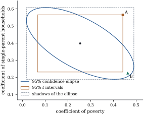

# Confidence ellipsoids

Two \( 95\% \) intervals, one for each of two coefficients, do not make a \( 95\% \) statement about the pair,
and they ignore the correlation between the estimates. The natural joint region is an ellipsoid: the set of
values the \( F \) test does not reject, shaped like the covariance matrix of the estimates, with shadows that are
wider than the \( t \) intervals. This geometry explains an \( F \) test that rejects while
every \( t \) test accepts, and the reverse.

## The ellipsoid

Let \( \bLambda \) be a \( p\times q \) matrix of rank \( q \) whose columns lie in \( \C(\X\T) \), so that every entry of
\( \bm\phi=\bLambda\T\bbeta \) is estimable. Put
\[
\hat{\bm\phi}=\bLambda\T\hbeta,\qquad \W=\bLambda\T\G\bLambda .
\]
By @thm-ss-hypothesis(a), neither depends on the choices of \( \hbeta \) and \( \G \), and \( \W \) is positive definite.
By @thm-opt-sampling(a), \( \hat{\bm\phi}\sim\Normal_q(\bm\phi,\sigma^2\W) \).

::: {#thm-ci-ellipsoid}
[Confidence ellipsoid for \( \bLambda\T\bbeta \)]

With the notation above, let \( F_\alpha=F_\alpha(q,n-r) \) and
\[
E(\Y)=\bigl\{\bm\phi_0\in\Real^q:\ (\hat{\bm\phi}-\bm\phi_0)\T\W^{-1}(\hat{\bm\phi}-\bm\phi_0)\le q\,s^2F_\alpha\bigr\}.
\]{#eq-ci-ellipsoid}

::: {.enumerate options="label=(\alph*)"}
1. \( E(\Y) \) is an exact \( 1-\alpha \) confidence set for \( \bLambda\T\bbeta \).

2. \( E(\Y) \) is a solid ellipsoid centred at \( \hat{\bm\phi} \). If \( \W=\sum_{k=1}^q w_k\bu_k\bu_k\T \) is a spectral
   decomposition, its principal axes point along \( \bu_1,\dots,\bu_q \) and have half-lengths
   \( \sqrt{q\,s^2F_\alpha\,w_k} \). Its volume is
   \[
\frac{\pi^{q/2}}{\Gamma(q/2+1)}\,\bigl(q\,s^2F_\alpha\bigr)^{q/2}\det(\W)^{1/2}.
\]

3. *(Duality with the \( F \) test.)* For \( \bm d\in\Real^q \), let \( \text{SSE}_{\bm d} \) be the minimum of
   \( \norm{\Y-\X\bb}^2 \) over \( \{\bb:\bLambda\T\bb=\bm d\} \) and let
   \[
F_{\bm d}=\frac{(\text{SSE}_{\bm d}-\text{SSE})/q}{s^2}=\frac{(\hat{\bm\phi}-\bm d)\T\W^{-1}(\hat{\bm\phi}-\bm d)}{q\,s^2}.
\]
   Then \( \bm d\in E(\Y) \) iff \( F_{\bm d}\le F_\alpha \), that is, iff the level-\( \alpha \) \( F \) test of
   \( H:\bLambda\T\bbeta=\bm d \) does not reject.
:::
:::

::: {.proof}
(a) Since \( \W \) is invertible, \( \W^{-1} \) is its only generalized inverse, and @cor-opt-quadratic with
\( \rank(\bLambda)=q \) gives
\[
\frac{(\hat{\bm\phi}-\bm\phi)\T\W^{-1}(\hat{\bm\phi}-\bm\phi)}{q\,s^2}\sim F(q,n-r)
\]
at every parameter value. This is a pivot, and \( \bm\phi\in E(\Y) \) is the event that it is at most \( F_\alpha \).

(b) Put \( c=q\,s^2F_\alpha \) and write \( \bm\phi_0-\hat{\bm\phi}=\sum_kc_k\bu_k \). Since
\( \W^{-1}=\sum_kw_k^{-1}\bu_k\bu_k\T \), the defining inequality becomes \( \sum_kc_k^2/w_k\le c \), the standard form of an
ellipsoid with half-axes \( \sqrt{cw_k} \) along \( \bu_k \). Equivalently \( E(\Y)=\hat{\bm\phi}+\W^{1/2}B \), where \( B \) is the
ball of radius \( \sqrt c \) in \( \Real^q \). A linear map multiplies volume by the absolute value of its determinant, so the volume is
\( \det(\W)^{1/2}c^{q/2} \) times the volume \( \pi^{q/2}/\Gamma(q/2+1) \) of the unit ball.

(c) The two expressions for \( F_{\bm d} \) agree by @thm-ss-hypothesis(c), and the equivalence is the definition of \( E(\Y) \).
:::

The statistic \( F_{\bm d} \) is the \( F \) statistic of the general linear hypothesis in both of its forms
(see @thm-glh-general-f), and part (c) is @prp-ci-duality in concrete form. In particular the test of
\( \bLambda\T\bbeta=\bzero \) rejects iff the ellipsoid misses the origin.

In the full-rank case with \( \bLambda=\I_p \), the region for the whole coefficient vector is
\[
\begin{aligned}
&\bigl\{\bb:(\hbeta-\bb)\T\X\T\X(\hbeta-\bb)\le p\,s^2F_\alpha(p,n-p)\bigr\}\\
&\qquad=\bigl\{\bb:\norm{\X\hbeta-\X\bb}^2\le p\,s^2F_\alpha(p,n-p)\bigr\}.
\end{aligned}
\]
The second form says that \( \bb \) is in the region iff its fitted vector \( \X\bb \) is close to the least squares fit
\( \hY \). This suggests looking at the mean vector directly.

## A ball in the column space

::: {#prp-ci-mean-ball}
[Confidence ball for the mean vector]

Let \( \bmu=\X\bbeta \) and \( c_r=r\,s^2F_\alpha(r,n-r) \). The set
\[
B(\Y)=\bigl\{\bmu_0\in\C(\X):\ \norm{\hY-\bmu_0}^2\le c_r\bigr\}
\]
is an exact \( 1-\alpha \) confidence set for \( \bmu \): a ball of radius \( \sqrt{c_r} \) in the \( r \)-dimensional space \( \C(\X) \),
centred at the fitted vector. Moreover, if \( \bLambda=\X\T\bT \) for an \( n\times q \) matrix \( \bT \) (such a \( \bT \) exists
by @thm-est-characterization), the image of \( B(\Y) \) under
\( \bmu_0\mapsto\bT\T\bmu_0 \) is the set
\[
\bigl\{\bm\phi_0:\ (\hat{\bm\phi}-\bm\phi_0)\T\W^{-1}(\hat{\bm\phi}-\bm\phi_0)\le c_r\bigr\},
\]
which contains the ellipsoid @eq-ci-ellipsoid.
:::

::: {.proof}
\( \hY-\bmu=\M(\Y-\X\bbeta) \), and \( \M \) is symmetric idempotent of rank \( r \), so
\( \norm{\hY-\bmu}^2/\sigma^2\sim\chi^2(r) \) by @thm-qf-chisq(a), independently of SSE (@thm-opt-sampling(c)). Dividing by
\( r\,s^2/\sigma^2 \) gives an \( F(r,n-r) \) pivot, and the first claim follows as before.

For the image, put \( \A=\bT\T\M \), a \( q\times n \) matrix. For \( \bmu_0\in\C(\X) \), \( \bT\T\bmu_0=\A\bmu_0 \), and
\( \A\A\T=\bT\T\M\bT=\W \) (@thm-ss-hypothesis(a)). Also \( \hat{\bm\phi}=\bT\T\hY=\A\hY \). So the image consists of the points
\( \hat{\bm\phi}-\A\bu \) with \( \bu\in\C(\X) \) and \( \norm\bu^2\le c_r \). If \( \bm z=\A\bu \) with \( \norm\bu^2\le c_r \), then
\( \bm z\T\W^{-1}\bm z=\bu\T\A\T\W^{-1}\A\bu\le\norm\bu^2\le c_r \), because \( \A\T\W^{-1}\A \) is symmetric and idempotent, hence
a projection, and a projection does not increase length (@prp-proj-trace-rank(d)). Conversely, if
\( \bm z\T\W^{-1}\bm z\le c_r \), then \( \bu=\A\T\W^{-1}\bm z \) lies in \( \C(\M)=\C(\X) \), satisfies \( \A\bu=\bm z \), and has
\( \norm\bu^2=\bm z\T\W^{-1}\bm z\le c_r \).

For the containment it remains to show \( q\,F_\alpha(q,\nu)\le r\,F_\alpha(r,\nu) \) when \( q\le r \). Let \( U_q\sim\chi^2(q) \),
\( U'\sim\chi^2(r-q) \) and \( V\sim\chi^2(\nu) \) be independent. Then \( U_q+U'\sim\chi^2(r) \), so for every \( c \),
\( \Pr\{(U_q+U')/(V/\nu)\le c\}\le\Pr\{U_q/(V/\nu)\le c\} \). The upper \( \alpha \) point of the variable on the left is
\( rF_\alpha(r,\nu) \), and that of the one on the right is \( qF_\alpha(q,\nu) \).
:::

So all confidence ellipsoids are views of one ball around \( \hY \) in the column space. Each linear summary
\( \bLambda\T\bbeta \) maps the ball to an ellipsoid, and since the ball covers \( \bmu \) with probability \( 1-\alpha \), all the images
cover their targets *simultaneously* with probability at least \( 1-\alpha \), at the price of the constant \( rF_\alpha(r,\nu) \) in
place of \( qF_\alpha(q,\nu) \). [Section 12.4](04-bands.html) takes \( q=1 \) and all directions at once.

## Shadows

One inequality gives the extent of an ellipsoid in every direction.

::: {#lem-ci-cauchy-schwarz}
[Extent of an ellipsoid]

Let \( \W \) be a \( q\times q \) positive definite matrix and \( c>0 \). For every \( \bm a\in\Real^q \),
\[
\max\bigl\{\bm a\T\bu:\ \bu\T\W^{-1}\bu\le c\bigr\}=\sqrt{c\,\bm a\T\W\bm a},
\]
attained at \( \bu=\sqrt{c/(\bm a\T\W\bm a)}\,\W\bm a \) when \( \bm a\ne\bzero \). Consequently \( \bu\T\W^{-1}\bu\le c \) iff
\( \lvert\bm a\T\bu\rvert\le\sqrt{c\,\bm a\T\W\bm a} \) for every \( \bm a\in\Real^q \).
:::

::: {.proof}
The bound is @cor-mat-generalized-rayleigh(c) with \( \B=\W^{-1} \); directly, write
\( \bm a\T\bu=(\W^{1/2}\bm a)\T(\W^{-1/2}\bu) \). By the Cauchy–Schwarz inequality,
\( (\bm a\T\bu)^2\le(\bm a\T\W\bm a)(\bu\T\W^{-1}\bu)\le c\,\bm a\T\W\bm a \), with equality when \( \W^{-1/2}\bu \) is a nonnegative
multiple of \( \W^{1/2}\bm a \) and \( \bu\T\W^{-1}\bu=c \), which is the stated \( \bu \). For the last statement, "only if" follows
from the maximum applied to \( \bm a \) and \( -\bm a \). For "if", take \( \bm a=\W^{-1}\bu \): then
\( (\bu\T\W^{-1}\bu)^2\le c\,\bu\T\W^{-1}\bu \), so \( \bu\T\W^{-1}\bu\le c \).
:::

::: {#cor-ci-shadows}
[Shadows of the confidence ellipsoid]

For every \( \bm a\in\Real^q \), the projection of \( E(\Y) \) onto the line spanned by \( \bm a \) is the interval
\[
\bm a\T\hat{\bm\phi}\ \pm\ \sqrt{q\,F_\alpha(q,n-r)}\ \,\text{se}(\bm a\T\hat{\bm\phi}),\qquad
\text{se}(\bm a\T\hat{\bm\phi})=s\sqrt{\bm a\T\W\bm a},
\]
and \( E(\Y) \) is the intersection of the slabs \( \{\bm\phi_0:\lvert\bm a\T\hat{\bm\phi}-\bm a\T\bm\phi_0\rvert\le\sqrt{qF_\alpha}\,\text{se}(\bm a\T\hat{\bm\phi})\} \)
over all \( \bm a \). Hence, with probability exactly \( 1-\alpha \), every one of these intervals contains \( \bm a\T\bLambda\T\bbeta \).
:::

::: {.proof}
Apply @lem-ci-cauchy-schwarz to \( \bu=\bm\phi_0-\hat{\bm\phi} \) with \( c=q\,s^2F_\alpha \). The extreme values of \( \bm a\T\bm\phi_0 \) over
\( E(\Y) \) are \( \bm a\T\hat{\bm\phi}\pm\sqrt{c\,\bm a\T\W\bm a} \), and the set of values in between is attained because
\( E(\Y) \) is convex. The intersection statement is the last part of the lemma. The final claim holds because the event "all
intervals cover" is the event \( \bm\phi\in E(\Y) \).
:::

A shadow is a \( t \) interval with \( t_{n-r,\alpha/2} \) replaced by \( \sqrt{qF_\alpha(q,n-r)} \). The multipliers agree when
\( q=1 \) (@exr-ci-ellipse-one) and the shadow is wider when \( q>1 \), as it must be: the shadows hold simultaneously for all
directions \( \bm a \), including directions chosen after seeing the data. This is Scheffé's method, developed in
[Chapter 13](../ch13-multiplicity/index.html) (@thm-mc-scheffe).

The box of one-at-a-time \( t \) intervals undercovers, and it disagrees with the ellipsoid in both directions: a corner of
the box can lie outside the ellipsoid, and the ellipsoid pokes out of the box along its long axis.

::: {#exm-ci-state-ellipse}
[A joint region for two coefficients]

In the murder-rate regression of @exm-ci-state-intervals, take \( \bLambda \) to pick out the coefficients of poverty and
single parenthood, so \( q=2 \), \( \hat{\bm\phi}=(0.2538,\ 0.3980)\T \), and the correlation of the two estimates is
\( -0.639 \). The negative correlation reflects the positive correlation of the regressors: the data can credit murder
to either, but not to both at once. With \( F_{0.05}(2,46)=3.200 \), the
\( 95\% \) ellipse is drawn in [Figure 12.2.1](#fig-ci-ellipse). The \( F \) statistic for \( \bm\phi=\bzero \) is
\( 39.81 \), so the origin is far outside.

The shadows of the ellipse on the two axes are \( (0.018,\ 0.490) \) and \( (0.188,\ 0.608) \),
wider than the \( t \) intervals \( (0.066,\ 0.442) \) and \( (0.231,\ 0.565) \) by the factor
\( \sqrt{2\times3.200}/2.013=1.257 \). Two points show how the ellipse and the box disagree.

- **A** \( =(0.442,\ 0.565) \), the upper corner of the box. Neither \( t \) test rejects, but A raises both coefficients
  at once, against the correlation, and the joint test rejects: \( F=11.230 \), \( p=0.0001 \).
- **B** \( =(0.463,\ 0.224) \), on the long axis of the ellipse. Both \( t \) statistics exceed
  \( 2.013 \) (\( 2.242 \) and \( 2.098 \)), but B trades one coefficient for the other, which the data cannot resolve,
  and \( F=2.888<3.200 \).

The ellipse and the box have similar areas (\( 0.1197 \) and \( 0.1255 \)) but different shapes. In
\( 40000 \) simulated data sets from the fitted model the ellipse covered the true pair in a proportion
\( 0.9500 \) and the box in only \( 0.9164 \).
:::

::: {when-format="html"}
{#fig-ci-ellipse width=62%}
:::

::: {when-format="pdf"}
{width=62%}
:::

```{.python .run #cell-ellipse-ellipse}
import numpy as np
import statsmodels.api as sm
from scipy import stats

data = sm.datasets.statecrime.load_pandas().data
data = data.drop(index="District of Columbia")
y = data["murder"].to_numpy()
X = np.column_stack([np.ones(len(y)), data[["poverty", "single", "urban"]]])
n, p = X.shape
C = np.linalg.inv(X.T @ X)
beta_hat = C @ X.T @ y
s2 = np.sum((y - X @ beta_hat) ** 2) / (n - p)

L = np.eye(p)[:, [1, 2]]                        # Lambda: the poverty and single coefficients
q = L.shape[1]
phi_hat = L.T @ beta_hat
W = L.T @ C @ L                                  # Cov(phi_hat) / sigma^2
Fq = stats.f.ppf(0.95, q, n - p)


def F_stat(d):
    """F statistic for the hypothesis Lambda^T beta = d."""
    u = phi_hat - d
    return u @ np.linalg.solve(W, u) / (q * s2)


def in_ellipse(d):
    return F_stat(d) <= Fq


corr = W[0, 1] / np.sqrt(W[0, 0] * W[1, 1])
print(f"estimates {phi_hat}, correlation of the estimates {corr:.3f}")
print(f"F({q}, {n - p}) 95% point {Fq:.3f}; F statistic for (0, 0): {F_stat(np.zeros(2)):.2f}")
```

```{.python .run #cell-ellipse-shadows}
tq = stats.t.ppf(0.975, n - p)
se = np.sqrt(s2 * np.diag(W))
t_box = np.column_stack([phi_hat - tq * se, phi_hat + tq * se])            # one-at-a-time t intervals
k = np.sqrt(q * Fq)
shadow = np.column_stack([phi_hat - k * se, phi_hat + k * se])            # projections of the ellipse
print("t intervals:\n", t_box.round(3))
print("shadows of the ellipse:\n", shadow.round(3), f"\nwider by the factor {k / tq:.3f}")
```

## Two cautions

**The ellipsoid is for a question fixed in advance.** If the coefficients are chosen because they look interesting, the ball of
@prp-ci-mean-ball or the methods of [Chapter 13](../ch13-multiplicity/index.html) are the honest tools.

**Intervals after a test.** If intervals are reported only when a preliminary test of \( \bLambda\T\bbeta=\bzero \) rejects, their
coverage *given* the rejection is no longer \( 1-\alpha \), and can be larger or smaller (Olshen 1973).

## Exercises

### A. Check your understanding

::: {#exr-ci-ellipse-one}
[A1]

Show that for \( q=1 \) the ellipsoid @eq-ci-ellipsoid is the \( t \) interval @eq-ci-t-interval. Which fact about the \( F(1,\nu) \)
distribution does this use?
:::

::: {.solution}
With \( q=1 \), \( \W=w \) is a positive number and the region is \( (\hat{\phi}-\phi_0)^2\le s^2wF_\alpha(1,n-r) \). If
\( T\sim t(\nu) \), then \( T^2\sim F(1,\nu) \) (@def-qf-noncentral-t and the remark after it), so
\( \Pr\{T^2\le t_{\nu,\alpha/2}^2\}=\Pr\{\lvert T\rvert\le t_{\nu,\alpha/2}\}=1-\alpha \) and \( F_\alpha(1,\nu)=t_{\nu,\alpha/2}^2 \). The region is
\( \lvert\hat{\phi}-\phi_0\rvert\le t_{\nu,\alpha/2}\,s\sqrt w \).
:::

::: {#exr-ci-ellipse-line}
[A2]

For the straight line \( \E Y_i=\beta_0+\beta_1x_i \), write the \( 95\% \) confidence ellipse for \( (\beta_0,\beta_1) \) in terms of
\( n \), \( \bar{x} \) and \( \sum x_i^2 \). Show that in the centred parameterization \( \E Y_i=\gamma_0+\beta_1(x_i-\bar{x}) \) the
axes of the ellipse for \( (\gamma_0,\beta_1) \) are parallel to the coordinate axes. When is it a circle?
:::

::: {.solution}
\( \X\T\X=\begin{pmatrix}n&n\bar{x}\\n\bar{x}&\sum x_i^2\end{pmatrix} \), and the region is
\( n(\hat{\beta}_0-b_0)^2+2n\bar{x}(\hat{\beta}_0-b_0)(\hat{\beta}_1-b_1)+\sum x_i^2(\hat{\beta}_1-b_1)^2\le2s^2F_\alpha(2,n-2) \). In the centred
parameterization the cross-product matrix is \( \diag(n,S_{xx}) \), so the quadratic form has no cross term, and the ellipse
has axes along the coordinates with half-lengths \( \sqrt{2s^2F_\alpha/n} \) and \( \sqrt{2s^2F_\alpha/S_{xx}} \). It is a circle iff
\( S_{xx}=n \), that is, iff the \( x_i \) have mean square deviation one.
:::

### B. Practice

::: {#exr-ci-volume-ratio}
[B1]

Take \( q=2 \) and let \( \rho \) be the correlation of \( \hat{\phi}_1 \) and \( \hat{\phi}_2 \). Show that the area of the ellipse divided by the area of
the box of the two \( t \) intervals is
\[
\frac{\pi F_\alpha(2,n-r)}{2\,t_{n-r,\alpha/2}^2}\sqrt{1-\rho^2},
\]
so that it depends on the design only through \( \rho \). Check it against @exm-ci-state-ellipse, where the areas are \( 0.1197 \) and \( 0.1255 \)
at \( \rho=-0.639 \). For which \( \lvert\rho\rvert \) do the two regions have equal area there, and what happens to the ratio as the two
regressors become collinear?
:::

::: {.solution}
By @thm-ci-ellipsoid(b) the ellipse has area \( \pi\cdot2F_\alpha s^2\det(\W)^{1/2} \), and
writing \( \omega_j \) for the diagonal entries of \( \W \), \( \det\W=\omega_1\omega_2(1-\rho^2) \). The box has sides \( 2t\,s\sqrt{\omega_j} \), so area \( 4t^2s^2\sqrt{\omega_1\omega_2} \); divide. In the example
\( F_{0.05}(2,46)=3.200 \) and \( t=2.013 \) give \( 1.240 \) at \( \rho=0 \), and \( 1.240\sqrt{1-\rho^2}=0.954 \) at \( \rho=-0.639 \), which is
\( 0.1197/0.1255 \). The areas agree when \( \sqrt{1-\rho^2}=1/1.240 \), that is \( \lvert\rho\rvert=0.592 \). With uncorrelated estimates the ellipse
is the larger region; as the regressors become collinear, \( \lvert\rho\rvert\to1 \), the ratio tends to \( 0 \) and the ellipse becomes a thin
needle across a large box, which the joint region mostly excludes.
:::

::: {#exr-ci-ellipse-difference}
[B2]

In @exm-ci-state-ellipse, the hypothesis that one point of poverty and one point of single parenthood have the same
coefficient is the line \( \phi_1=\phi_2 \). Using @lem-ci-cauchy-schwarz, show that this line meets the ellipse iff
\( \lvert\hat{\phi}_1-\hat{\phi}_2\rvert\le\sqrt{2F_\alpha(2,n-r)}\,\text{se}(\hat{\phi}_1-\hat{\phi}_2) \). Compare this with the \( t \) test
of \( \phi_1=\phi_2 \). Which is appropriate if the hypothesis was formulated before seeing the data?
:::

::: {.solution}
The line is \( \{\bm\phi_0:\bm a\T\bm\phi_0=0\} \) with \( \bm a=(1,-1)\T \). By @cor-ci-shadows, the values of \( \bm a\T\bm\phi_0 \) over the
ellipse fill the interval \( \bm a\T\hat{\bm\phi}\pm\sqrt{2F_\alpha}\,s\sqrt{\bm a\T\W\bm a} \), so the line meets the ellipse iff this
interval contains \( 0 \). The \( t \) test uses the smaller multiplier \( t_{n-r,\alpha/2} \). It is the right test for a hypothesis fixed in
advance. The ellipse criterion is the right one for a contrast chosen after looking at the estimates, because it holds
simultaneously for all \( \bm a \).
:::

::: {#exr-ci-singular-lambda}
[B3]

Let the columns of \( \bLambda \) lie in \( \C(\X\T) \) but be linearly dependent, with \( \rank(\bLambda)=k<q \). Show that
\( \W=\bLambda\T\G\bLambda \) is singular, that \( \hat{\bm\phi}-\bm\phi\in\C(\W) \) with probability one, and that
\[
\begin{aligned}
\bigl\{\bm\phi_0\in\hat{\bm\phi}+\C(\W):\ &(\hat{\bm\phi}-\bm\phi_0)\T\W\ginv(\hat{\bm\phi}-\bm\phi_0)\\
&\le k\,s^2F_\alpha(k,n-r)\bigr\}
\end{aligned}
\]
is an exact \( 1-\alpha \) confidence set, a \( k \)-dimensional ellipsoid inside a \( k \)-dimensional affine subspace of \( \Real^q \).
:::

::: {.solution}
\( \W=(\M\bT)\T(\M\bT) \) has rank \( \rank(\M\bT)=\rank(\bLambda)=k \) (proof of @cor-opt-quadratic). The vector \( \hat{\bm\phi}-\bm\phi \) is
\( \Normal_q(\bzero,\sigma^2\W) \), so it lies in \( \C(\W) \) almost surely (@thm-rv-cov-nnd). By @cor-opt-quadratic the quadratic form over
\( k\,s^2 \) is \( F(k,n-r) \) and does not depend on the generalized inverse. So the displayed set covers \( \bm\phi \) with probability
\( 1-\alpha \). Restricted to the affine subspace, write \( \W=\bm U\bm D\bm U\T \) with \( \bm U \) (\( q\times k \)) orthonormal and \( \bm D \) positive
diagonal. For \( \bm\phi_0-\hat{\bm\phi}=\bm U\bm c \), the form is \( \bm c\T\bm D^{-1}\bm c \), an ellipsoid in the coordinates \( \bm c \).
:::

### C. Going deeper

::: {#exr-ci-likelihood-region}
[C1]

Let \( \X \) have full column rank. Show that the confidence ellipsoid for \( \bbeta \) is a region of the form
\( \{\bb:\ \ell_p(\bb)\ge\ell_p(\hbeta)-k\} \), where \( \ell_p(\bb)=\max_{\sigma^2}\ell(\bb,\sigma^2) \) is the profile log-likelihood of
[Chapter 7](../ch07-optimality/index.html), and find \( k \) in terms of \( F_\alpha(p,n-p) \). How does \( k \) compare with the value
\( \tfrac12\chi^2_\alpha(p) \) suggested by the asymptotic theory of likelihood ratios?
:::

::: {.solution}
The profile log-likelihood is \( \ell_p(\bb)=\text{const}-\tfrac n2\log\norm{\Y-\X\bb}^2 \), and
\( \norm{\Y-\X\bb}^2=\text{SSE}+(\hbeta-\bb)\T\X\T\X(\hbeta-\bb) \) by @eq-proj-distance-split. So
\( \ell_p(\hbeta)-\ell_p(\bb)=\tfrac n2\log\{1+pF_{\bb}/(n-p)\} \), where \( F_{\bb} \) is the statistic of @thm-ci-ellipsoid(c). This is
increasing in \( F_{\bb} \), so the ellipsoid is the region with \( k=\tfrac n2\log\{1+pF_\alpha(p,n-p)/(n-p)\} \). As \( n\to\infty \),
\( pF_\alpha(p,n-p)\to\chi^2_\alpha(p) \) and \( k\to\tfrac12\chi^2_\alpha(p) \). For finite \( n \), \( k \) is larger, and the exact region is
larger than the asymptotic likelihood region.
:::
