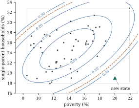

# Prediction intervals

Often the quantity of interest is an observation not yet made: tomorrow's stack loss, or the reading of
the next specimen. An interval for it must allow for the error in the estimated mean, which shrinks as data
accumulate, and the error of the new observation itself, which does not. The first depends on where the new
point lies relative to the data; the second makes prediction intervals depend on normality in a way that
confidence intervals do not.

## Predicting a new observation

Let the data follow the normal linear model of [Section 12.1](01-estimable-intervals.html), and let
\[
Y_0=\x_0\T\bbeta+\varepsilon_0,\qquad \varepsilon_0\sim\Normal(0,\sigma^2),\ \ \varepsilon_0\text{ independent of }\Y,
\]{#eq-ci-new-observation}

be a future observation at a regressor vector \( \x_0\in\C(\X\T) \). The requirement \( \x_0\in\C(\X\T) \) makes the mean
\( \x_0\T\bbeta \) estimable. Without it, @prp-ci-nonestimable shows that nothing useful can be said. We call
\[
h_0=\x_0\T\G\x_0
\]
the **leverage** of the new point. When \( \x_0 \) is the \( i \)th row of \( \X \), \( h_0 \) is the diagonal entry \( h_{ii} \) of \( \M \) (@prp-proj-leverage),
and \( \sigma^2h_0 \) is always the variance of \( \hat{Y}_0=\x_0\T\hbeta \) (@thm-opt-sampling(a)).

::: {#thm-ci-prediction-interval}
[Prediction interval]

Under @eq-ci-new-observation, put \( \hat{Y}_0=\x_0\T\hbeta \).

::: {.enumerate options="label=(\alph*)"}
1. \( Y_0-\hat{Y}_0\sim\Normal\bigl(0,\sigma^2(1+h_0)\bigr) \), it is independent of \( s^2 \), and
   \[
\frac{Y_0-\hat{Y}_0}{s\sqrt{1+h_0}}\sim t(n-r).
\]

2. The interval \( \hat{Y}_0\pm t_{n-r,\alpha/2}\,s\sqrt{1+h_0} \) contains \( Y_0 \) with probability exactly \( 1-\alpha \),
   the probability being computed over \( \Y \) and \( Y_0 \) jointly, at every \( (\bbeta,\sigma^2) \).

3. More generally, if \( \bar{Y}_0 \) is the mean of \( m \) independent new observations at \( \x_0 \), each distributed as in
   @eq-ci-new-observation, then \( \hat{Y}_0\pm t_{n-r,\alpha/2}\,s\sqrt{1/m+h_0} \) contains \( \bar{Y}_0 \) with probability
   exactly \( 1-\alpha \). As \( m\to\infty \) this interval becomes the confidence interval
   \( \hat{Y}_0\pm t_{n-r,\alpha/2}\,s\sqrt{h_0} \) for \( \x_0\T\bbeta \).
:::
:::

::: {.proof}
We prove (c), of which (a) and (b) are the case \( m=1 \). The new observations are independent of \( \Y \), and
\( \bar{Y}_0\sim\Normal(\x_0\T\bbeta,\sigma^2/m) \). The vector \( (\bar{Y}_0,\Y\T)\T \) is normal with independent blocks, so
\( \bar{Y}_0-\hat{Y}_0 \), a linear function of it, is normal (@thm-mvn-linear) with mean
\( \x_0\T\bbeta-\x_0\T\bbeta=0 \) and variance \( \sigma^2/m+\sigma^2h_0 \), the two terms adding because \( \bar{Y}_0 \) and
\( \hat{Y}_0 \) are independent. For independence from \( s^2 \): \( \hat{Y}_0 \) is a function of \( \M\Y \), and \( \M\Y \) and SSE are
independent (@thm-opt-sampling(c)). Since \( \bar{Y}_0 \) is independent of \( \Y \), for any events,
\[
\begin{aligned}
&\Pr(\bar{Y}_0\in A,\ \M\Y\in B,\ \text{SSE}\in D)\\
&\qquad=\Pr(\bar{Y}_0\in A)\Pr(\M\Y\in B)\Pr(\text{SSE}\in D),
\end{aligned}
\]
so \( (\bar{Y}_0,\M\Y) \) is independent of SSE, and so is \( \bar{Y}_0-\hat{Y}_0 \). Dividing the standardized normal variable
by \( \sqrt{(\text{SSE}/\sigma^2)/(n-r)} \) gives \( t(n-r) \) (@def-qf-noncentral-t), and the interval statement is
\( \Pr\{\lvert T\rvert\le t_{n-r,\alpha/2}\}=1-\alpha \). The limit as \( m\to\infty \) is immediate, and the limiting interval is
@eq-ci-t-interval with \( \blambda=\x_0 \).
:::

Part (a) was sketched in @exr-opt-prediction-t. A *prediction* interval is for a random variable, and its probability
refers to the joint experiment: collect the data, compute the interval, observe \( Y_0 \). Given the data, the probability
that the interval contains \( Y_0 \) is random,
\[
\begin{aligned}
\Pr\bigl(Y_0\in\text{interval}\mid\Y\bigr)&=\Phi\Bigl(\frac{\x_0\T(\hbeta-\bbeta)+t\,s\sqrt{1+h_0}}{\sigma}\Bigr)\\
&\quad-\Phi\Bigl(\frac{\x_0\T(\hbeta-\bbeta)-t\,s\sqrt{1+h_0}}{\sigma}\Bigr),
\end{aligned}
\]
with \( t=t_{n-r,\alpha/2} \) and \( \Phi \) the standard normal distribution function, and it is only its expectation that
equals \( 1-\alpha \).

In the variance \( \sigma^2(1+h_0) \), the leverage \( h_0 \) is the price of not knowing \( \bbeta \), of order \( r/n \) at a typical
point (@prp-proj-leverage). The \( 1 \) is the new error, which no amount of data removes: the prediction interval never becomes
shorter than about \( 2z_{\alpha/2}\sigma \), while the interval for the mean shrinks to a point.

::: {#exm-ci-state-prediction}
[Predicting a state's murder rate]

In the murder-rate regression, consider a state at the centroid of the regressors. Its leverage is \( h_0=1/n=0.0200 \) (see @prp-ci-new-leverage), the
fitted rate is \( 4.514 \), and the \( 95\% \) intervals are
\[
\text{mean response: }(4.090,\ 4.938),\qquad \text{new state: }(1.487,\ 7.541).
\]
The prediction interval is \( 7.14 \) times as long as the interval for the mean, and nearly all of its length, \( 6.053 \)
per 100,000, comes from \( s \).
:::

```{.python .run #cell-prediction-predict}
import numpy as np
import statsmodels.api as sm
from scipy import stats

data = sm.datasets.statecrime.load_pandas().data
data = data.drop(index="District of Columbia")
y = data["murder"].to_numpy()
X = np.column_stack([np.ones(len(y)), data[["poverty", "single", "urban"]]])
n, p = X.shape
C = np.linalg.inv(X.T @ X)
beta_hat = C @ X.T @ y
s = np.sqrt(np.sum((y - X @ beta_hat) ** 2) / (n - p))
q = stats.t.ppf(0.975, n - p)
h = np.einsum("ij,jk,ik->i", X, C, X)            # leverages of the 50 states


def intervals(x0):
    """Leverage h0, 95% interval for the mean response, 95% prediction interval."""
    h0 = x0 @ C @ x0
    fit = x0 @ beta_hat
    ci = (fit - q * s * np.sqrt(h0), fit + q * s * np.sqrt(h0))
    pi = (fit - q * s * np.sqrt(1 + h0), fit + q * s * np.sqrt(1 + h0))
    return h0, fit, ci, pi


x_centre = X.mean(axis=0)                        # the average state
x_hidden = np.array([1.0, 20.0, 19.0, 60.0])     # each coordinate inside its observed range
for name, x0 in [("centre", x_centre), ("hidden", x_hidden)]:
    h0, fit, ci, pi = intervals(x0)
    print(f"{name}: h0 = {h0:.4f}, fit {fit:.3f}, mean ({ci[0]:.3f}, {ci[1]:.3f}), "
          f"new state ({pi[0]:.3f}, {pi[1]:.3f})")
print(f"largest leverage in the data: {h.max():.4f}")
```

## Leverage and extrapolation

::: {#prp-ci-new-leverage}
[Leverage of a new point]

Let \( \x_0=\X\T\boldsymbol{\rho}\in\C(\X\T) \) and \( h_0=\x_0\T\G\x_0 \).

::: {.enumerate options="label=(\alph*)"}
1. \( h_0=\min\{\norm{\mathbf{a}}^2:\ \X\T\mathbf{a}=\x_0\} \), and the minimum is attained only at \( \mathbf{a}=\M\boldsymbol{\rho} \).

2. If \( \X=[\bone,\X_1] \) has full column rank, \( \x_0=(1,\x_{01}\T)\T \), \( \bar{\x} \) is the vector of column means of
   \( \X_1 \) and \( \tilde{\X}_1=\X_1-\bone\bar{\x}\T \), then
   \[
h_0=\frac1n+(\x_{01}-\bar{\x})\T\bigl(\tilde{\X}_1\T\tilde{\X}_1\bigr)^{-1}(\x_{01}-\bar{\x}).
\]

3. If further columns are added, \( \X_+=[\X,\mathbf{Z}] \), and \( \x_{0+}=(\x_0\T,\mathbf{z}_0\T)\T\in\C(\X_+\T) \), then the leverage of
   \( \x_{0+} \) in the enlarged model is at least \( h_0 \).
:::
:::

::: {.proof}
(a) Let \( \X\T\mathbf{a}=\x_0 \). Then \( \X\T\M\mathbf{a}=\X\T\mathbf{a}=\x_0=\X\T\M\boldsymbol{\rho} \), so \( \M\mathbf{a}-\M\boldsymbol{\rho} \) lies in \( \C(\X) \) and is
orthogonal to \( \C(\X) \); hence \( \M\mathbf{a}=\M\boldsymbol{\rho} \). By Pythagoras,
\( \norm{\mathbf{a}}^2=\norm{\M\boldsymbol{\rho}}^2+\norm{(\I-\M)\mathbf{a}}^2\ge\norm{\M\boldsymbol{\rho}}^2 \), with equality iff \( \mathbf{a}=\M\boldsymbol{\rho} \), and
\( \norm{\M\boldsymbol{\rho}}^2=\boldsymbol{\rho}\T\X\G\X\T\boldsymbol{\rho}=h_0 \) by @thm-proj-M-formula.

(b) \( \X=[\bone,\tilde{\X}_1]\A \) with \( \A=\begin{pmatrix}1&\bar{\x}\T\\\bzero&\I\end{pmatrix} \), which is invertible. Since
\( \bone\T\tilde{\X}_1=\bzero\T \), \( \X\T\X=\A\T\diag\bigl(n,\tilde{\X}_1\T\tilde{\X}_1\bigr)\A \), and so
\( h_0=\bw\T\diag\bigl(1/n,(\tilde{\X}_1\T\tilde{\X}_1)^{-1}\bigr)\bw \) with \( \bw=\A^{-\top}\x_0 \). Solving \( \A\T\bw=\x_0 \) gives
\( \bw=(1,(\x_{01}-\bar{\x})\T)\T \).

(c) Every \( \mathbf{a} \) with \( \X_+\T\mathbf{a}=\x_{0+} \) also satisfies \( \X\T\mathbf{a}=\x_0 \). A minimum over a smaller set is at least as large,
so (a), applied to both models, gives the claim.
:::

Part (a) is the Gauss–Markov theorem in disguise. Part (b) makes leverage a distance: the quadratic form is \( (n-1)^{-1} \)
times the squared Mahalanobis distance of \( \x_{01} \) from the centroid of the regressors, as for the observed points
(@prp-proj-leverage-mahalanobis). So the interval for the mean is shortest at the centroid, where \( h_0=1/n \), and widens along
ellipsoidal contours. Part (c) says a larger model never predicts more precisely at a given point, though it may predict with less
bias; Chapter 29 weighs the two.

With several correlated regressors, a point can lie inside the range of every regressor and still be far from the data, because it
breaks their correlation. This **hidden extrapolation** is detected by the leverage, not by the separate ranges.

::: {#exm-ci-hidden-extrapolation}
[Hidden extrapolation]

Poverty ranges from \( 8.5\% \) to \( 21.9\% \) over the 50 states, and single-parent households from \( 17.9\% \) to \( 32.8\% \).
A state with poverty \( 20\% \), single-parent households \( 19\% \) and \( 60\% \) urban is inside every range, but poor with few single
parents, a combination absent from the data. Its leverage is \( h_0=0.435 \), far above the largest leverage among the actual states, \( 0.260 \) (Mississippi).
[Figure 12.3.1](#fig-ci-leverage) shows the contours of \( h_0 \) over the two regressors, with urbanization held at its mean.

The fitted rate is \( 3.817 \). The \( 95\% \) interval for the mean is \( (1.840,\ 5.794) \), longer than at the centroid by the
factor \( \sqrt{0.435/0.0200}=4.66 \). The prediction interval, \( (0.227,\ 7.407) \), is only \( 1.186 \) times as long as at
the centroid, because it is dominated by \( s \). The prediction interval barely registers the extrapolation, and the real danger, that the
model may be wrong where there are no data to check it, is in neither formula. If urbanization is dropped from the model the leverage of this point falls to \( 0.287 \), as
@prp-ci-new-leverage(c) requires.
:::

::: {when-format="html"}
{#fig-ci-leverage width=62%}
:::

::: {when-format="pdf"}
{width=62%}
:::

## When the errors are not normal

The estimate \( \hat{Y}_0 \) is a weighted sum of \( n \) errors, approximately normal by a central limit theorem when no weight
dominates (Chapter 19). The new error \( \varepsilon_0 \) is a single draw, and its distribution enters the prediction interval
unchanged, however large \( n \) is.

::: {#prp-ci-pi-limit}
[Prediction intervals without normality]

Consider a sequence of full-rank models \( \Y_n=\X_n\bbeta+\be_n \) with \( p \) fixed and \( n\to\infty \), and a fixed \( \x_0 \) whose
leverage \( h_{0,n}=\x_0\T(\X_n\T\X_n)^{-1}\x_0 \) tends to zero. Let \( \varepsilon_1,\dots,\varepsilon_n \) and \( \varepsilon_0 \)
be independent and identically distributed with mean \( 0 \), variance \( \sigma^2 \), finite fourth moment and a continuous
distribution function, and let \( Y_0=\x_0\T\bbeta+\varepsilon_0 \). Then the coverage of the nominal \( 1-\alpha \) prediction
interval \( \hat{Y}_0\pm t_{n-p,\alpha/2}\,s\sqrt{1+h_{0,n}} \) satisfies
\[
\begin{aligned}
&\Pr\bigl\{\lvert Y_0-\hat{Y}_0\rvert\le t_{n-p,\alpha/2}\,s\sqrt{1+h_{0,n}}\bigr\}\\
&\qquad\longrightarrow\ \Pr\bigl\{\lvert\varepsilon_0\rvert\le z_{\alpha/2}\,\sigma\bigr\},
\end{aligned}
\]
where \( z_{\alpha/2} \) is the upper \( \alpha/2 \) point of \( \Normal(0,1) \). Likewise the probabilities of missing above and below tend to
\( \Pr\{\varepsilon_0>z_{\alpha/2}\sigma\} \) and \( \Pr\{\varepsilon_0<-z_{\alpha/2}\sigma\} \).
:::

::: {.proof}
Write \( T_n=(Y_0-\hat{Y}_0)/(s\sqrt{1+h_{0,n}}) \), \( t_n=t_{n-p,\alpha/2} \) and \( E=\varepsilon_0/\sigma \). First,
\( Y_0-\hat{Y}_0=\varepsilon_0-\x_0\T(\hbeta-\bbeta) \), and \( \x_0\T(\hbeta-\bbeta) \) has mean zero and variance \( \sigma^2h_{0,n}\to0 \) (@thm-lm-moments),
so it tends to zero in probability by Chebyshev's inequality. Second, \( s\to\sigma \) in probability (@cor-lm-s2-consistent),
and \( t_n\to z_{\alpha/2} \). Hence \( D_n=T_n-E\to0 \) in probability. Fix \( \eta>0 \). On the event
\( \{\lvert D_n\rvert\le\eta/2,\ \lvert t_n-z_{\alpha/2}\rvert\le\eta/2\} \), whose probability tends to one,
\[
\lvert E\rvert\le z_{\alpha/2}-\eta\ \Longrightarrow\ \lvert T_n\rvert\le t_n\ \Longrightarrow\ \lvert E\rvert\le z_{\alpha/2}+\eta .
\]
So \( \Pr\{\lvert E\rvert\le z_{\alpha/2}-\eta\}\le\liminf\Pr\{\lvert T_n\rvert\le t_n\}\le\limsup\Pr\{\lvert T_n\rvert\le t_n\}\le\Pr\{\lvert E\rvert\le z_{\alpha/2}+\eta\} \).
The distribution function of \( E \) is continuous, so letting \( \eta\to0 \) gives the limit. The one-sided statements are proved the same way.
:::

The limit is the nominal \( 1-\alpha \) only if \( \Pr\{\lvert\varepsilon_0\rvert\le z_{\alpha/2}\sigma\}=1-\alpha \), a property of the
normal distribution, not of large samples. A simulation shows both effects: a straight line with \( n \) equally spaced design points on
\( [0,1] \), prediction at \( x_0=0.8 \), and errors with mean zero and variance one that are normal, centred exponential (skewed) or
uniform (short-tailed). With \( 20000 \) data sets for each case, the coverages of the nominal
\( 80\% \) and \( 95\% \) intervals are:

| Errors | \( n \) | mean, 80% | mean, 95% | new obs., 80% | new obs., 95% |
|---|---|---|---|---|---|
| normal | 20 | 0.799 | 0.949 | 0.797 | 0.949 |
| normal | 400 | 0.805 | 0.953 | 0.802 | 0.953 |
| exponential | 20 | 0.774 | 0.931 | 0.863 | 0.939 |
| exponential | 400 | 0.799 | 0.949 | 0.896 | 0.949 |
| uniform | 20 | 0.797 | 0.948 | 0.787 | 0.983 |
| uniform | 400 | 0.800 | 0.950 | 0.741 | 1.000 |

At \( n=400 \) the intervals for the mean are near nominal for every law, while the prediction intervals approach
the limits of @prp-ci-pi-limit: \( 0.898 \) and \( 0.948 \) (exponential), \( 0.740 \) and \( 1.000 \) (uniform). The exponential \( 95\% \) interval looks fine only by accident: at \( n=400 \) it misses above
in a proportion \( 0.051 \) of the samples and below in \( 0.0000 \), since a centred exponential error is never below
\( -1 \).

```{.python .run #cell-prediction-coverage}
rng = np.random.default_rng(1203)
laws = {
    "normal": lambda size: rng.normal(size=size),
    "exponential": lambda size: rng.exponential(size=size) - 1.0,                  # skewed
    "uniform": lambda size: rng.uniform(-np.sqrt(3), np.sqrt(3), size=size),       # short tails
}                                                                                  # all: mean 0, variance 1
x0_sim = 0.8


def simulate(law, n_sim, reps=20_000):
    x = np.linspace(0.0, 1.0, n_sim)
    Xs = np.column_stack([np.ones(n_sim), x])
    Hs = np.linalg.solve(Xs.T @ Xs, Xs.T)                        # beta_hat = Hs y
    z0 = np.array([1.0, x0_sim])
    h0 = z0 @ np.linalg.solve(Xs.T @ Xs, z0)
    E = laws[law]((reps, n_sim))                                  # true beta = 0, sigma = 1
    fit = E @ (Hs.T @ z0)
    s_sim = np.sqrt(np.sum((E - (E @ Hs.T) @ Xs.T) ** 2, axis=1) / (n_sim - 2))
    new = laws[law](reps)                                         # the new observation's error
    out = {}
    for level in (0.80, 0.95):
        t = stats.t.ppf(0.5 + level / 2, n_sim - 2)
        out[("mean", level)] = np.mean(np.abs(fit) <= t * s_sim * np.sqrt(h0))
        out[("new", level)] = np.mean(np.abs(new - fit) <= t * s_sim * np.sqrt(1 + h0))
    return out


table = {(law, m): simulate(law, m) for law in laws for m in (20, 400)}
for (law, m), out in table.items():
    print(f"{law:12s} n = {m:3d}: " + ", ".join(f"{k[0]} {k[1]:.2f}: {v:.3f}" for k, v in out.items()))
```

Remedies, transformation (Chapter 22) and resampling (Chapter 23), come later. Checking normality matters much more for
prediction than for estimation.

::: {.remark}
[Prediction is not intervention]

A prediction interval describes the next observation from the *same process*. If the regressors are set by intervention,
say a policy that changes a state's poverty rate, the observed association need not describe what happens (Chapter 25).
:::

## Exercises

### A. Check your understanding

::: {#exr-ci-pi-ratio}
[A1]

Show that the ratio of the length of the prediction interval to that of the confidence interval for the mean at \( \x_0 \) is
\( \sqrt{(1+h_0)/h_0} \). What is it in @exm-ci-state-prediction, and what happens to it as \( n\to\infty \) with the design growing
regularly?
:::

::: {.solution}
Both intervals use the multiplier \( t_{n-r,\alpha/2}\,s \), with \( \sqrt{1+h_0} \) and \( \sqrt{h_0} \) respectively. At the centroid,
\( h_0=0.0200 \) and the ratio is \( \sqrt{51}=7.14 \). As the design grows, \( h_0\to0 \) and the ratio tends to infinity: the
confidence interval shrinks to a point while the prediction interval does not.
:::

### B. Practice

::: {#exr-ci-two-future}
[B1]

Two new observations will be made, at \( \x_{01} \) and \( \x_{02} \), with independent errors. Find an exact \( 1-\alpha \) prediction
interval for their difference \( Y_{01}-Y_{02} \). Show that when \( \x_{01}=\x_{02} \) it does not depend on the data except through \( s \).
:::

::: {.solution}
\( Y_{01}-Y_{02}-(\x_{01}-\x_{02})\T\hbeta \) is normal with mean zero and variance
\( \sigma^2\{2+(\x_{01}-\x_{02})\T\G(\x_{01}-\x_{02})\} \), independent of \( s^2 \) by the argument of @thm-ci-prediction-interval. The interval is
\( (\x_{01}-\x_{02})\T\hbeta\pm t_{n-r,\alpha/2}\,s\sqrt{2+(\x_{01}-\x_{02})\T\G(\x_{01}-\x_{02})} \). When the two points coincide it is
\( \pm t_{n-r,\alpha/2}\,s\sqrt2 \): the difference of two new errors, for which the fitted model contributes only its estimate of \( \sigma \).
:::

::: {#exr-ci-leverage-increment}
[B2]

In @prp-ci-new-leverage(c), let \( \X \) have full column rank and add a single column \( \bz\notin\C(\X) \). Show that the new leverage is
\[
h_{0+}=h_0+\frac{(z_0-\mathbf{k}\T\x_0)^2}{\norm{(\I-\M)\bz}^2},\qquad \mathbf{k}=(\X\T\X)^{-1}\X\T\bz .
\]
So the leverage is unchanged iff \( z_0 \) equals the value \( \mathbf{k}\T\x_0 \) predicted for it by the other regressors.
:::

::: {.solution}
Use @prp-ci-new-leverage(a) for the enlarged model. Write \( \x_0=\X\T\boldsymbol{\rho} \) and split any feasible \( \mathbf{a} \) as
\( \mathbf{a}=\M\mathbf{a}+\mathbf{b} \) with \( \mathbf{b}\perp\C(\X) \). The constraint \( \X\T\mathbf{a}=\x_0 \) forces \( \M\mathbf{a}=\M\boldsymbol{\rho} \), as in the proof
of the proposition. The constraint \( \bz\T\mathbf{a}=z_0 \) then reads \( \bz\T\M\boldsymbol{\rho}+\bz\T\mathbf{b}=z_0 \), and
\( \bz\T\M\boldsymbol{\rho}=\bz\T\X(\X\T\X)^{-1}\X\T\boldsymbol{\rho}=\mathbf{k}\T\x_0 \). Since \( \mathbf{b}\perp\C(\X) \), \( \bz\T\mathbf{b}=((\I-\M)\bz)\T\mathbf{b} \), and by the
Cauchy–Schwarz inequality the shortest \( \mathbf{b} \) with \( ((\I-\M)\bz)\T\mathbf{b}=z_0-\mathbf{k}\T\x_0 \) is a multiple of \( (\I-\M)\bz \), with
\( \norm{\mathbf{b}}^2=(z_0-\mathbf{k}\T\x_0)^2/\norm{(\I-\M)\bz}^2 \). Adding \( \norm{\M\boldsymbol{\rho}}^2=h_0 \) gives the formula.
:::

::: {#exr-ci-through-origin}
[B3]

For the line through the origin, \( \E Y_i=\beta x_i \) with \( \sum x_i^2>0 \), write the \( 1-\alpha \) confidence interval for the mean at
\( x_0 \) and the prediction interval for \( Y_0 \). Show that the confidence interval for the mean
has length proportional to \( \lvert x_0\rvert \), and is a point at \( x_0=0 \). Why is that reasonable, and what does it assume?
:::

::: {.solution}
Here \( r=1 \), \( \hat{\beta}=\sum x_iy_i/\sum x_i^2 \), \( s^2=\sum(y_i-\hat{\beta} x_i)^2/(n-1) \) and \( h_0=x_0^2/\sum x_i^2 \). The intervals are
\( \hat{\beta} x_0\pm t_{n-1,\alpha/2}\,s\lvert x_0\rvert/\sqrt{\sum x_i^2} \) and
\( \hat{\beta} x_0\pm t_{n-1,\alpha/2}\,s\sqrt{1+x_0^2/\sum x_i^2} \). At \( x_0=0 \) the model asserts that the mean is exactly zero, so there is
nothing to estimate. The interval is only as good as that assertion: if the true line has a small intercept, the interval near
\( x_0=0 \) is too short.
:::

::: {#exr-ci-random-x0}
[B4]

Suppose the new regressor vector \( \mathbf{X}_0 \) is random, independent of the pair \( (\Y,\varepsilon_0) \), and always lies in \( \C(\X\T) \). Show that the
prediction interval of @thm-ci-prediction-interval, computed at the realized \( \mathbf{X}_0 \), still covers \( Y_0 \) with probability exactly
\( 1-\alpha \).
:::

::: {.solution}
Condition on \( \mathbf{X}_0=\x_0 \). By independence, given this event \( (\Y,\varepsilon_0) \) has its unconditional distribution, so
@thm-ci-prediction-interval applies and the conditional coverage is \( 1-\alpha \) for every \( \x_0 \). Averaging over the distribution of
\( \mathbf{X}_0 \) gives \( 1-\alpha \).
:::

### C. Going deeper

::: {#exr-ci-simultaneous-prediction}
[C1]

Let \( k \) new observations be made at the rows of a \( k\times p \) matrix \( \X_0 \) whose rows lie in \( \C(\X\T) \), with errors independent of each
other and of \( \Y \). Show that \( \mathbf{D}=\mathbf{Y}_0-\X_0\hbeta\sim\Normal_k\bigl(\bzero,\sigma^2(\I_k+\X_0\G\X_0\T)\bigr) \), independent of
\( s^2 \), and deduce that the intervals
\[
\x_{0j}\T\hbeta\ \pm\ \sqrt{k\,F_\alpha(k,n-r)}\ s\sqrt{1+h_{0j}},\qquad j=1,\dots,k,
\]
contain all \( k \) new observations simultaneously with probability at least \( 1-\alpha \).
:::

::: {.solution}
Normality, the mean and the covariance follow as in @thm-ci-prediction-interval, and \( \mathbf{S}=\I_k+\X_0\G\X_0\T \) is positive definite. So
\( \mathbf{D}\T\mathbf{S}^{-1}\mathbf{D}/(k s^2)\sim F(k,n-r) \) (@cor-qf-mahalanobis and @def-qf-noncentral-f). By @lem-ci-cauchy-schwarz with
\( \mathbf{a}=\vect{e}_j \), the event \( \mathbf{D}\T\mathbf{S}^{-1}\mathbf{D}\le k s^2F_\alpha \) implies \( \lvert D_j\rvert\le\sqrt{kF_\alpha}\,s\sqrt{S_{jj}} \) for
every \( j \), and \( S_{jj}=1+h_{0j} \). [Chapter 13](../ch13-multiplicity/index.html) compares this with Bonferroni's method, which is shorter when \( k \) is small.
:::

::: {#exr-ci-tolerance}
[C2]

A \( (P,1-\alpha) \) **tolerance interval** at \( \x_0 \) is a random interval that, with probability at least \( 1-\alpha \) over \( \Y \), contains at
least a proportion \( P \) of the distribution of \( Y_0 \). Show that the prediction interval of @thm-ci-prediction-interval is not a
\( (1-\alpha,1-\alpha) \) tolerance interval, by showing that its conditional coverage given \( \Y \) is below \( 1-\alpha \) with probability
bounded away from zero. Construct a conservative tolerance interval from a lower confidence bound for the conditional coverage,
using a \( 1-\alpha/2 \) upper confidence bound for \( \sigma \) and a \( 1-\alpha/2 \) confidence interval for \( \x_0\T\bbeta \).
:::
