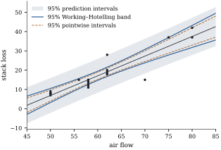

# Simultaneous bands for the regression line and surface

A fitted line is usually drawn inside a shaded region. If the region is made of pointwise intervals, each
vertical slice covers the true mean with probability \( 1-\alpha \), but the region does not cover the whole true line
with that probability. A reader who asks "which lines are consistent with the data?" needs a simultaneous band,
and for a linear model the Cauchy–Schwarz inequality gives one with exact coverage.

## Pointwise is not simultaneous

::: {#def-ci-band}
[Simultaneous confidence band]

Let \( \mathcal S\subseteq\C(\X\T) \) be a set of regressor vectors. Random functions \( \ell(\x)=\ell(\x;\Y) \) and
\( u(\x)=u(\x;\Y) \) form a \( 1-\alpha \) **simultaneous confidence band** for the regression function over \( \mathcal S \) if
\[
\Pr_{\bbeta,\sigma^2}\bigl\{\ell(\x)\le\x\T\bbeta\le u(\x)\ \text{ for every }\x\in\mathcal S\bigr\}\ \ge\ 1-\alpha
\]
for every \( (\bbeta,\sigma^2) \).
:::

Pointwise \( t \) intervals fail this: for the stack loss line of @exm-ci-stackloss-band, the pointwise \( 95\% \) intervals
cover the true line over the observed range in only \( 0.8705 \) of simulated samples.

## The Working–Hotelling band

::: {#thm-ci-working-hotelling}
[Working–Hotelling band]

Let \( \mathcal L \) be a linear subspace of \( \C(\X\T) \) of dimension \( k\ge1 \), and let \( w_k=\sqrt{k\,F_\alpha(k,n-r)} \). Then
\[
\Pr\bigl\{\lvert\x\T\hbeta-\x\T\bbeta\rvert\le w_k\,s\sqrt{\x\T\G\x}\ \text{ for all }\x\in\mathcal L\bigr\}=1-\alpha .
\]{#eq-ci-wh-band}

In particular:

::: {.enumerate options="label=(\alph*)"}
1. with \( \mathcal L=\C(\X\T) \) and \( k=r \), the functions \( \x\T\hbeta\pm w_r\,s\sqrt{\x\T\G\x} \) form an exact \( 1-\alpha \)
   simultaneous band for the regression surface over all estimable \( \x \);

2. for a straight line \( \E Y_i=\beta_0+\beta_1x_i \) with the \( x_i \) not all equal, the band
   \[
\hat{\beta}_0+\hat{\beta}_1x\ \pm\ \sqrt{2F_\alpha(2,n-2)}\ s\,\sqrt{\frac1n+\frac{(x-\bar{x})^2}{S_{xx}}},\qquad x\in\Real,
\]
   contains the true line \( \beta_0+\beta_1x \) for every real \( x \) with probability exactly \( 1-\alpha \).
:::
:::

::: {.proof}
*Step 1: from \( \mathcal L \) to a subspace of \( \C(\X) \).* The map \( \bu\mapsto\X\T\bu \) is one to one on \( \C(\X) \), since
\( \X\T\bu=\bzero \) with \( \bu\in\C(\X) \) forces \( \bu\in\C(\X)\cap\C(\X)\perpc=\{\bzero\} \). It maps \( \C(\X) \) onto \( \C(\X\T) \), because
\( \X\T\bm\rho=\X\T\M\bm\rho \). So \( \mathcal U=\{\bu\in\C(\X):\X\T\bu\in\mathcal L\} \) is a subspace of \( \C(\X) \) of dimension \( k \), and every
\( \x\in\mathcal L \) is \( \X\T\bu \) for exactly one \( \bu\in\mathcal U \). For such a pair,
\[
\begin{aligned}
\x\T\hbeta-\x\T\bbeta&=\bu\T(\X\hbeta-\X\bbeta)=\bu\T\M(\Y-\X\bbeta)=\bu\T\bv,\\
\x\T\G\x&=\bu\T\X\G\X\T\bu=\bu\T\M\bu=\norm\bu^2,
\end{aligned}
\]
where \( \bv=\bP_{\mathcal U}(\Y-\X\bbeta) \). The middle equality uses \( \X\hbeta=\M\Y \) and \( \M\X=\X \). The last step of the first chain
uses \( \bu=\M\bu=\bP_{\mathcal U}\bu \), and the second chain uses @thm-proj-M-formula.

*Step 2: the supremum.* By the Cauchy–Schwarz inequality, for \( \bu\in\mathcal U \), \( \bu\ne\bzero \),
\[
\frac{(\x\T\hbeta-\x\T\bbeta)^2}{\x\T\G\x}=\frac{(\bu\T\bv)^2}{\norm\bu^2}\le\norm\bv^2,
\]
with equality at \( \bu=\bv \) when \( \bv\ne\bzero \), and \( \bv\in\mathcal U \). So the supremum of the left side over
\( \x\in\mathcal L\setminus\{\bzero\} \) equals \( \norm\bv^2 \) and is attained.

*Step 3: its distribution.* \( \Y-\X\bbeta\sim\Normal_n(\bzero,\sigma^2\I) \), and \( \bP_{\mathcal U} \) is symmetric idempotent of rank \( k \), so
\( \norm\bv^2/\sigma^2\sim\chi^2(k) \) (@thm-qf-chisq(a)). Since \( \mathcal U\subseteq\C(\X) \), \( \bP_{\mathcal U}=\bP_{\mathcal U}\M \), so \( \bv \) is a function of
\( \M\Y \) and is independent of SSE (@thm-opt-sampling(c)). Hence \( \norm\bv^2/(k\,s^2)\sim F(k,n-r) \) (@def-qf-noncentral-f), and the event in
@eq-ci-wh-band, which is \( \norm\bv^2\le w_k^2s^2 \) by Step 2, has probability \( 1-\alpha \). (At \( \x=\bzero \) both sides of the inequality are zero.)

*Part (a)* is the case \( \mathcal L=\C(\X\T) \), \( \mathcal U=\C(\X) \).

*Part (b).* Here \( r=k=2 \) and \( \mathcal L=\Real^2 \), but the band uses only the vectors \( \x=(1,x)\T \). The ratio in Step 2 is unchanged when \( \x \)
is multiplied by a nonzero scalar, so its supremum over \( \{(1,x)\T:x\in\Real\} \) equals its supremum over all \( \x=(a,b)\T \) with \( a\ne0 \). By Step 2
the supremum over all of \( \Real^2 \) is attained at \( \x^*=\X\T\bv \), whose first coordinate is \( \bone\T\bv \). The random variable \( \bone\T\bv \) is
normal with variance \( \sigma^2\norm{\bP_{\mathcal U}\bone}^2=\sigma^2n>0 \), because \( \bone\in\C(\X)=\mathcal U \). So with probability one \( \x^* \) has a nonzero first
coordinate, the two suprema are equal, and the band event has the probability computed in Step 3. The formula for \( \x\T\G\x \) is
@eq-lm-var-mean-response divided by \( \sigma^2 \).
:::

The proof has one idea: every linear function of the fitted mean is an inner product with \( \bv \), and the worst case over all
directions is \( \norm\bv \). With \( \mathcal L=\C(\X\T) \) the band holds exactly when the confidence ball of @prp-ci-mean-ball contains
\( \X\bbeta \): the band is that ball, viewed one linear functional at a time. Applied to general families of estimable functions, the
argument gives Scheffé's intervals, which [Chapter 13](../ch13-multiplicity/index.html) develops (@thm-mc-scheffe) and compares with
Bonferroni and Tukey.

The straight-line band is hyperbolic, narrowest at \( \bar{x} \). Although \( x \) varies along a line, the multiplier uses \( k=2 \),
because the band must hold for intercept and slope together.

## How much wider?

The band is wider than the pointwise intervals by the factor \( w_k/t_{n-r,\alpha/2} \), the same at every \( \x \). The
multipliers \( w_k=\sqrt{kF_{0.05}(k,\nu)} \) for \( 95\% \) coverage are:

| \( k \) | \( \nu=5 \) | \( \nu=10 \) | \( \nu=20 \) | \( \nu=60 \) | \( \nu=\infty \) |
|---|---|---|---|---|---|
| 1 | 2.571 | 2.228 | 2.086 | 2.000 | 1.960 |
| 2 | 3.402 | 2.865 | 2.643 | 2.510 | 2.448 |
| 3 | 4.028 | 3.335 | 3.049 | 2.876 | 2.795 |
| 5 | 5.025 | 4.078 | 3.682 | 3.441 | 3.327 |
| 10 | 6.881 | 5.457 | 4.845 | 4.464 | 4.279 |

The row \( k=1 \) is the \( t \) multiplier; the column \( \nu=\infty \) is \( \sqrt{\chi^2_{0.05}(k)} \), for known \( \sigma \). For a
straight line the band is about a quarter wider than the pointwise intervals, for ten coefficients more than twice as wide:
for large \( k \) simultaneity costs roughly a factor \( \sqrt k \).

::: {#exm-ci-stackloss-band}
[A band for the stack loss line]

Regress stack loss on air flow for the \( 21 \) days of Brownlee's plant data (@exm-opt-stackloss-mle), ignoring
the other two regressors. The fitted line is \( -44.132+1.0203\,x \) with \( s=4.098 \), \( \bar{x}=60.43 \) and
\( S_{xx}=1681.1 \). The pointwise multiplier is \( t_{19,0.025}=2.093 \), and the Working–Hotelling multiplier is
\( \sqrt{2F_{0.05}(2,19)}=2.654 \), larger by the factor \( 1.268 \). [Figure 12.4.1](#fig-ci-band) shows the
data, the band, the pointwise intervals, and the \( 95\% \) prediction intervals of [Section 12.3](03-prediction.html).

Near the centre, at \( x=60 \), the fitted mean is \( 17.09 \), and the half-widths are \( 1.87 \)
(pointwise), \( 2.38 \) (band) and \( 8.78 \) (prediction). At \( x=80 \), the edge of the data, the fitted mean is
\( 37.49 \) and the half-widths are \( 4.50 \), \( 5.71 \) and \( 9.69 \).

In \( 40000 \) data sets simulated from the fitted line, the band contained the true line over the whole real line in a
proportion \( 0.9500 \) of the samples and over the observed range \( 50\le x\le80 \) in
\( 0.9537 \). The pointwise intervals covered at \( x=60 \) in \( 0.9517 \) of the samples, but covered the
line over the whole observed range in only \( 0.8705 \).
:::

::: {when-format="html"}
{#fig-ci-band width=70%}
:::

::: {when-format="pdf"}
{width=70%}
:::

```{.python .run #cell-bands-band}
import numpy as np
import statsmodels.api as sm
from scipy import stats

data = sm.datasets.stackloss.load_pandas().data
x = data["AIRFLOW"].to_numpy()
y = data["STACKLOSS"].to_numpy()
n = len(y)
X = np.column_stack([np.ones(n), x])
C = np.linalg.inv(X.T @ X)
beta_hat = C @ X.T @ y
s = np.sqrt(np.sum((y - X @ beta_hat) ** 2) / (n - 2))

grid = np.linspace(45, 85, 401)
Z = np.column_stack([np.ones_like(grid), grid])
fit = Z @ beta_hat
se_mean = s * np.sqrt(np.einsum("ij,jk,ik->i", Z, C, Z))   # s * sqrt(1/n + (x - xbar)^2 / Sxx)
t_pt = stats.t.ppf(0.975, n - 2)                            # pointwise multiplier
w_wh = np.sqrt(2 * stats.f.ppf(0.95, 2, n - 2))             # Working-Hotelling multiplier
pointwise = (fit - t_pt * se_mean, fit + t_pt * se_mean)
band = (fit - w_wh * se_mean, fit + w_wh * se_mean)
se_new = np.sqrt(s**2 + se_mean**2)
prediction = (fit - t_pt * se_new, fit + t_pt * se_new)
print(f"slope {beta_hat[1]:.4f}, s = {s:.3f}; multipliers: t {t_pt:.3f}, Working-Hotelling {w_wh:.3f}")
```

## Bands over part of the space, and other shapes

The band holds over the whole line. If only \( x\in[a,b] \) matters it is conservative (the simulated \( 0.9537 \)), and an
exact band over \( [a,b] \) uses a smaller multiplier (Wynn and Bloomfield 1971). The hyperbolic shape is also a choice: bands of
constant width, or with straight edges, come from replacing the Euclidean norm in Step 2 by another norm (Gafarian 1964; Liu 2010).
And if only some regressors vary, \( \mathcal L \) is smaller, and so is
\( k \).

## Exercises

### A. Check your understanding

::: {#exr-ci-band-limit}
[A1]

For a straight line with many residual degrees of freedom, compute the ratio of the Working–Hotelling multiplier to the pointwise
one at \( \alpha=0.05 \). How does the ratio change at \( \alpha=0.01 \)?
:::

::: {.solution}
As \( \nu\to\infty \), \( 2F_\alpha(2,\nu)\to\chi^2_\alpha(2)=-2\log\alpha \), since \( \chi^2(2) \) is exponential with mean \( 2 \). At
\( \alpha=0.05 \) the ratio is \( \sqrt{2\log20}/z_{0.025}=2.448/1.960=1.249 \). At \( \alpha=0.01 \) it is
\( \sqrt{2\log100}/z_{0.005}=3.035/2.576=1.178 \). The relative cost of simultaneity falls as the level becomes more
demanding. As \( \alpha\to0 \), both squared multipliers, \( z_{\alpha/2}^2 \) and \( \chi^2_\alpha(2)=2\log(1/\alpha) \), grow like
\( 2\log(1/\alpha)+O\bigl(\log\log(1/\alpha)\bigr) \), so the ratio of the multipliers tends to \( 1 \).
:::

::: {#exr-ci-band-through-origin}
[A2]

For the line through the origin \( \E Y_i=\beta x_i \), show that a simultaneous band for \( \beta x \) over all real \( x \) is
\( \hat{\beta} x\pm t_{n-1,\alpha/2}\,s\lvert x\rvert/\sqrt{\sum x_i^2} \), with no widening at all. Explain this with the dimension
\( k \) of @thm-ci-working-hotelling.
:::

::: {.solution}
Here \( \C(\X\T)=\Real \), so \( k=1 \) and \( w_1=t_{n-1,\alpha/2} \). Directly: the band holds at every \( x \) iff it holds at \( x=1 \),
since both sides scale with \( \lvert x\rvert \).
:::

### B. Practice

::: {#exr-ci-band-ellipse}
[B1]

For the straight line, show that the Working–Hotelling band contains the line \( b_0+b_1x \) for every \( x \) iff \( (b_0,b_1) \) lies in the
\( 1-\alpha \) confidence ellipse for \( (\beta_0,\beta_1) \) of @thm-ci-ellipsoid. Deduce that the band is the envelope of all lines whose
coefficients lie in the ellipse.
:::

::: {.solution}
Put \( \bu=(\hat{\beta}_0-b_0,\hat{\beta}_1-b_1)\T \) and \( \W=(\X\T\X)^{-1} \). The line \( b_0+b_1x \) is inside the band at \( x \) iff
\( \lvert(1,x)\bu\rvert\le w_2\,s\sqrt{(1,x)\W(1,x)\T} \). By scale invariance this holds for all \( x \) iff it holds for all \( \bm a=(a_1,a_2)\T \) with
\( a_1\ne0 \), and by continuity iff it holds for all \( \bm a \). By @lem-ci-cauchy-schwarz that is \( \bu\T\W^{-1}\bu\le w_2^2s^2 \), which is the
ellipse. At each \( x \), the upper edge of the band is the maximum of \( b_0+b_1x \) over the ellipse (@cor-ci-shadows), so the band is the envelope.
:::

::: {#exr-ci-band-quadratic}
[B2]

For quadratic regression \( \E Y_i=\beta_0+\beta_1x_i+\beta_2x_i^2 \), the natural band over all \( x \) uses \( \x=(1,x,x^2)\T \), a curve in
\( \Real^3 \) whose directions do not fill \( \Real^3 \). Show that the band with multiplier \( w_3 \) has coverage at least \( 1-\alpha \) over all
\( x \), and argue that its coverage is strictly larger than \( 1-\alpha \). (Hint: when is the maximizing direction \( \X\T\bv \) of Step 2 a multiple of
some \( (1,x,x^2)\T \)?)
:::

::: {.solution}
The band event over all \( \x\in\Real^3 \) has probability \( 1-\alpha \) and is contained in the event over the curve, so the coverage is at least
\( 1-\alpha \). Write \( S=\norm\bv^2 \) and \( S_c \) for the supremum of the ratio of Step 2 over the curve. The ratio depends on \( \bv \) only through
\( S \) and the direction \( \bv/\norm\bv \), so \( S_c=\rho S \), where \( \rho\le1 \) is a continuous function of the direction alone. Equality \( \rho=1 \)
requires either that \( \X\T\bv \) be a multiple of some \( (1,x,x^2)\T \), that is, its coordinates \( (c_0,c_1,c_2) \) satisfy \( c_0c_2=c_1^2 \), or
that \( \X\T\bv \) be a multiple of \( (0,0,1)\T \), the limit of \( (1,x,x^2)\T/x^2 \) as \( x\to\infty \), where the supremum is approached but not
attained. Both are events of probability zero. For a spherical normal vector in \( \mathcal U \), the length and the direction are independent, and both are independent of \( s^2 \). So the
coverage over the curve exceeds \( 1-\alpha \) by \( \Pr\{w_3^2s^2<S\le w_3^2s^2/\rho\} \), which is positive because \( S/\sigma^2 \) has a positive
density on \( (0,\infty) \) and \( \rho<1 \) almost surely.
:::

### C. Going deeper

::: {#exr-ci-prediction-band}
[C1]

A single new observation \( Y_0=\x_0\T\bbeta+\varepsilon_0 \) will be taken at a regressor vector \( \x_0\in\C(\X\T) \) that is not known in advance.
Show that the band \( \x\T\hbeta\pm\sqrt{(r+1)F_\alpha(r+1,n-r)}\,s\sqrt{1+\x\T\G\x} \), \( \x\in\C(\X\T) \), contains \( Y_0 \) with probability at
least \( 1-\alpha \), whatever \( \x_0 \) turns out to be. (Hint: apply Step 2 of the proof to the \( (r+1) \)-dimensional vector
\( (\bv,\varepsilon_0) \).)
:::

::: {.solution}
For \( \x=\X\T\bu \) with \( \bu\in\C(\X) \), \( Y_0-\x\T\hbeta=\varepsilon_0-\bu\T\bv \), with \( \bv=\M(\Y-\X\bbeta) \), and \( 1+\x\T\G\x=1+\norm\bu^2 \). By
Cauchy–Schwarz in \( \C(\X)\times\Real \), \( (\varepsilon_0-\bu\T\bv)^2\le(1+\norm\bu^2)(\varepsilon_0^2+\norm\bv^2) \). The variable
\( (\varepsilon_0^2+\norm\bv^2)/\sigma^2 \) is \( \chi^2(r+1) \), independent of SSE, so \( (\varepsilon_0^2+\norm\bv^2)/((r+1)s^2)\sim F(r+1,n-r) \), and on the
event that it is at most \( F_\alpha(r+1,n-r) \), which has probability \( 1-\alpha \), the band contains \( Y_0 \) at every \( \x \), in particular at \( \x_0 \).
:::

::: {#exr-ci-two-bands}
[C2]

Two straight lines are fitted in one model, with separate intercepts and slopes and a common \( \sigma^2 \). Construct simultaneous bands for both
lines with joint coverage at least \( 1-\alpha \) in two ways: (i) @thm-ci-working-hotelling with \( \mathcal L=\Real^4 \), (ii) a band for each line with
\( \mathcal L=\Real^2 \) at level \( \alpha/2 \), combined by the Bonferroni inequality. Compare the multipliers for \( n-r=20 \) and explain which is
better and why.
:::
