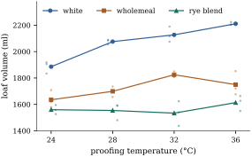

# Interaction and its interpretation

The additive model says that the difference between two levels of \( A \) is the same at every level of \( B \). *Interaction* is the failure of that statement. This section defines interaction through the cell means, so that its meaning does not depend on a parameterization. It then shows how to see interaction in a plot and when a change of scale removes it, and explains why a "main effect" in the presence of interaction is a weighted average whose weights someone has to choose.

## Cell means and the definition of interaction

Write \( \mu_{ij} \) for the mean response in cell \( (i,j) \). The **cell-means model** \( \E(y_{ijk})=\mu_{ij} \) places no restriction on the \( ab \) means. By @prp-est-interaction(a) it has the same mean space as the overparameterized model \( \mu+\alpha_i+\beta_j+\gamma_{ij} \), and every cell mean of an occupied cell is estimable. Averages with equal weights split the table of means into four parts:
\[
\mu_{ij}=\bar{\mu}_{\cdot\cdot}+(\bar{\mu}_{i\cdot}-\bar{\mu}_{\cdot\cdot})+(\bar{\mu}_{\cdot j}-\bar{\mu}_{\cdot\cdot})+(\mu_{ij}-\bar{\mu}_{i\cdot}-\bar{\mu}_{\cdot j}+\bar{\mu}_{\cdot\cdot}).
\]{#eq-tw-cell-split}

This is an algebraic identity. The four parts are the images of the vector of cell means under \( \bar{\mathbf{J}}_a\otimes\bar{\mathbf{J}}_b \), \( \mathbf{C}_a\otimes\bar{\mathbf{J}}_b \), \( \bar{\mathbf{J}}_a\otimes\mathbf{C}_b \) and \( \mathbf{C}_a\otimes\mathbf{C}_b \), which are mutually orthogonal projections (@lem-tw-kron).

::: {#def-tw-interaction}
[Interaction]

Let \( \mu_{ij} \) be the cell means of a two-way layout.

::: {.enumerate options="label=(\alph*)"}
1. An **interaction contrast** is a linear function \( \sum_{i,j}d_{ij}\mu_{ij} \) whose coefficient table \( (d_{ij}) \) is not zero and has every row sum and every column sum equal to zero. The simplest is the **tetrad difference** \( \mu_{ij}-\mu_{il}-\mu_{kj}+\mu_{kl} \) of rows \( i\ne k \) and columns \( j\ne l \). It is the difference between columns \( j \) and \( l \) in row \( i \), minus the same difference in row \( k \).

2. The factors **interact** if some interaction contrast is nonzero. Otherwise the layout is **additive**.

3. In the *effects form* \( \mu_{ij}=\mu+\alpha_i+\beta_j+\gamma_{ij} \) of @eq-tw-cell-split, the **main effects** are \( \alpha_i=\bar{\mu}_{i\cdot}-\bar{\mu}_{\cdot\cdot} \) and \( \beta_j=\bar{\mu}_{\cdot j}-\bar{\mu}_{\cdot\cdot} \), and the **interaction effects** are \( \gamma_{ij}=\mu_{ij}-\bar{\mu}_{i\cdot}-\bar{\mu}_{\cdot j}+\bar{\mu}_{\cdot\cdot} \). They satisfy \( \sum_i\alpha_i=\sum_j\beta_j=0 \), and every row and column of \( (\gamma_{ij}) \) sums to zero.
:::

:::

The cell means are what the data estimate. The effects in (c) are one coordinate system for them, fixed by the choice of equal weights. The next result shows that whether interaction is present does not depend on that choice.

::: {#prp-tw-interaction-equiv}
[Equivalent forms of additivity]

For a table of cell means \( (\mu_{ij}) \), the following are equivalent:

::: {.enumerate options="label=(\roman*)"}
1. every tetrad difference is zero;

2. for all rows \( i,k \), the difference \( \mu_{ij}-\mu_{kj} \) does not depend on \( j \);

3. \( \mu_{ij}=u_i+v_j \) for some numbers \( u_1,\dots,u_a \) and \( v_1,\dots,v_b \);

4. every interaction contrast is zero;

5. for some pair of weight vectors \( \mathbf{s}\in\Real^a \) and \( \bw\in\Real^b \) with \( \sum_ks_k=\sum_lw_l=1 \),
   \[
\mu_{ij}-\sum_lw_l\mu_{il}-\sum_ks_k\mu_{kj}+\sum_{k,l}s_kw_l\mu_{kl}=0\quad\text{for all }i,j ;
\]

6. the condition in (v) holds for every such pair of weight vectors, in particular \( \gamma_{ij}=0 \) for all \( i,j \).
:::

Moreover, the coefficient tables of interaction contrasts, together with the zero table, form a subspace of dimension \( (a-1)(b-1) \), and \( \sum_{i,j}d_{ij}\mu_{ij}=\sum_{i,j}d_{ij}\gamma_{ij} \) for each of them.
:::

::: {.proof}
(i)\( \Rightarrow \)(ii): a zero tetrad difference says \( \mu_{ij}-\mu_{kj}=\mu_{il}-\mu_{kl} \). (ii)\( \Rightarrow \)(iii): put \( u_i=\mu_{i1}-\mu_{11} \) and \( v_j=\mu_{1j} \). By (ii), \( \mu_{ij}-\mu_{1j}=\mu_{i1}-\mu_{11} \), that is, \( \mu_{ij}=u_i+v_j \). (iii)\( \Rightarrow \)(iv): \( \sum_{i,j}d_{ij}(u_i+v_j)=\sum_iu_i\sum_jd_{ij}+\sum_jv_j\sum_id_{ij}=0 \). (iv)\( \Rightarrow \)(i): a tetrad difference is an interaction contrast. (iii)\( \Rightarrow \)(vi): substituting \( u_i+v_j \), the four terms are \( u_i+v_j \), \( u_i+\sum_lw_lv_l \), \( \sum_ks_ku_k+v_j \) and \( \sum_ks_ku_k+\sum_lw_lv_l \), and the signed sum is zero. (vi)\( \Rightarrow \)(v) is trivial. (v)\( \Rightarrow \)(iii): (v) writes \( \mu_{ij} \) as \( \sum_lw_l\mu_{il} \), which depends only on \( i \), plus \( \sum_ks_k\mu_{kj}-\sum_{k,l}s_kw_l\mu_{kl} \), which depends only on \( j \).

For the last statement, read tables as vectors in \( \Real^{ab} \) with \( j \) running fastest. A table has zero row and column sums iff it is fixed by \( \mathbf{C}_a\otimes\mathbf{C}_b \), as in the proof of @thm-tw-additive(e). So the coefficient tables form \( \C(\mathbf{C}_a\otimes\mathbf{C}_b) \), of dimension \( (a-1)(b-1) \) by @lem-tw-kron(b). Such a table is orthogonal to the first three parts of @eq-tw-cell-split, which leaves \( \sum d_{ij}\gamma_{ij} \).
:::

So interaction is a property of the table of cell means, with \( (a-1)(b-1) \) dimensions. In the overparameterized model \( \mu+\alpha_i+\beta_j+\gamma_{ij} \) without side conditions, \( \alpha_i-\alpha_k \) is not estimable (@prp-est-interaction). The function \( \alpha_i-\alpha_k+\bar{\gamma}_{i\cdot}-\bar{\gamma}_{k\cdot} \) is estimable, because it equals \( \bar{\mu}_{i\cdot}-\bar{\mu}_{k\cdot} \). Software that prints a "main effect" in such a model has chosen side conditions (@thm-est-side-conditions) and hence a set of weights, and the printed number depends on that choice. The last part of this section explains why.

## Interaction plots

An **interaction plot** draws the estimated cell means \( \bar{y}_{ij\cdot} \) against the levels of one factor, with one line (a *profile*) for each level of the other. By @prp-tw-interaction-equiv(ii), the layout is additive iff the profiles of the true means are parallel, that is, vertical translates of each other. [Figure 16.2.1](#fig-tw-interaction-types) shows three patterns of true means. In (a) the profiles are parallel. In (b) they fan out, but the row that is higher in one column is higher in every column. In (c) they cross.

::: {when-format="html"}
{#fig-tw-interaction-types width=100%}
:::

::: {when-format="pdf"}
{width=100%}
:::

Estimated profiles are never exactly parallel. Whether the departures exceed the noise is a question for the \( F \) test of [Section 16.3](03-balanced.html). The plot shows *where* the interaction is, which is usually more useful.

::: {#exm-tw-bread}
[Flour and proofing temperature]

A bakery trial measured the volume (ml) of loaves made from three flours (white, wholemeal and a rye blend), with the dough proofed at four temperatures (24, 28, 32 and 36 °C). Three loaves were baked for each of the \( 12 \) combinations, \( 36 \) in all, in random order. The data are synthetic, generated by the script `bread_factorial.py`. The cell means are

| | 24 °C | 28 °C | 32 °C | 36 °C | mean |
|---|---|---|---|---|---|
| white | 1885.7 | 2075.7 | 2127.0 | 2211.0 | 2074.8 |
| wholemeal | 1635.0 | 1699.0 | 1824.7 | 1749.7 | 1727.1 |
| rye blend | 1559.7 | 1554.0 | 1533.7 | 1613.3 | 1565.2 |
| mean | 1693.4 | 1776.2 | 1828.4 | 1858.0 | 1789.0 |

[Figure 16.2.2](#fig-tw-bread) is the interaction plot. White flour gains volume steadily with temperature. Wholemeal gains up to 32 °C and then loses. The rye blend hardly responds. The profiles are far from parallel. The within-cell standard deviation, estimated in [Section 16.3](03-balanced.html), is \( s=56.4 \) ml, so a cell mean of three loaves has standard error \( 56.4/\sqrt3\approx32.6 \) ml, much smaller than the departures from parallelism. Yet the flours never change order: at every temperature white beats wholemeal, which beats the rye blend. The interaction changes the *size* of the flour differences but not their *direction*.
:::

::: {when-format="html"}
{#fig-tw-bread width=70%}
:::

::: {when-format="pdf"}
{width=70%}
:::

## Removable and nonremovable interaction

Panel (b) of [Figure 16.2.1](#fig-tw-interaction-types) shows the pattern of the solver data of @exm-tw-solvers: the effect of \( A \) is a constant *ratio*, and on the logarithmic scale the table is additive. Such interaction is **removable**: some strictly increasing \( g \) makes the table \( g(\mu_{ij}) \) additive. When can no transformation remove an interaction?

::: {#prp-tw-removable}
[An order condition for removable interaction]

If \( g \) is strictly increasing and the table \( g(\mu_{ij}) \) is additive, then the rows are ordered in the same way in every column, and the columns in the same way in every row. That is, for all \( i,k \) the sign of \( \mu_{ij}-\mu_{kj} \) does not depend on \( j \), and for all \( j,l \) the sign of \( \mu_{ij}-\mu_{il} \) does not depend on \( i \). In particular, if \( \mu_{ij}>\mu_{kj} \) and \( \mu_{il}<\mu_{kl} \) for some \( i,k,j,l \), no strictly increasing transformation removes the interaction.
:::

::: {.proof}
Write \( g(\mu_{ij})=u_i+v_j \) (@prp-tw-interaction-equiv(iii)). Since \( g \) is strictly increasing, \( \mu_{ij}>\mu_{kj} \) iff \( g(\mu_{ij})>g(\mu_{kj}) \) iff \( u_i>u_k \), a condition that does not involve \( j \). The same holds with \( > \) replaced by \( = \) or \( < \). The statement for columns is symmetric.
:::

This justifies a distinction that is often drawn informally. An interaction is **quantitative** (or *ordinal*) if the orders are consistent in the sense of the proposition, and **qualitative** (or *crossing*, *disordinal*) if the order of some pair of levels reverses. Qualitative interaction is a fact about the phenomenon on every monotone scale. Quantitative interaction may be a fact about the scale of measurement. Whether an interaction is qualitative can depend on which factor one looks along. In the bread trial the flours keep their order at every temperature, but the temperatures do not keep their order for every flour. White flour gives more volume at 36 °C than at 32 °C, and wholemeal gives less. If the true means follow the same pattern as the estimates, the proposition says that no rescaling of volume makes the table additive. The condition is necessary but not sufficient. With three or more levels of each factor, a table can have consistent orders and still admit no additive rescaling (@exr-tw-nonremovable).

The listing checks the three tables of [Figure 16.2.1](#fig-tw-interaction-types). It also shows that the logarithm *creates* interaction in the additive table (a). Additivity is a property of a table on a given scale, and so is its absence.

```{.python .run #cell-interaction-types-patterns}
import itertools

import numpy as np

additive = np.array([[4.0, 6.0, 7.0], [2.0, 4.0, 5.0]])            # rows: levels of A
removable = np.exp(np.array([[1.0, 1.6, 2.2], [0.4, 1.0, 1.6]]))  # exp of an additive table
crossing = np.array([[3.0, 5.0, 7.0], [6.0, 5.0, 4.0]])


def interaction(mu):
    """mu_ij - mu_i. - mu_.j + mu_.. (equal weights)."""
    return mu - mu.mean(1, keepdims=True) - mu.mean(0, keepdims=True) + mu.mean()


def same_orders(mu):
    """Necessary condition for removability: every column orders the rows alike, and every row the columns."""
    a, b = mu.shape
    rows_ok = all(len(set(np.sign(mu[i] - mu[k]))) == 1 for i, k in itertools.combinations(range(a), 2))
    cols_ok = all(len(set(np.sign(mu[:, j] - mu[:, l]))) == 1 for j, l in itertools.combinations(range(b), 2))
    return rows_ok and cols_ok


for name, mu in [("additive", additive), ("removable", removable), ("crossing", crossing)]:
    print(f"{name:9s} max |interaction| raw {np.abs(interaction(mu)).max():.3f}"
          f"  log {np.abs(interaction(np.log(mu))).max():.3f}   same orders: {same_orders(mu)}")
```

Two cautions apply to transforming data rather than means. Since \( \E\,g(Y)\ne g(\E\,Y) \) for nonlinear \( g \), additivity of \( g(y) \) and of \( g(\mu_{ij}) \) agree only approximately, for small errors. And a transformation also changes the shape and variance of the errors. In @exm-tw-solvers the logarithm happened to fix both, because the noise was multiplicative. The choice of scale is the subject of Chapter 22.

## Main effects in the presence of interaction

Without interaction, "the effect of \( A \)" is the common difference \( \mu_{ij}-\mu_{kj} \). With interaction, the difference between rows \( i \) and \( k \) is a list of **simple effects** \( \delta_j=\mu_{ij}-\mu_{kj} \), and a single summary must average them with weights. For a weight vector \( \bw \) with \( w_j\ge0 \) and \( \sum_jw_j=1 \), define the **\( \bw \)-weighted main effect** difference of rows \( i \) and \( k \) as \( \sum_jw_j\delta_j=\sum_jw_j\mu_{ij}-\sum_jw_j\mu_{kj} \).

::: {#prp-tw-weighted-main}
[Main effects depend on the weights]

Fix rows \( i\ne k \) and let \( \delta_j=\mu_{ij}-\mu_{kj} \).

::: {.enumerate options="label=(\alph*)"}
1. If the \( \delta_j \) are all equal, every weighted main effect difference equals their common value.

2. If they are not all equal, the values of \( \sum_jw_j\delta_j \) over weight vectors with every \( w_j>0 \) fill the open interval \( (\min_j\delta_j,\ \max_j\delta_j) \). In particular, if the simple effects change sign, some weighting with all weights positive makes the main effect of \( A \) for these two rows exactly zero, and other weightings give it either sign.

3. If all \( \delta_j>0 \), every weighted main effect difference is positive.
:::

:::

::: {.proof}
(a) and (c) are immediate, and a weighted average with positive weights of numbers that are not all equal lies strictly between their minimum and maximum. Conversely, let \( \min_j\delta_j<t<\max_j\delta_j \), attained at columns \( j_0 \) and \( j_1 \), and let \( \bar{\delta}=b^{-1}\sum_j\delta_j \). For \( 0<\varepsilon<1 \) put \( t_\varepsilon=(t-\varepsilon\bar{\delta})/(1-\varepsilon) \). Since \( t_\varepsilon\to t \) as \( \varepsilon\to0 \), there is an \( \varepsilon \) with \( \delta_{j_0}<t_\varepsilon<\delta_{j_1} \). Then \( t_\varepsilon=\lambda\delta_{j_0}+(1-\lambda)\delta_{j_1} \) for some \( \lambda\in(0,1) \). The weights \( \varepsilon/b \) on every column, plus \( (1-\varepsilon)\lambda \) on \( j_0 \) and \( (1-\varepsilon)(1-\lambda) \) on \( j_1 \), are all positive and give \( \varepsilon\bar{\delta}+(1-\varepsilon)t_\varepsilon=t \).
:::

In table (c) of [Figure 16.2.1](#fig-tw-interaction-types) the simple effects of \( A_1 \) against \( A_2 \) are \( -3 \), \( 0 \) and \( 3 \). With equal weights the main effect of \( A \) is exactly zero, although \( A \) matters in two of the three columns. With weights \( (\tfrac12,\tfrac12,0) \) it is \( -1.5 \), and with \( (0,\tfrac12,\tfrac12) \) it is \( +1.5 \).

The balanced analysis of [Section 16.3](03-balanced.html) uses equal weights: its sum of squares for \( A \) tests \( \bar{\mu}_{1\cdot}=\dots=\bar{\mu}_{a\cdot} \). In unbalanced data the various sums of squares use different weights, some determined by the cell counts (@thm-ss-two-way-hypotheses), and [Chapter 17](../ch17-unbalanced-data/index.html) sorts them out (@thm-ub-types). Equal weights are a convention, natural when the levels of \( B \) were chosen as a representative spread.

For the bread trial the simple effects of white against wholemeal flour are \( 250.7 \), \( 376.7 \), \( 302.3 \) and \( 461.3 \) ml at the four temperatures. The equal-weight main effect is their average, \( 347.7 \) ml. A bakery that proofs mostly warm might weight the temperatures in the proportions \( 1:1:2:4 \), and then the relevant difference is \( 384.7 \) ml. Both figures answer different questions correctly. Because all four simple effects are positive, part (c) guarantees that white flour gives larger loaves than wholemeal under every weighting, a statement that needs no choice of weights.

::: {.idea}
Report main effects when the interaction is small or quantitative, and say what they average over. When the interaction is qualitative, report simple effects. A main effect that averages a positive and a negative effect answers a question nobody asked.
:::

## Exercises

### A. Check your understanding

::: {#exr-tw-effects-crossing}
[A1]

For the crossing table \( \mu=\begin{pmatrix}3&5&7\\6&5&4\end{pmatrix} \), compute \( \bar{\mu}_{\cdot\cdot} \), \( \alpha_i \), \( \beta_j \) and \( \gamma_{ij} \) of @def-tw-interaction(c). Check that the tetrad difference of columns 1 and 3 equals \( \gamma_{11}-\gamma_{13}-\gamma_{21}+\gamma_{23} \).
:::

::: {.solution}
\( \bar{\mu}_{\cdot\cdot}=5 \), row means \( 5,5 \), so \( \alpha_1=\alpha_2=0 \). Column means \( 4.5,5,5.5 \), so \( \beta=(-0.5,0,0.5) \). Then \( \gamma_{1j}=\mu_{1j}-5-\beta_j=(-1.5,0,1.5) \) and \( \gamma_{2j}=(1.5,0,-1.5) \). The tetrad difference is \( 3-7-6+4=-6 \), and \( \gamma_{11}-\gamma_{13}-\gamma_{21}+\gamma_{23}=-1.5-1.5-1.5-1.5=-6 \).
:::

::: {#exr-tw-bread-orders}
[A2]

From the table of cell means in @exm-tw-bread, compute the simple effects of wholemeal against the rye blend at the four temperatures. Is their interaction quantitative or qualitative? Which pair of temperatures, if any, reverses its order for some flour?
:::

### B. Practice

::: {#exr-tw-tetrad-basis}
[B1]

Show that the \( (a-1)(b-1) \) tetrad differences \( \mu_{ij}-\mu_{ib}-\mu_{aj}+\mu_{ab} \), \( i<a \), \( j<b \), have linearly independent coefficient tables. Conclude that they form a basis of the interaction contrasts, so that additivity is equivalent to \( (a-1)(b-1) \) linear restrictions on the cell means.
:::

::: {.solution}
The coefficient table of the \( (i,j) \) tetrad has entry \( 1 \) at \( (i,j) \) and its other nonzero entries in row \( a \) or column \( b \). In a linear combination \( \sum_{i<a,j<b}c_{ij}(\text{table}_{ij}) \), the entry at position \( (i,j) \) with \( i<a \), \( j<b \) is \( c_{ij} \), because no other table in the list has a nonzero entry there. So the combination vanishes only if all \( c_{ij}=0 \). There are \( (a-1)(b-1) \) independent tables in a space of that dimension (@prp-tw-interaction-equiv), so they form a basis. Additivity means all interaction contrasts vanish, which is equivalent to the basis contrasts vanishing.
:::

::: {#exr-tw-log-additive}
[B2]

Let \( \mu_{ij}=u_i+v_j>0 \) be an additive table. Show that \( \log\mu_{ij} \) is additive only if all \( u_i \) are equal or all \( v_j \) are equal. So on a positive scale a transformation can create interaction as well as remove it.
:::

::: {.solution}
By @prp-tw-interaction-equiv(i), \( \log\mu_{ij} \) is additive iff \( \mu_{ij}\mu_{kl}=\mu_{il}\mu_{kj} \) for all \( i,k,j,l \). Expanding \( (u_i+v_j)(u_k+v_l)-(u_i+v_l)(u_k+v_j)=u_iv_l+u_kv_j-u_iv_j-u_kv_l=-(u_i-u_k)(v_j-v_l) \). This vanishes for all index choices iff \( u_i=u_k \) for all \( i,k \) or \( v_j=v_l \) for all \( j,l \), since if some \( u_i\ne u_k \) and some \( v_j\ne v_l \), that choice of indices gives a nonzero product.
:::

::: {#exr-tw-two-by-two-removable}
[B3]

Show that the converse of @prp-tw-removable holds for \( 2\times2 \) tables. If the rows are ordered alike in both columns and the columns alike in both rows, then some strictly increasing function \( g \) makes \( g(\mu_{ij}) \) additive.
:::

### C. Going deeper

::: {#exr-tw-nonremovable}
[C1]

Consider the \( 3\times3 \) table
\[
\mu=\begin{pmatrix}1&3&6\\4&7&9\\5&10&11\end{pmatrix}.
\]
Check that every row and every column is increasing, so that the order condition of @prp-tw-removable holds. Show that nevertheless no strictly increasing \( g \) makes \( g(\mu_{ij}) \) additive. (*Hint:* compare \( \mu_{21} \) with \( \mu_{12} \), \( \mu_{32} \) with \( \mu_{23} \), and \( \mu_{31} \) with \( \mu_{13} \).) The condition violated here is the *double cancellation* axiom of conjoint measurement.
:::

::: {.solution}
The rows \( (1,3,6) \), \( (4,7,9) \), \( (5,10,11) \) and the columns \( (1,4,5) \), \( (3,7,10) \), \( (6,9,11) \) are increasing. Suppose \( g(\mu_{ij})=u_i+v_j \) with \( g \) strictly increasing. From \( \mu_{21}=4>3=\mu_{12} \) we get \( u_2+v_1>u_1+v_2 \). From \( \mu_{32}=10>9=\mu_{23} \) we get \( u_3+v_2>u_2+v_3 \). Adding, \( u_3+v_1>u_1+v_3 \), so \( \mu_{31}>\mu_{13} \). But \( \mu_{31}=5<6=\mu_{13} \), a contradiction.
:::

::: {#exr-tw-weights-hypothesis}
[C2]

For a weight vector \( \bw \), let \( H_A^{\bw} \) be the hypothesis that \( \sum_jw_j\mu_{ij} \) is the same for all \( i \). Show that \( H_A^{\bw} \) and \( H_A^{\bw'} \) define the same set of cell-mean tables only if \( \bw=\bw' \). Show also that on the set of additive tables all of them coincide with \( \alpha_1=\dots=\alpha_a \).
:::
