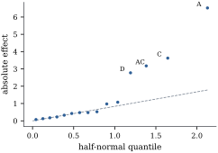

# Higher-way layouts

Nothing in the two-way analysis depended on there being two factors. With \( t \) crossed factors, all combinations observed equally often, the observation space splits into \( 2^t \) mutually orthogonal pieces plus error, one for each set of factors. This section proves that decomposition, interprets the interaction of three or more factors, specializes to two-level factorial designs, and ends with a warning about pooling "negligible" terms into error.

## The general balanced factorial

Let factors \( F_1,\dots,F_t \) have \( l_1,\dots,l_t\ge2 \) levels. Suppose all \( N=l_1\cdots l_t \) combinations are observed \( m\ge1 \) times each, so \( n=Nm \). Stack the observations with the replicate index fastest, then the level of \( F_t \), and so on, with \( F_1 \) slowest. For a subset \( S\subseteq\{1,\dots,t\} \), a *term*, define
\[
\begin{aligned}
\bP_S&=\mathbf{E}_1\otimes\dots\otimes\mathbf{E}_t\otimes\bar{\mathbf{J}}_m,\qquad \mathbf{E}_s=\begin{cases}\mathbf{C}_{l_s},&s\in S,\\ \bar{\mathbf{J}}_{l_s},&s\notin S,\end{cases}\\
\bP_E&=\I_{l_1}\otimes\dots\otimes\I_{l_t}\otimes\mathbf{C}_m ,
\end{aligned}
\]{#eq-tw-factorial-projections}

and the **marginal averaging operator**
\[
\A_S=\mathbf{G}_1\otimes\dots\otimes\mathbf{G}_t\otimes\bar{\mathbf{J}}_m,\qquad \mathbf{G}_s=\begin{cases}\I_{l_s},&s\in S,\\ \bar{\mathbf{J}}_{l_s},&s\notin S.\end{cases}
\]
The operator \( \A_S \) replaces each observation by the mean of all observations that share its levels of the factors in \( S \). For example, with three factors \( A,B,C \), \( \A_{\{A,C\}}\y \) has entries \( \bar{y}_{i\cdot k\cdot} \). Let \( \mathcal V_S \) be the set of vectors whose entries depend only on the levels of the factors in \( S \). It is the column space of the indicator matrix of the combinations of those factors. So \( \mathcal V_\emptyset=\spn(\bone) \), and \( \mathcal V_{\{1,\dots,t\}} \) is the space of the full cell-means model.

::: {#thm-tw-factorial}
[The balanced factorial decomposition]

In the setting above:

::: {.enumerate options="label=(\alph*)"}
1. The \( 2^t \) matrices \( \bP_S \) and \( \bP_E \) are mutually orthogonal projections that sum to \( \I \). Their ranks are \( r_S=\prod_{s\in S}(l_s-1) \) (with \( r_\emptyset=1 \)) and \( N(m-1) \).

2. \( \A_S \) is the orthogonal projection onto \( \mathcal V_S \), and \( \A_S=\sum_{T\subseteq S}\bP_T \). So \( \mathcal V_S=\bigoplus_{T\subseteq S}\C(\bP_T) \).

3. \( \bP_S=\sum_{T\subseteq S}(-1)^{|S|-|T|}\A_T \). Thus \( \bP_S\y \) is the alternating sum of the marginal means over the subsets of \( S \).

4. Let \( \mathcal H \) be a *hierarchical* family of terms: \( \emptyset\in\mathcal H \), and \( T\subseteq S\in\mathcal H \) implies \( T\in\mathcal H \). The model \( \E(\Y)\in\sum_{S\in\mathcal H}\mathcal V_S \), which contains the terms in \( \mathcal H \) and nothing else, has projection \( \sum_{S\in\mathcal H}\bP_S \). If terms are entered one at a time so that each term follows all of its subsets, the sequential sum of squares of term \( S \) is \( \norm{\bP_S\y}^2 \), whatever the order.

5. If \( \E(\Y)=\bmu\in\mathcal V_{\{1,\dots,t\}} \) and \( \Cov(\Y)=\sigma^2\I \), then \( \E\norm{\bP_S\Y}^2=\sigma^2r_S+\norm{\bP_S\bmu}^2 \). Under normality the \( \norm{\bP_S\Y}^2 \) and \( \text{SSE}=\norm{\bP_E\Y}^2 \) are independent. When \( m\ge2 \),
   \[
F_S=\frac{\norm{\bP_S\Y}^2/r_S}{\text{SSE}/(N(m-1))}\sim F\bigl(r_S,\ N(m-1),\ \norm{\bP_S\bmu}^2/\sigma^2\bigr).
\]
:::

:::

::: {.proof}
(a) By @lem-tw-kron(d) with \( t+1 \) factors, \( \I \) is the sum of the \( 2^{t+1} \) products with \( \bar{\mathbf{J}} \) or \( \mathbf{C} \) in each position. Those with \( \bar{\mathbf{J}}_m \) last are the \( \bP_S \). Those with \( \mathbf{C}_m \) last add up to \( \I\otimes\dots\otimes\I\otimes\mathbf{C}_m=\bP_E \). Orthogonality and ranks come from @lem-tw-kron(b) and (c).

(b) In each position \( s\in S \) write \( \I_{l_s}=\bar{\mathbf{J}}_{l_s}+\mathbf{C}_{l_s} \) and expand. This gives \( \A_S=\sum_{T\subseteq S}\bP_T \), a sum of orthogonal projections, hence a projection (@thm-proj-sum) onto \( \bigoplus_{T\subseteq S}\C(\bP_T) \). The entries of \( \A_S\y \) are means over sets of observations with the same levels of the factors in \( S \), so \( \C(\A_S)\subseteq\mathcal V_S \). Conversely, averaging a vector in \( \mathcal V_S \) over such a set leaves it unchanged, so \( \mathcal V_S\subseteq\C(\A_S) \).

(c) In each position \( s\in S \) write \( \mathbf{C}_{l_s}=\I_{l_s}-\bar{\mathbf{J}}_{l_s} \) and expand. Choosing \( \I \) in the positions of \( T\subseteq S \) and \( -\bar{\mathbf{J}} \) in the rest of \( S \) gives \( (-1)^{|S|-|T|}\A_T \).

(d) By (b), \( \sum_{S\in\mathcal H}\mathcal V_S=\sum_{S\in\mathcal H}\bigoplus_{T\subseteq S}\C(\bP_T) \). Every \( T \) appearing belongs to \( \mathcal H \), and every \( T\in\mathcal H \) appears (take \( S=T \)). So the model space is \( \bigoplus_{T\in\mathcal H}\C(\bP_T) \), with projection \( \sum_{T\in\mathcal H}\bP_T \) (@thm-proj-sum). If the terms enter in an order in which each follows its subsets, every intermediate model is hierarchical. Two consecutive models differ by one term \( S \), so their projections differ by \( \bP_S \) (@def-ss-sequential).

(e) The subspaces \( \C(\bP_S) \) form an analysis of variance decomposition of \( \mathcal V_{\{1,\dots,t\}} \) by (a) and (b). Apply @thm-ss-expected-mean-squares and @cor-ss-ms-distributions.
:::

With \( t=2 \) the theorem is @thm-tw-balanced, since \( \bP_{\{1\}}=\bP_A \), \( \bP_{\{2\}}=\bP_B \) and \( \bP_{\{1,2\}}=\bP_{AB} \). Part (c) gives the familiar formulas. For three factors \( A,B,C \) with levels indexed by \( i,j,k \) and replicates by \( r \), the three-factor term has entries
\[
(\bP_{ABC}\y)_{ijkr}=\bar{y}_{ijk\cdot}-\bar{y}_{ij\cdot\cdot}-\bar{y}_{i\cdot k\cdot}-\bar{y}_{\cdot jk\cdot}+\bar{y}_{i\cdot\cdot\cdot}+\bar{y}_{\cdot j\cdot\cdot}+\bar{y}_{\cdot\cdot k\cdot}-\bar{y}_{\cdot\cdot\cdot\cdot}.
\]
Part (d) explains why balanced factorials have one analysis of variance table and not several. The qualification "each term follows its subsets" matters: entering \( AB \) before \( A \) gives \( A \) nothing, because \( \mathcal V_A\subseteq\mathcal V_{AB} \) (@exr-tw-order-hierarchy). The listing builds the decomposition for a \( 2\times3\times4 \) layout with \( m=2 \) and checks the ranks of part (a). The script also checks parts (b), (c) and (d).

```{.python .run #cell-kron-projections-threeway}
import itertools

import numpy as np

def Jbar(k):
    return np.full((k, k), 1.0 / k)          # averaging: replaces a k-vector by its mean


def Cen(k):
    return np.eye(k) - Jbar(k)               # centring: subtracts the mean


def kron_all(mats):
    out = np.ones((1, 1))
    for A in mats:
        out = np.kron(out, A)
    return out


def factorial_projections(levels, m):
    """P_S for every subset S of the factors (a 0/1 tuple), and the error projection."""
    P = {}
    for S in itertools.product([0, 1], repeat=len(levels)):
        P[S] = kron_all([Cen(l) if s else Jbar(l) for l, s in zip(levels, S)] + [Jbar(m)])
    P["error"] = kron_all([np.eye(l) for l in levels] + [Cen(m)])
    return P


def rank(A):
    return int(round(np.trace(A)))           # rank = trace for a projection

levels, m3 = [2, 3, 4], 2
P3 = factorial_projections(levels, m3)
for S in P3:
    if S == "error":
        continue
    label = "".join(f for f, s in zip("ABC", S) if s) or "mean"
    print(f"{label:5s} rank {rank(P3[S]):2d}   predicted {int(np.prod([l - 1 for l, s in zip(levels, S) if s]))}")
print("error rank", rank(P3["error"]), "  n =", int(np.prod(levels)) * m3)
```

## Three-factor interaction

In a three-factor layout with cell means \( \mu_{ijk} \), the two-factor interaction of \( A \) and \( B \) can be computed separately at each level \( k \) of \( C \):
\[
\gamma^{(k)}_{ij}=\mu_{ijk}-\bar{\mu}_{i\cdot k}-\bar{\mu}_{\cdot jk}+\bar{\mu}_{\cdot\cdot k}.
\]
The \( AB \) interaction of the analysis of variance, the entries of \( \bP_{AB}\bmu \), is the average of these over \( k \). A three-factor interaction is present when they are not all the same.

::: {#prp-tw-three-factor}
[Three-factor interaction]

For the cell means \( \mu_{ijk} \) of a three-factor layout, the following are equivalent:

::: {.enumerate options="label=(\roman*)"}
1. \( \bP_{ABC}\bmu=\bzero \);

2. the \( AB \) interaction effects \( \gamma^{(k)}_{ij} \) at level \( k \) of \( C \) do not depend on \( k \);

3. every \( AB \) interaction contrast \( \sum_{i,j}d_{ij}\mu_{ijk} \) has the same value at every level \( k \) of \( C \);

4. statements (ii) and (iii) with the roles of the three factors permuted in any way;

5. \( \mu_{ijk}=f_{ij}+g_{ik}+h_{jk} \) for some numbers \( f_{ij} \), \( g_{ik} \), \( h_{jk} \).
:::

:::

::: {.proof}
It suffices to consider \( m=1 \), since the replicate factor \( \bar{\mathbf{J}}_m \) only repeats entries. Then \( \bP_{ABC}=\mathbf{C}_a\otimes\mathbf{C}_b\otimes\mathbf{C}_c=\mathbf{C}_a\otimes\mathbf{C}_b\otimes\I_c-\mathbf{C}_a\otimes\mathbf{C}_b\otimes\bar{\mathbf{J}}_c \). Applied to \( \bmu \), the first term produces \( \gamma^{(k)}_{ij} \) in position \( (i,j,k) \), because it centres over \( i \) and over \( j \) within each \( k \). The second produces the average of \( \gamma^{(k)}_{ij} \) over \( k \). So (i) holds iff \( \gamma^{(k)}_{ij} \) equals its average over \( k \) for all \( i,j,k \), which is (ii). By @prp-tw-interaction-equiv, \( \sum_{i,j}d_{ij}\mu_{ijk}=\sum_{i,j}d_{ij}\gamma^{(k)}_{ij} \) for every zero-margin table \( (d_{ij}) \). Since the tables \( \gamma^{(k)} \) themselves have zero margins, \( \gamma^{(k)}=\gamma^{(k')} \) iff their inner products with every zero-margin \( \mathbf{d} \) agree (take \( \mathbf{d}=\gamma^{(k)}-\gamma^{(k')} \)). This proves (ii)\( \Leftrightarrow \)(iii). Statement (i) is symmetric in the three factors, which gives (iv). Finally, the vectors of the form in (v) make up \( \mathcal V_{AB}+\mathcal V_{AC}+\mathcal V_{BC} \), the model space of the hierarchical family of all terms except \( ABC \). By @thm-tw-factorial(d) this is the orthogonal complement of \( \C(\bP_{ABC}) \) in the cell-means space, so \( \bmu \) lies in it iff \( \bP_{ABC}\bmu=\bzero \).
:::

So the three-factor interaction is an "interaction of interactions". It measures how much the pattern of \( AB \) interaction changes from one level of \( C \) to another, and by (iv) it measures the same thing whichever factor plays the role of \( C \). When it is present, the \( AB \) interaction in the table is an equal-weight average over the levels of \( C \), with all the caveats of [Section 16.2](02-interaction.html). Interpretation proceeds from the top down: examine the highest-order interactions clearly present, then read lower-order terms as averages or look at simple effects. Models are usually required to be hierarchical, because a model with \( AB \) but without \( A \) constrains the equal-weight average \( \bar{\mu}_{i\cdot\cdot} \), and so depends on an arbitrary choice of weights.

## Two-level factorial designs

When every factor has two levels, each \( \mathbf{C}_2 \) has rank one, and every term of @thm-tw-factorial has a single degree of freedom. Code the levels of each factor as \( -1 \) ("low") and \( +1 \) ("high"). For a nonempty term \( S \), let \( \x_S \) be the column whose entry for an observation is the product of the codes of the factors in \( S \). For example, \( \x_{AC} \) is \( +1 \) when \( A \) and \( C \) are at the same level and \( -1 \) otherwise. The **effect** of \( S \) is
\[
\hat{E}_S=\bar{y}(\x_S=+1)-\bar{y}(\x_S=-1),
\]
the mean response where \( \x_S \) is \( +1 \) minus the mean where it is \( -1 \). For a main effect this is the average change in response when the factor moves from low to high. For \( AC \) it is half the difference between the effect of \( C \) at high \( A \) and at low \( A \) (@exr-tw-simple-two-level).

::: {#prp-tw-two-level}
[Effects in a \( 2^t \) factorial]

In a \( 2^t \) factorial with \( m \) replicates, \( n=2^tm \), and a nonempty term \( S \):

::: {.enumerate options="label=(\alph*)"}
1. \( \bP_S=\x_S\x_S\T/n \). The columns \( \x_S \) are mutually orthogonal and orthogonal to \( \bone \).

2. \( \hat{E}_S=2\x_S\T\y/n \), and \( \Var(\hat{E}_S)=4\sigma^2/n \). Estimated effects of different terms are uncorrelated.

3. The sum of squares of \( S \) is \( \norm{\bP_S\y}^2=n\hat{E}_S^2/4 \).

4. In the regression of \( \y \) on \( \bone \) and all \( 2^t-1 \) columns \( \x_S \), the coefficient of \( \x_S \) is \( \hat{E}_S/2 \), and it is the same in every submodel that contains \( \x_S \).
:::

:::

::: {.proof}
(a) With \( \bu=(-1,1)\T \), \( \mathbf{C}_2=\tfrac12\bu\bu\T \) and \( \bar{\mathbf{J}}_2=\tfrac12\bone_2\bone_2\T \). By the mixed-product rule \( \bP_S=(2^tm)^{-1}\x\x\T \), where \( \x \) is the Kronecker product with \( \bu \) in the positions of \( S \), \( \bone_2 \) elsewhere, and \( \bone_m \) last. Its entries are the products of the codes of the factors in \( S \), so \( \x=\x_S \). Orthogonality follows from @thm-tw-factorial(a), since \( \x_S\in\C(\bP_S) \) and \( \bone\in\C(\bP_\emptyset) \).
(b) Since \( \x_S\perp\bone \), exactly \( n/2 \) entries are \( +1 \), so \( \x_S\T\y=\tfrac n2\bigl(\bar{y}(+)-\bar{y}(-)\bigr) \). Then \( \Var(\hat{E}_S)=(4/n^2)\sigma^2\norm{\x_S}^2=4\sigma^2/n \). Covariances are \( (4/n^2)\sigma^2\x_S\T\x_T=0 \).
(c) \( \norm{\bP_S\y}^2=(\x_S\T\y)^2/n=n\hat{E}_S^2/4 \).
(d) With orthogonal columns each coefficient is \( \x_S\T\y/\norm{\x_S}^2=\x_S\T\y/n \) and does not depend on the other columns (@prp-opt-orthogonal-design).
:::

::: {#exm-tw-seals}
[Heat seals: an unreplicated \( 2^4 \) design]

A packaging line makes heat seals on plastic film. Four factors were each set at two levels: \( A \), jaw temperature; \( B \), jaw pressure; \( C \), dwell time; \( D \), film gauge. One seal was made at each of the \( 16 \) combinations, in random order, and its peel strength was measured in newtons. The data are synthetic, generated by the script `two_level.py`. In standard order (\( A \) changing fastest), the strengths are

| run | 1 | 2 | 3 | 4 | 5 | 6 | 7 | 8 | 9 | 10 | 11 | 12 | 13 | 14 | 15 | 16 |
|---|---|---|---|---|---|---|---|---|---|---|---|---|---|---|---|---|
| \( A \) | − | + | − | + | − | + | − | + | − | + | − | + | − | + | − | + |
| \( B \) | − | − | + | + | − | − | + | + | − | − | + | + | − | − | + | + |
| \( C \) | − | − | − | − | + | + | + | + | − | − | − | − | + | + | + | + |
| \( D \) | − | − | − | − | − | − | − | − | + | + | + | + | + | + | + | + |
| \( y \) | 28.5 | 32.1 | 26.7 | 31.1 | 29.0 | 37.4 | 27.2 | 37.4 | 25.8 | 26.6 | 24.2 | 28.8 | 24.9 | 34.3 | 25.9 | 36.7 |

The mean is \( 29.79 \). The largest estimated effects are \( A \) (\( 6.52 \)), \( C \) (\( 3.62 \)), \( AC \) (\( 3.17 \)) and \( D \) (\( -2.78 \)). They are followed by \( BD \) (\( 1.08 \)) and \( AB \) (\( 0.98 \)), and none of the other nine exceeds \( 0.53 \) in absolute value. There is no pure error. The experimenters had decided *before the trial* to treat the five interactions of three or four factors as negligible and to use their sums of squares as error. That gives \( s^2=0.514 \) on \( 5 \) degrees of freedom. Against the critical value \( F_{0.05}(1,5)=6.61 \), the tests reject for \( A \), \( C \) and \( AC \) (\( F=331.0 \), \( 102.2 \), \( 78.4 \), each \( p<0.001 \)), for \( D \) (\( F=59.9 \), \( p=0.001 \)), and, nominally, for \( BD \) (\( p=0.030 \)) and \( AB \) (\( p=0.042 \)). The last two are among ten tests, however. Holm's procedure at familywise level \( 0.05 \) (@thm-mc-holm) accepts \( A \), \( C \), \( AC \) and \( D \) and stops at \( BD \), whose \( p \)-value exceeds \( 0.05/6 \). The data were in fact generated with exactly those four effects.

The interaction \( AC \) matters in practice. The effect of dwell time is \( \hat{E}_C+\hat{E}_{AC}=3.62+3.17=6.79 \) N at high temperature and \( \hat{E}_C-\hat{E}_{AC}=0.45 \) N at low temperature (@exr-tw-simple-two-level). Longer dwell helps only when the jaws are hot. [Figure 16.4.1](#fig-tw-half-normal) shows the half-normal plot of Daniel (1959): absolute effects against half-normal quantiles. Noise falls near a line through the origin and real effects stand out above it, with no estimate of \( \sigma \) needed.
:::

::: {when-format="html"}
{#fig-tw-half-normal width=58%}
:::

::: {when-format="pdf"}
{width=58%}
:::

```{.python .run #cell-two-level-design}
import itertools

import numpy as np
from scipy import stats

k = 4
runs = np.array(list(itertools.product([-1, 1], repeat=k)))[:, ::-1]   # standard order: A changes fastest
names = []
columns = []
for size in range(1, k + 1):
    for S in itertools.combinations(range(k), size):
        names.append("".join("ABCD"[i] for i in S))
        columns.append(np.prod(runs[:, list(S)], axis=1))
Xc = np.column_stack(columns)                   # 16 x 15 matrix of +-1 contrast columns
print("columns orthogonal:", np.allclose(Xc.T @ Xc, 16 * np.eye(15)))
```

```{.python .run #cell-two-level-effects}
true = 30 + 3.0 * runs[:, 0] + 2.0 * runs[:, 2] + 1.5 * runs[:, 0] * runs[:, 2] - 1.25 * runs[:, 3]
rng = np.random.default_rng(16_04)
y = np.round(true + rng.normal(scale=1.0, size=16), 1)
n = len(y)
effects = Xc.T @ y / (n / 2)                    # mean at + minus mean at -
ss = n * effects ** 2 / 4                       # one degree of freedom each
order = np.argsort(-np.abs(effects))
for i in order[:6]:
    print(f"{names[i]:4s} effect {effects[i]:6.2f}   SS {ss[i]:7.2f}")
high = [i for i, nm in enumerate(names) if len(nm) >= 3]   # ABC, ABD, ACD, BCD, ABCD
ss_pooled = ss[high].sum()
s2 = ss_pooled / len(high)
F = ss / s2
p = stats.f.sf(F, 1, len(high))
for i in order[:6]:
    print(f"{names[i]:4s} F = {F[i]:7.2f}  p = {p[i]:.3f}")
```

Two-level designs are economical: every main effect is estimated with the precision \( 4\sigma^2/n \) of the whole experiment, as if each factor had been studied alone with all \( n \) runs. With many factors, *fractional* factorials use a chosen subset of the \( 2^t \) runs and deliberately confound some effects with others. Box, Hunter and Hunter (2005) and Wu and Hamada (2009) develop that theory.

## Pooling and its dangers

In @exm-tw-seals the error was built from the sums of squares of terms assumed to be zero. This is **pooling**: replacing \( \text{SSE} \) by \( \text{SSE}+\sum_{T\in\mathcal Q}\norm{\bP_T\y}^2 \), with \( \nu_E+\sum_{T\in\mathcal Q}r_T \) degrees of freedom, for a set \( \mathcal Q \) of terms. Without replication it is the only source of an error term. The theory is simple when \( \mathcal Q \) is fixed in advance.

::: {#prp-tw-pooling}
[Pooling a fixed set of terms]

In the setting of @thm-tw-factorial(e) with normal errors, let \( \mathcal Q \) be a set of terms fixed before the data are seen. Let \( \nu \) be the pooled degrees of freedom and \( \text{MS}_{\text{pool}} \) the pooled mean square. Let \( S\notin\mathcal Q \) and \( F_S^{\text{pool}}=(\norm{\bP_S\Y}^2/r_S)/\text{MS}_{\text{pool}} \).

::: {.enumerate options="label=(\alph*)"}
1. \( \E\,\text{MS}_{\text{pool}}=\sigma^2+\nu^{-1}\sum_{T\in\mathcal Q}\norm{\bP_T\bmu}^2 \).

2. If \( \bP_T\bmu=\bzero \) for every \( T\in\mathcal Q \), then \( F_S^{\text{pool}}\sim F(r_S,\nu,\norm{\bP_S\bmu}^2/\sigma^2) \). The pooled test is exact and has more denominator degrees of freedom.

3. If \( \bP_S\bmu=\bzero \) but some pooled term is not null, then \( \Pr\{F_S^{\text{pool}}>F_\alpha(r_S,\nu)\}<\alpha \). The test is conservative, and its power is reduced for the same reason.
:::

:::

::: {.proof}
The matrix \( \bP_{\text{pool}}=\bP_E+\sum_{T\in\mathcal Q}\bP_T \) is a projection of rank \( \nu \), orthogonal to \( \bP_S \) (@thm-tw-factorial(a)). By @thm-qf-orthogonal-projections, \( U=\norm{\bP_S\Y}^2/\sigma^2 \) and \( V=\norm{\bP_{\text{pool}}\Y}^2/\sigma^2 \) are independent, with \( V\sim\chi^2(\nu,\delta) \) and \( \delta=\sum_{T\in\mathcal Q}\norm{\bP_T\bmu}^2/\sigma^2 \), because \( \bP_E\bmu=\bzero \). Part (a) is the mean \( \nu+\delta \) of \( V \), times \( \sigma^2/\nu \). If \( \delta=0 \), (b) is the definition of the \( F \) distribution. For (c), \( U\sim\chi^2(r_S) \), and with \( c=F_\alpha(r_S,\nu) \),
\[
\Pr\{F_S^{\text{pool}}>c\}=\E\Bigl[\Pr\Bigl\{V<\frac{\nu U}{r_Sc}\Bigm|U\Bigr\}\Bigr].
\]
By @prp-qf-ncchisq-monotone, \( \Pr\{\chi^2(\nu,\delta)<x\} \) is strictly smaller for \( \delta>0 \) than for \( \delta=0 \), for every \( x>0 \). Taking expectations gives a probability smaller than its value at \( \delta=0 \), which is \( \alpha \).
:::

The dangers come when the choice of \( \mathcal Q \) depends on the data. There are two common ways that happens.

*Pooling after a preliminary test.* A common rule pools an interaction into error if its own \( F \) test is not significant at a lenient level such as \( 0.25 \). Consider a \( 2\times3\times4 \) layout with \( m=2 \), so \( \nu_E=24 \) and \( r_{ABC}=6 \), and test a null main effect \( A \) at level \( 0.05 \) after this preliminary test of \( ABC \). By @thm-tw-factorial(e), \( \text{SS}_A \), \( \text{SS}_{ABC} \) and \( \text{SSE} \) are independent, with distributions \( \sigma^2\chi^2(1) \), \( \sigma^2\chi^2(6,\gamma_{ABC}) \) and \( \sigma^2\chi^2(24) \). So the rule can be simulated exactly by drawing these three variables ([Figure 16.4.2](#fig-tw-pooling)). When \( ABC \) is absent, the rule pools in \( 75\% \) of samples, precisely those with small \( \text{MS}_{ABC} \). The pooled denominator is biased downwards, and the test of \( A \) rejects a true null with probability \( 0.0551 \) instead of \( 0.05 \). When \( ABC \) is large the rule rarely pools, and the level returns to \( 0.05 \) (\( 0.0504 \) at \( \gamma_{ABC}=30 \)). Always pooling is very conservative there (\( 0.0064 \)), as @prp-tw-pooling(c) predicts. Here the damage is modest, but a preliminary test buys degrees of freedom with a size that is no longer what it claims to be (Bancroft 1944).

::: {when-format="html"}
{#fig-tw-pooling width=66%}
:::

::: {when-format="pdf"}
{width=66%}
:::

```{.python .run #cell-pooling-pretest}
import numpy as np
from scipy import stats

alpha, alpha_pre = 0.05, 0.25
df_A, df_ABC, df_E = 1, 6, 24

def rejection_rates(gamma, reps, rng):
    """Size of the level-0.05 test of A under three pooling rules, when A has no effect."""
    ssA = rng.chisquare(df_A, reps)
    ssABC = rng.noncentral_chisquare(df_ABC, gamma, reps) if gamma > 0 else rng.chisquare(df_ABC, reps)
    ssE = rng.chisquare(df_E, reps)
    never = ssA / (ssE / df_E) > stats.f.ppf(1 - alpha, df_A, df_E)
    pooled_F = ssA / ((ssE + ssABC) / (df_E + df_ABC))
    always = pooled_F > stats.f.ppf(1 - alpha, df_A, df_E + df_ABC)
    pool = ssABC / df_ABC / (ssE / df_E) <= stats.f.ppf(1 - alpha_pre, df_ABC, df_E)
    pretest = np.where(pool, always, never)
    return never.mean(), always.mean(), pretest.mean(), pool.mean()


rng = np.random.default_rng(20260919)
gammas = np.array([0, 2, 4, 6, 8, 10, 12, 16, 20, 25, 30])
rates = np.array([rejection_rates(g, 400_000, rng) for g in gammas])
for g, (nv, al, pt, pl) in zip(gammas, rates):
    print(f"gamma {g:3d}: never {nv:.4f}  always {al:.4f}  pre-test {pt:.4f}  (pooled in {pl:.2f})")
```

*Pooling the smallest effects.* The second temptation is much worse. In an unreplicated \( 2^t \) design one may look at the estimated effects, declare the smallest few to be "error", and test the rest against them. If no factor does anything, the \( 15 \) estimated effects of a \( 2^4 \) design are independent normal variables with a common variance (@prp-tw-two-level(b)). Pool the five smallest in absolute value and test the largest against them with the \( F(1,5) \) critical value. It is declared significant in a fraction \( 0.999 \) of null data sets (and so, of course, at least one effect is declared significant). The five smallest of fifteen normal variables are the bottom third of the noise, and a mean square built from them underestimates the variance by a factor of \( 11.5 \) on average. This is why the error terms in @exm-tw-seals were chosen before the data were seen, and why the half-normal plot and Lenth's (1989) robust standard error (@exr-tw-lenth) are the standard tools for unreplicated designs.

```{.python .run #cell-pooling-smallest}
rng2 = np.random.default_rng(16_0404)
reps = 200_000
effects = rng2.normal(size=(reps, 15))                        # 15 null effect estimates, common variance
sq = np.sort(effects ** 2, axis=1)
F_largest = sq[:, -1] / sq[:, :5].mean(axis=1)                # largest against the five smallest
size_largest = np.mean(F_largest > stats.f.ppf(1 - alpha, 1, 5))
pooled_ms = sq[:, :5].mean(axis=1)                           # the "error" mean square; true variance 1
underestimate = 1 / pooled_ms.mean()                          # factor by which it falls short on average
print(f"largest effect declared significant: {size_largest:.3f};"
      f"  pooled mean square averages {pooled_ms.mean():.3f}, an underestimate by a factor {underestimate:.1f}")
```

::: {.idea}
Pooling is safe when the pooled terms are chosen before the data are seen and are genuinely negligible. It is conservative when they are chosen in advance but are not negligible. It is invalid when they are chosen because they look small.
:::

## Exercises

### A. Check your understanding

::: {#exr-tw-three-way-df}
[A1]

List the terms and their degrees of freedom for a balanced \( 3\times2\times4 \) layout with \( m=2 \), and check that they add up to \( n-1 \).
:::

::: {#exr-tw-term-count}
[A2]

For \( t \) factors each with \( l \) levels, show that the number of terms involving exactly \( q \) factors is \( \binom tq \), each with \( (l-1)^q \) degrees of freedom, and that these add up to \( l^t-1 \).
:::

### B. Practice

::: {#exr-tw-order-hierarchy}
[B1]

In a balanced two-way layout, show that if \( AB \) (the cell indicators) is entered before \( A \), the sequential sum of squares of \( A \) is zero. What does that say about software output for models written in a non-hierarchical order?
:::

::: {#exr-tw-simple-two-level}
[B2]

In a \( 2^t \) factorial, show that the effect of \( C \) computed only from the runs with \( A \) at its high level is \( \hat{E}_C+\hat{E}_{AC} \), and at the low level it is \( \hat{E}_C-\hat{E}_{AC} \). Conclude that \( \hat{E}_{AC} \) is half the difference between the two simple effects of \( C \).
:::

::: {.solution}
Let \( \bar{y}_{a c} \) be the mean of the runs with codes \( a,c\in\{-1,1\} \) for \( A \) and \( C \), each averaging \( n/4 \) runs. Then \( \hat{E}_C=\tfrac12(\bar{y}_{1,1}+\bar{y}_{-1,1})-\tfrac12(\bar{y}_{1,-1}+\bar{y}_{-1,-1}) \), and, since \( \x_{AC}=+1 \) when the codes agree, \( \hat{E}_{AC}=\tfrac12(\bar{y}_{1,1}+\bar{y}_{-1,-1})-\tfrac12(\bar{y}_{1,-1}+\bar{y}_{-1,1}) \). Adding, \( \hat{E}_C+\hat{E}_{AC}=\bar{y}_{1,1}-\bar{y}_{1,-1} \), the effect of \( C \) at high \( A \). Subtracting gives \( \bar{y}_{-1,1}-\bar{y}_{-1,-1} \). Half the difference of the two is \( \hat{E}_{AC} \).
:::

::: {#exr-tw-three-factor-formula}
[B3]

Use @thm-tw-factorial(c) to derive the displayed formula for \( (\bP_{ABC}\y)_{ijkr} \). Write the analogous formula for \( (\bP_{AB}\y)_{ijkr} \) in a three-factor layout, and check that it does not involve \( k \).
:::

### C. Going deeper

::: {#exr-tw-lenth}
[C1]

In an unreplicated \( 2^t \) design, let \( \hat{E}_1,\dots,\hat{E}_K \) be the \( K=2^t-1 \) estimated effects. Lenth (1989) proposed \( s_0=1.5\,\text{median}\,|\hat{E}_S| \) and the *pseudo standard error* \( \text{PSE}=1.5\,\text{median}\{|\hat{E}_S|:|\hat{E}_S|<2.5s_0\} \). Show that if all effects are null and \( \tau^2=4\sigma^2/n \), then \( \text{median}|\hat{E}_S|\to0.6745\,\tau \) as \( K\to\infty \), so that \( s_0 \) estimates \( 1.01\,\tau \). Explain why the trimming at \( 2.5s_0 \) makes \( \text{PSE} \) insensitive to a few large active effects, and why that is the property pooling lacks.
:::

::: {.solution}
Under the null hypothesis the \( \hat{E}_S \) are independent \( \Normal(0,\tau^2) \) variables (@prp-tw-two-level(b)), so \( |\hat{E}_S| \) has the half-normal distribution with median \( \tau\,\Phi^{-1}(0.75)=0.6745\,\tau \). The sample median converges to it, and \( 1.5\times0.6745\approx1.01 \), so \( s_0\approx\tau \). The median is unaffected by a few large values. The trimmed median in \( \text{PSE} \) additionally removes effects that are large compared with the first estimate before re-estimating, so active effects enter neither estimate as long as they are few (*effect sparsity*). Pooling the smallest effects uses the bottom of the distribution only and so is biased downwards. The median of all effects is instead a consistent estimate of the scale when most effects are null.
:::
