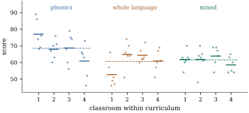

# Nested factors

So far every level of one factor has appeared with every level of the other. Many studies are built differently. Pupils are taught in classrooms, and each classroom follows one curriculum. Specimens are cut from batches, and each batch comes from one supplier. Classroom 3 under one curriculum has nothing to do with classroom 3 under another: the factors are *nested*, not crossed. This section gives the decomposition for balanced nested layouts, explains why a nested factor has no main effect, and shows why the right denominator for the outer factor depends on what the inner levels represent.

## Nested and crossed factors

::: {#def-tw-nested}
[Nested factors]

Factor \( B \) is **nested** in factor \( A \) if every level of \( B \) occurs together with exactly one level of \( A \). Factors \( A \) and \( B \) are **crossed** if every level of \( B \) occurs with every level of \( A \). A **balanced nested layout** has \( a \) levels of \( A \), \( b \) levels of \( B \) within each level of \( A \), and \( m \) observations at each level of \( B \). We write \( B(A) \) for the nested factor, index its levels within level \( i \) of \( A \) by \( j=1,\dots,b \), and write \( y_{ijk} \), \( k=1,\dots,m \).
:::

The labels \( j \) are local: \( (i,j) \) names a level of \( B \), but \( j \) alone names nothing. The model is
\[
\E(y_{ijk})=\mu+\alpha_i+\beta_{j(i)},\qquad \Cov(\Y)=\sigma^2\I ,
\]{#eq-tw-nested-model}

with \( 1+a+ab \) parameters. Every level of \( B \) has its own mean \( \mu_{ij}=\mu+\alpha_i+\beta_{j(i)} \), so the mean space is the set of vectors constant on each level of \( B \), of dimension \( ab \). This is the mean space of the crossed cell-means model @eq-tw-cell-means on an array of the same shape. Nesting changes not the space of possible means but which questions about them make sense. In a crossed layout, averaging over \( i \) at fixed \( j \) is meaningful. In a nested layout it is not, so there is no main effect of \( B \) and no \( AB \) interaction, only variation among the levels of \( B \) within each level of \( A \).

## The nested decomposition

With the observations stacked as in [Section 16.1](01-additive.html) (\( k \) fastest, then \( j \), then \( i \)), define
\[
\begin{aligned}
\bP_0&=\bar{\mathbf{J}}_a\otimes\bar{\mathbf{J}}_b\otimes\bar{\mathbf{J}}_m, &
\bP_A&=\mathbf{C}_a\otimes\bar{\mathbf{J}}_b\otimes\bar{\mathbf{J}}_m,\\
\bP_{B(A)}&=\I_a\otimes\mathbf{C}_b\otimes\bar{\mathbf{J}}_m, &
\bP_E&=\I_a\otimes\I_b\otimes\mathbf{C}_m .
\end{aligned}
\]{#eq-tw-nested-projections}

::: {#thm-tw-nested}
[The balanced nested layout]

Assume @eq-tw-nested-model for a balanced nested layout with \( a\ge2 \), \( b\ge2 \), \( m\ge2 \). Write \( \mu_{ij} \) for the mean of level \( (i,j) \) of \( B \) and \( \bar{\mu}_{i\cdot}=b^{-1}\sum_j\mu_{ij} \).

::: {.enumerate options="label=(\alph*)"}
1. The four matrices @eq-tw-nested-projections are mutually orthogonal projections summing to \( \I \), with ranks \( 1 \), \( a-1 \), \( a(b-1) \) and \( ab(m-1) \). The first three sum to the projection onto the mean space. Moreover \( \bP_{B(A)}=\bP_B+\bP_{AB} \), where \( \bP_B \) and \( \bP_{AB} \) are the projections @eq-tw-five-projections of the crossed layout of the same shape.

2. The sums of squares are
   \[
\text{SS}_A=bm\sum_i(\bar{y}_{i\cdot\cdot}-\bar{y}_{\cdot\cdot\cdot})^2,\qquad
\text{SS}_{B(A)}=m\sum_i\sum_j(\bar{y}_{ij\cdot}-\bar{y}_{i\cdot\cdot})^2,\qquad
\text{SSE}=\sum_{i,j,k}(y_{ijk}-\bar{y}_{ij\cdot})^2 .
\]
   So \( \text{SS}_{B(A)} \) is the sum over \( i \) of the between-levels sums of squares of \( B \) computed separately within each level of \( A \).

3. The function \( \lambda_0\mu+\sum_i\lambda_i\alpha_i+\sum_{i,j}\kappa_{ij}\beta_{j(i)} \) is estimable iff \( \lambda_i=\sum_j\kappa_{ij} \) for every \( i \) and \( \lambda_0=\sum_i\lambda_i \). In particular \( \beta_{j(i)}-\beta_{l(i)} \) is estimable, but \( \beta_{j(i)}-\beta_{l(k)} \) with \( i\ne k \) is not, and \( \alpha_i-\alpha_k \) is not, while \( \alpha_i-\alpha_k+\bar{\beta}_{\cdot(i)}-\bar{\beta}_{\cdot(k)}=\bar{\mu}_{i\cdot}-\bar{\mu}_{k\cdot} \) is.

4. The expected mean squares are
   \[
\E\,\text{MS}_A=\sigma^2+\frac{bm}{a-1}\sum_i(\bar{\mu}_{i\cdot}-\bar{\mu}_{\cdot\cdot})^2,\qquad
\E\,\text{MS}_{B(A)}=\sigma^2+\frac{m}{a(b-1)}\sum_{i,j}(\mu_{ij}-\bar{\mu}_{i\cdot})^2,\qquad
\E\,\text{MSE}=\sigma^2 .
\]
   Under normal errors the three sums of squares are independent, and \( F_A=\text{MS}_A/\text{MSE} \) and \( F_{B(A)}=\text{MS}_{B(A)}/\text{MSE} \) have noncentral \( F \) distributions with \( (a-1,ab(m-1)) \) and \( (a(b-1),ab(m-1)) \) degrees of freedom and noncentralities equal to \( \sigma^{-2} \) times the sums in the numerators above. So \( F_A \) is an exact test of \( \bar{\mu}_{1\cdot}=\dots=\bar{\mu}_{a\cdot} \), and \( F_{B(A)} \) of \( \mu_{ij}=\bar{\mu}_{i\cdot} \) for all \( i,j \).
:::

:::

::: {.proof}
(a) Ranks and symmetric idempotence follow from @lem-tw-kron(b). The mixed-product rule gives \( \bP_0\bP_A=\bzero \) (from \( \bar{\mathbf{J}}_a\mathbf{C}_a \)), \( \bP_0\bP_{B(A)}=\bP_A\bP_{B(A)}=\bzero \) (from \( \bar{\mathbf{J}}_b\mathbf{C}_b \)), and each of the first three is orthogonal to \( \bP_E \) (from \( \bar{\mathbf{J}}_m\mathbf{C}_m \)). Next, \( \bP_0+\bP_A=\I_a\otimes\bar{\mathbf{J}}_b\otimes\bar{\mathbf{J}}_m \), and adding \( \bP_{B(A)} \) gives \( \I_a\otimes\I_b\otimes\bar{\mathbf{J}}_m \), the projection onto the vectors constant on each level of \( B \), which is the mean space. Adding \( \bP_E \) gives \( \I \). Finally, \( \I_a\otimes\mathbf{C}_b\otimes\bar{\mathbf{J}}_m=(\bar{\mathbf{J}}_a+\mathbf{C}_a)\otimes\mathbf{C}_b\otimes\bar{\mathbf{J}}_m=\bP_B+\bP_{AB} \).

(b) \( \bP_{B(A)}=\I_a\otimes\I_b\otimes\bar{\mathbf{J}}_m-\I_a\otimes\bar{\mathbf{J}}_b\otimes\bar{\mathbf{J}}_m \) maps \( y_{ijk} \) to \( \bar{y}_{ij\cdot}-\bar{y}_{i\cdot\cdot} \). The other two are as in @thm-tw-balanced(b).

(c) By @thm-est-estimable-identifiable the estimable functions are the linear combinations \( \sum_{i,j}w_{ij}(\mu+\alpha_i+\beta_{j(i)}) \) of the expected responses. Such a combination has \( \kappa_{ij}=w_{ij} \), \( \lambda_i=\sum_jw_{ij} \) and \( \lambda_0=\sum_{i,j}w_{ij} \), which gives the conditions. Conversely, if they hold, \( w_{ij}=\kappa_{ij} \) reproduces the function. The three examples follow by checking the conditions. For \( \alpha_i-\alpha_k \) all \( \kappa \) are zero but \( \lambda_i=1\ne0 \).

(d) Apply @thm-ss-expected-mean-squares and @cor-ss-ms-distributions to the decomposition in (a). The vector \( \bP_A\bmu \) has entries \( \bar{\mu}_{i\cdot}-\bar{\mu}_{\cdot\cdot} \), repeated \( bm \) times, and \( \bP_{B(A)}\bmu \) has entries \( \mu_{ij}-\bar{\mu}_{i\cdot} \), repeated \( m \) times.
:::

Part (a) is the precise sense in which a nested factor "absorbs" the interaction. If nested data are analysed as though crossed, with the local labels \( j \) treated as real levels, the sums of squares for \( B \) and \( AB \) add up to \( \text{SS}_{B(A)} \), but each depends on the arbitrary labelling (@exr-tw-relabel). Part (c) is the nested analogue of @prp-est-interaction. The contrasts among the outer levels that can be estimated are contrasts among averages over their own inner levels.

More stages work the same way. With \( A \), \( B \) nested in \( A \), and \( C \) nested in \( B \), the projections are \( \mathbf{C}\otimes\bar{\mathbf{J}}\otimes\bar{\mathbf{J}}\otimes\bar{\mathbf{J}} \), \( \I\otimes\mathbf{C}\otimes\bar{\mathbf{J}}\otimes\bar{\mathbf{J}} \), \( \I\otimes\I\otimes\mathbf{C}\otimes\bar{\mathbf{J}} \) and the error \( \I\otimes\I\otimes\I\otimes\mathbf{C} \) (@exr-tw-three-stage). Each nested term has an identity matrix in the positions of the factors it is nested in and a centring matrix in its own position. The listing checks the identity of part (a) and the ranks for \( a=3 \), \( b=4 \), \( m=2 \).

```{.python .run #cell-kron-projections-nested}
import itertools

import numpy as np

def Jbar(k):
    return np.full((k, k), 1.0 / k)          # averaging: replaces a k-vector by its mean


def Cen(k):
    return np.eye(k) - Jbar(k)               # centring: subtracts the mean


def kron_all(mats):
    out = np.ones((1, 1))
    for A in mats:
        out = np.kron(out, A)
    return out


def factorial_projections(levels, m):
    """P_S for every subset S of the factors (a 0/1 tuple), and the error projection."""
    P = {}
    for S in itertools.product([0, 1], repeat=len(levels)):
        P[S] = kron_all([Cen(l) if s else Jbar(l) for l, s in zip(levels, S)] + [Jbar(m)])
    P["error"] = kron_all([np.eye(l) for l in levels] + [Cen(m)])
    return P


def rank(A):
    return int(round(np.trace(A)))           # rank = trace for a projection

a, b, m = 3, 4, 2
PB_in_A = kron_all([np.eye(a), Cen(b), Jbar(m)])        # B within A
P2 = factorial_projections([a, b], m)
print("B(A) = B + AB of the crossed layout:", np.allclose(PB_in_A, P2[(0, 1)] + P2[(1, 1)]))
print("rank of B(A):", rank(PB_in_A), " = a(b-1) =", a * (b - 1))
```

## What the inner levels represent

The tests of @thm-tw-nested(d) treat the levels of \( B \) as fixed. Then \( H_A \) says that the averages over *these particular* inner levels are equal, and the error is the variation within inner levels. That is right when the inner levels matter in themselves, such as three specific machines in each of two factories.

Often, though, the inner levels are a sample. The classrooms in a curriculum study stand for all classrooms that might follow that curriculum. Then the question about \( A \) concerns populations of inner levels, and the variation *between* inner levels is part of the noise against which \( A \) must be judged. A preview of Chapters 32 and 33 makes this precise. If the \( \beta_{j(i)} \) are independent \( \Normal(0,\sigma_B^2) \) variables, independent of normal errors, then \( \E\,\text{MS}_{B(A)}=\sigma^2+m\sigma_B^2 \), and \( \E\,\text{MS}_A \) has the same expression plus a term that vanishes under \( H_A \) (@exr-tw-random-classrooms). The ratio \( \text{MS}_A/\text{MS}_{B(A)} \) then has an exact \( F(a-1,a(b-1)) \) null distribution. The ratio \( \text{MS}_A/\text{MSE} \) does not, because its numerator is inflated by \( m\sigma_B^2 \) even when \( H_A \) is true. With \( a(b-1) \) denominator degrees of freedom instead of \( ab(m-1) \), the correct test is based, in effect, on the number of inner levels rather than the number of observations (@exr-tw-means-analysis).

::: {#exm-tw-classrooms}
[Curricula and classrooms]

Seventy-two pupils took the same reading test after a year in one of three reading curricula. Each curriculum was followed in four classrooms, with six pupils tested per classroom. The data are synthetic, generated by the script `nested_classrooms.py` with random classroom effects (standard deviation 4 points), pupil-level noise (standard deviation 8), and curriculum means differing by a few points. The classroom means are

| curriculum | classroom 1 | classroom 2 | classroom 3 | classroom 4 | mean |
|---|---|---|---|---|---|
| phonics | 77.0 | 67.8 | 68.7 | 60.8 | 68.6 |
| whole language | 52.7 | 64.8 | 64.3 | 60.8 | 60.7 |
| mixed | 61.8 | 61.8 | 63.8 | 58.5 | 61.5 |

and the nested analysis of variance is

| Source | df | Sum of squares | Mean square |
|---|---|---|---|
| curriculum | 2 | 908.3 | 454.2 |
| classroom(curriculum) | 9 | 1445.8 | 160.6 |
| pupils (error) | 60 | 3063.3 | 51.1 |

Classrooms within curricula differ: \( F_{B(A)}=3.15 \) on \( 9 \) and \( 60 \) degrees of freedom, \( p=0.004 \). For curricula, the fixed-effects test of @thm-tw-nested(d) gives \( F=8.90 \) on \( 2 \) and \( 60 \) degrees of freedom (\( p=0.0004 \)). It says, correctly, that these twelve classrooms differ between curricula on average. Against the classroom mean square the ratio is \( F=2.83 \) on \( 2 \) and \( 9 \) degrees of freedom (\( p=0.111 \)). For classrooms in general, no difference has been shown. [Figure 16.5.1](#fig-tw-classrooms) shows why: with only four classrooms per curriculum, the gap rests on a handful of classroom means. One phonics classroom (\( 77.0 \)) contributes much of it, and the lowest phonics classroom (\( 60.8 \)) sits among those of the other curricula.

The listing checks by simulation which test to trust. It generates \( 20000 \) data sets from the same design with random classroom effects and *no* curriculum effect. The test against pupils rejects at the nominal \( 5\% \) level in a fraction \( 0.289 \) of them, and the test against classrooms in a fraction \( 0.051 \). Under the null hypothesis the ratio of the two expected mean squares is \( (8^2+6\cdot4^2)/8^2=2.5 \).
:::

::: {when-format="html"}
{#fig-tw-classrooms width=90%}
:::

::: {when-format="pdf"}
{width=90%}
:::

```{.python .run #cell-nested-classrooms-nested}
import numpy as np
from scipy import stats

a, b, m = 3, 4, 6
data_rng = np.random.default_rng(16_05)
curriculum_effect = np.array([3.0, -2.0, 0.0])
classroom_effect = data_rng.normal(scale=4.0, size=(a, b))
scores = np.round(62 + curriculum_effect[:, None, None] + classroom_effect[:, :, None]
                  + data_rng.normal(scale=8.0, size=(a, b, m)))

def Jbar(k):
    return np.full((k, k), 1.0 / k)


def Cen(k):
    return np.eye(k) - Jbar(k)


y = scores.ravel()                                    # pupils fastest, then classroom, then curriculum
P = {"curriculum": np.kron(np.kron(Cen(a), Jbar(b)), Jbar(m)),
     "classroom(curriculum)": np.kron(np.kron(np.eye(a), Cen(b)), Jbar(m)),
     "error": np.kron(np.kron(np.eye(a), np.eye(b)), Cen(m))}
ss = {k: y @ Pk @ y for k, Pk in P.items()}
df = {k: int(round(np.trace(Pk))) for k, Pk in P.items()}
ms = {k: ss[k] / df[k] for k in P}
for k in P:
    print(f"{k:22s} df {df[k]:2d}  SS {ss[k]:8.1f}  MS {ms[k]:7.1f}")
F_cls = ms["classroom(curriculum)"] / ms["error"]
F_cur_fixed = ms["curriculum"] / ms["error"]
F_cur_random = ms["curriculum"] / ms["classroom(curriculum)"]
print(f"classrooms within curricula: F = {F_cls:.2f}, p = {stats.f.sf(F_cls, df['classroom(curriculum)'], df['error']):.3f}")
print(f"curricula against pupils:    F = {F_cur_fixed:.2f}, p = {stats.f.sf(F_cur_fixed, 2, df['error']):.3f}")
print(f"curricula against classrooms: F = {F_cur_random:.2f}, p = {stats.f.sf(F_cur_random, 2, df['classroom(curriculum)']):.3f}")
```

```{.python .run #cell-nested-classrooms-size}
rng = np.random.default_rng(20260919)
reps = 20_000
Pc, Pb, Pe = P["curriculum"], P["classroom(curriculum)"], P["error"]
rej_fixed = rej_random = 0
for _ in range(reps):
    sim = (rng.normal(scale=4.0, size=(a, b))[:, :, None] + rng.normal(scale=8.0, size=(a, b, m))).ravel()
    msc, msb, mse = sim @ Pc @ sim / 2, sim @ Pb @ sim / 9, sim @ Pe @ sim / 60
    rej_fixed += msc / mse > stats.f.ppf(0.95, 2, 60)
    rej_random += msc / msb > stats.f.ppf(0.95, 2, 9)
print(f"no curriculum effect, random classrooms: rejection rate {rej_fixed / reps:.3f} "
      f"against pupils, {rej_random / reps:.3f} against classrooms")
```

::: {.warning}
The mistake of testing an outer factor against the within-level error, when the inner levels are a sample, is common enough to have a name, *pseudoreplication* (Hurlbert 1984). The pupils are not independent replicates of a curriculum. The classrooms are. With a fixed number of pupils, adding classrooms improves the curriculum comparison much more than adding pupils per classroom.
:::

Nested and crossed structure are often combined, for example when every classroom is tested both before and after the year. The balanced decomposition is again a sum of Kronecker products, one for each meaningful term (@exr-tw-mixed-structure). Unbalanced nested data lose the Kronecker structure, and random inner levels lead to the mixed models of Chapters 32 and 33.

## Exercises

### A. Check your understanding

::: {#exr-tw-crossed-or-nested}
[A1]

Say whether each pair of factors is crossed or nested, and if nested, which is inside which. (a) Four fertilizers applied to plots of each of three wheat varieties. (b) Two suppliers, each delivering five batches, with several specimens tested from each batch. (c) Hospitals within regions, with patients within hospitals. (d) Three laboratories, each measuring portions of the same six reference samples.
:::

### B. Practice

::: {#exr-tw-relabel}
[B1]

In a balanced nested layout, permute the local labels \( j \) of \( B \) within one level \( i \) of \( A \), leaving the data unchanged. Show that \( \text{SS}_{B(A)} \) does not change, but that \( \text{SS}_B \) and \( \text{SS}_{AB} \) of the crossed analysis generally do. Conclude that only their sum has a meaning for nested data.
:::

::: {.solution}
\( \text{SS}_{B(A)}=m\sum_i\sum_j(\bar{y}_{ij\cdot}-\bar{y}_{i\cdot\cdot})^2 \) sums over \( j \) within each \( i \), so the order of the \( j \) within a level of \( A \) does not matter. \( \text{SS}_B=am\sum_j(\bar{y}_{\cdot j\cdot}-\bar{y}_{\cdot\cdot\cdot})^2 \) depends on which inner levels share a label \( j \) across different \( i \). For example, with \( a=b=2 \), \( m=1 \) and inner means \( (1,3) \) and \( (1,3) \), the column means are \( 1 \) and \( 3 \) and \( \text{SS}_B=4 \). Swapping the labels in the second row gives inner means \( (1,3) \) and \( (3,1) \), column means \( 2 \) and \( 2 \), and \( \text{SS}_B=0 \). By @thm-tw-nested(a), \( \text{SS}_B+\text{SS}_{AB}=\text{SS}_{B(A)} \) is unchanged, so the interaction absorbs the difference.
:::

::: {#exr-tw-means-analysis}
[B2]

Show that \( \text{MS}_A/\text{MS}_{B(A)} \) equals the one-way \( F \) statistic for \( A \) computed from the \( ab \) inner-level means \( \bar{y}_{ij\cdot} \), treated as \( b \) observations at each of the \( a \) levels. Interpret this as an analysis in which the inner level is the unit.
:::

::: {.solution}
Let \( z_{ij}=\bar{y}_{ij\cdot} \). The one-way analysis of the \( z_{ij} \) has between sum of squares \( b\sum_i(\bar{z}_{i\cdot}-\bar{z}_{\cdot\cdot})^2 \) on \( a-1 \) degrees of freedom and within sum of squares \( \sum_{i,j}(z_{ij}-\bar{z}_{i\cdot})^2 \) on \( a(b-1) \). Since \( \bar{z}_{i\cdot}=\bar{y}_{i\cdot\cdot} \), these are \( \text{SS}_A/m \) and \( \text{SS}_{B(A)}/m \) by @thm-tw-nested(b). The factor \( m \) cancels in the ratio of mean squares. So the test of \( A \) against \( B(A) \) is exactly the one-way analysis of variance of the inner-level means. The individual observations enter only through those means.
:::

::: {#exr-tw-three-stage}
[B3]

For a three-stage nested layout (\( a \) levels of \( A \), \( b \) levels of \( B \) in each, \( c \) levels of \( C \) in each level of \( B \), \( m \) observations at each level of \( C \)), verify that the four projections given in the text and \( \bP_0 \) are mutually orthogonal and sum to \( \I \), and find their ranks. Give the sum of squares for \( C(B) \) in terms of means.
:::

### C. Going deeper

::: {#exr-tw-random-classrooms}
[C1]

In the balanced nested layout of @thm-tw-nested, let \( y_{ijk}=\mu+\alpha_i+b_{ij}+\varepsilon_{ijk} \), where the \( b_{ij} \) and \( \varepsilon_{ijk} \) are uncorrelated random variables with means zero and variances \( \sigma_B^2 \) and \( \sigma^2 \). Show that \( \Cov(\Y)=\sigma^2\I+m\sigma_B^2(\I_a\otimes\I_b\otimes\bar{\mathbf{J}}_m) \), and use @thm-rv-quadform-mean to show that
\[
\E\,\text{MS}_A=\sigma^2+m\sigma_B^2+\frac{bm}{a-1}\sum_i(\alpha_i-\bar{\alpha})^2,\qquad \E\,\text{MS}_{B(A)}=\sigma^2+m\sigma_B^2 .
\]
Compare @exr-ss-random-oneway.
:::

::: {.solution}
The vector of \( b_{ij} \), each repeated \( m \) times, is \( (\I_a\otimes\I_b\otimes\bone_m)\mathbf{b} \), with covariance \( \sigma_B^2(\I_a\otimes\I_b\otimes\bone_m\bone_m\T)=m\sigma_B^2(\I_a\otimes\I_b\otimes\bar{\mathbf{J}}_m) \). Adding the error covariance gives \( \bSigma=\Cov(\Y) \). By @thm-rv-quadform-mean, \( \E(\Y\T\bP\Y)=\tr(\bP\bSigma)+\bmu\T\bP\bmu \). For \( \bP=\bP_A \): \( \bP_A(\I\otimes\I\otimes\bar{\mathbf{J}}_m)=\bP_A \), so \( \tr(\bP_A\bSigma)=(\sigma^2+m\sigma_B^2)(a-1) \), and \( \bmu\T\bP_A\bmu=bm\sum_i(\alpha_i-\bar{\alpha})^2 \). For \( \bP_{B(A)} \) likewise \( \tr=(\sigma^2+m\sigma_B^2)a(b-1) \), and \( \bP_{B(A)}\bmu=\bzero \) because the mean \( \mu+\alpha_i \) does not vary within levels of \( A \). Dividing by the degrees of freedom gives the result. Under \( H_A \) both mean squares have expectation \( \sigma^2+m\sigma_B^2 \), which is why the ratio \( \text{MS}_A/\text{MS}_{B(A)} \) is the natural test statistic.
:::

::: {#exr-tw-mixed-structure}
[C2]

Suppose each classroom of @exm-tw-classrooms is tested on two occasions (factor \( C \), crossed with classroom), with \( m \) pupils per classroom and occasion. Order the observations by curriculum, classroom, occasion and replicate. Write the Kronecker projections for the terms \( A \), \( B(A) \), \( C \), \( AC \), \( C\times B(A) \) and error, check that they are mutually orthogonal and sum to \( \I \), and find their ranks.
:::
