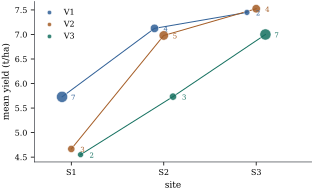

# The cell-means model

With several factors the observations fall into *cells*, one for each combination of levels.
The effects model of [Chapter 8](../ch08-estimability/index.html) writes the mean of a cell as
\( \mu+\alpha_i+\beta_j+\gamma_{ij} \) and pays for it with side conditions and codings. The cell-means
model gives each cell its own parameter and nothing else. It fits the same values as the effects model with
all interactions, but every question about the factors becomes a statement about a table of means, and the
counts enter only through the precision with which that table is estimated.

## The model

::: {#def-ub-cell-means}
[Cell-means model]

Let factors \( F_1,\dots,F_k \) have \( a_1,\dots,a_k \) levels. A **cell** is a combination
\( \omega=(i_1,\dots,i_k) \) of levels, and there are \( p=a_1a_2\cdots a_k \) cells. Cell \( \omega \) contains
\( n_\omega\ge0 \) observations \( y_{\omega1},\dots,y_{\omega n_\omega} \). It is **occupied** if
\( n_\omega\ge1 \) and **empty** otherwise. Write \( O \) for the set of occupied cells, \( m=|O| \) and
\( n=\sum_\omega n_\omega \). The **cell-means model** is
\[
y_{\omega l}=\mu_\omega+\varepsilon_{\omega l},\qquad l=1,\dots,n_\omega,
\]
with errors that are uncorrelated with mean zero and variance \( \sigma^2 \), and independent
\( \Normal(0,\sigma^2) \) when we test. In matrix form \( \E(\Y)=\W\bmu \), where \( \bmu\in\Real^p \) collects the
cell means and \( \W \) is the \( n\times p \) matrix whose column \( \omega \) indicates the observations in
cell \( \omega \). We write \( \bD=\W\T\W=\diag(n_\omega) \), and \( \bar{y}_\omega \) for the average of an
occupied cell.
:::

Empty cells keep their entries in \( \bmu \): their means do not enter the distribution of the data, but they
are properties of the population ([Section 17.4](04-empty-cells.html)). In two-factor notation, cells are pairs \( (i,j) \), counts are
\( n_{ij} \), and we order the cells row by row: \( \bmu=(\mu_{11},\dots,\mu_{1b},\mu_{21},\dots,\mu_{ab})\T \).
With this ordering, a Kronecker product \( \mathbf{P}\otimes\mathbf{Q} \) acts on \( \bmu \) by transforming the
\( a\times b \) table \( (\mu_{ij}) \) into \( \mathbf{P}(\mu_{ij})\mathbf{Q}\T \) (@prp-mat-kronecker(f) applied to the
transposed table).

By @prp-est-interaction(a), the overparameterized two-way model with interaction has column space
\( \C(\W) \), so the cell-means model is its identifiable parameterization. It is also a one-way layout (@def-aov-oneway) whose groups are the \( m \) occupied cells. The factorial structure plays no part in fitting.

::: {#prp-ub-cell-means}
[Inference with cell means]

In the model of @def-ub-cell-means, let \( \bD^{+} \) be the diagonal matrix with entries \( 1/n_\omega \) for
occupied cells and \( 0 \) for empty ones, and let \( \bar{\y}\in\Real^p \) hold \( \bar{y}_\omega \) for occupied
cells and \( 0 \) for empty ones. Then:

::: {.enumerate options="label=(\alph*)"}
1. \( \rank(\W)=m \), and \( \M=\W\bD^{+}\W\T \) replaces each observation by the average of its cell;

2. \( \blambda\T\bmu \) is estimable iff \( \lambda_\omega=0 \) for every empty cell. Its best linear unbiased
   estimator is \( \blambda\T\bar{\y}=\sum_{\omega\in O}\lambda_\omega\bar{y}_\omega \), with variance
   \( \sigma^2\sum_{\omega\in O}\lambda_\omega^2/n_\omega \);

3. \( \text{SSE}=\sum_{\omega\in O}\sum_l(y_{\omega l}-\bar{y}_\omega)^2 \) has \( n-m \) degrees of freedom,
   and \( s^2=\text{SSE}/(n-m) \), the pooled within-cell variance, is unbiased for \( \sigma^2 \);

4. if \( \bL \) is a \( q\times p \) matrix of rank \( q \) whose rows vanish on the empty cells, \( \mathbf{d}\in\Real^q \),
   and \( n>m \), the \( F \) statistic for \( H:\bL\bmu=\mathbf{d} \) is
   \[
F=\frac{(\bL\bar{\y}-\mathbf{d})\T(\bL\bD^{+}\bL\T)^{-1}(\bL\bar{\y}-\mathbf{d})}{q\,s^2}
   \sim F(q,\,n-m,\,\gamma_H),
\]{#eq-ub-cell-f}

   where \( \gamma_H=(\bL\bmu-\mathbf{d})\T(\bL\bD^{+}\bL\T)^{-1}(\bL\bmu-\mathbf{d})/\sigma^2 \).

:::

:::

::: {.proof}
(a) The columns of \( \W \) for occupied cells are nonzero indicators with disjoint supports, and those
for empty cells are zero. So \( \rank(\W)=m \). Since \( \bD\bD^{+}\bD=\bD \), \( \bD^{+} \) is a generalized
inverse of \( \W\T\W \), and \( \M=\W\bD^{+}\W\T \) by @thm-proj-M-formula. The entry of \( \W\bD^{+}\W\T\y \)
for an observation in cell \( \omega \) is \( n_\omega^{-1}\sum_ly_{\omega l}=\bar{y}_\omega \).

(b) The rows of \( \W \) are the coordinate vectors \( \mathbf{e}_\omega\T \) of the occupied cells, so
\( \C(\W\T)=\spn\{\mathbf{e}_\omega:\omega\in O\} \), and @thm-est-characterization gives the criterion.
The vector \( \bD^{+}\W\T\y=\bar{\y} \) solves the normal equations (@thm-proj-normal-equations), so \( \blambda\T\bar{\y} \) is the least
squares estimator of an estimable \( \blambda\T\bmu \), and it is best linear unbiased by the Gauss–Markov
theorem (@thm-opt-gauss-markov). The cell averages are uncorrelated with variances \( \sigma^2/n_\omega \),
which gives the variance.

(c) \( \text{SSE}=\norm{(\I-\M)\y}^2 \) is the displayed sum by (a), and
\( \E(\text{SSE})=\sigma^2\tr(\I-\M)=\sigma^2(n-m) \) by @thm-rv-quadform-mean, since
\( (\I-\M)\W\bmu=\bzero \).

(d) Apply @thm-glh-general-f with \( \G=\bD^{+} \), \( \hbeta=\bar{\y} \) and \( \bLambda\T=\bL \), which is
testable by (b). The matrix \( \bL\bD^{+}\bL\T \) is nonsingular: for \( \mathbf{x}\neq\bzero \),
\( \mathbf{x}\T\bL\bD^{+}\bL\T\mathbf{x}=\sum_{\omega\in O}(\bL\T\mathbf{x})_\omega^2/n_\omega \). If this were zero, \( \bL\T\mathbf{x} \)
would vanish on \( O \), and hence everywhere, because the rows of \( \bL \) vanish off \( O \). That
contradicts \( \rank(\bL)=q \).
:::

The counts enter only through \( \bD^{+} \), the variances of the cell averages. An unbalanced cell-means
analysis has one fitting step, averaging within cells, and one inferential tool, @eq-ub-cell-f. The work lies
in choosing \( \bL \).

## Standard hypotheses as Kronecker products

Let every cell of a two-way layout be occupied. Let \( \mathbf{C}_a \) be an \( a\times(a-1) \) matrix whose columns form a
basis of the contrasts \( \{\mathbf{u}\in\Real^a:\bone\T\mathbf{u}=0\} \), and define \( \mathbf{C}_b \) in the same way. These are
coding matrices in the sense of @def-est-coding. The \( a\times a \) centring matrix of
[Chapter 16](../ch16-multiway-layouts/index.html) has the same column space, but its columns are linearly dependent, so we keep the
thinner matrix here and count restrictions by its columns. The three classical hypotheses are
\[
H_A:\ \bigl(\mathbf{C}_a\T\otimes b^{-1}\bone_b\T\bigr)\bmu=\bzero,\qquad
H_B:\ \bigl(a^{-1}\bone_a\T\otimes\mathbf{C}_b\T\bigr)\bmu=\bzero,\qquad
H_{AB}:\ \bigl(\mathbf{C}_a\T\otimes\mathbf{C}_b\T\bigr)\bmu=\bzero .
\]{#eq-ub-kronecker-hypotheses}

By the remark on Kronecker products above, \( H_A \) says that \( \mathbf{C}_a\T \) annihilates the vector of
**unweighted row means** \( \bar{\mu}_{i\cdot}=b^{-1}\sum_j\mu_{ij} \), that is, that these means are all
equal. \( H_B \) says the same of the unweighted column means. \( H_{AB} \) says that
\( \mathbf{C}_a\T(\mu_{ij})\mathbf{C}_b=\bzero \). Because \( \C(\mathbf{C}_a)=\bone_a\perpc \) and \( \C(\mathbf{C}_b)=\bone_b\perpc \), this holds iff the doubly
centred table \( \mu_{ij}-\bar{\mu}_{i\cdot}-\bar{\mu}_{\cdot j}+\bar{\mu}_{\cdot\cdot} \) vanishes, that is, iff the
cell means are additive (@def-tw-interaction). The ranks are \( a-1 \), \( b-1 \) and \( (a-1)(b-1) \) (@prp-mat-kronecker(c)), and the hypotheses do not depend on the basis of contrasts (@exr-ub-contrast-basis).
They are the hypotheses tested in the balanced layout by @thm-tw-balanced, where every type of sum of squares
tests them.

## Weighted and unweighted marginal means

A row of the table can be summarized by any average of its cells. Two choices dominate practice. The
**weighted row mean** \( \bar{\mu}^w_i=n_{i\cdot}^{-1}\sum_jn_{ij}\mu_{ij} \) weights each cell by its count. Its
natural estimator is the raw average \( \bar{y}_{i\cdot\cdot} \) of all observations in row \( i \). The
**unweighted row mean** \( \bar{\mu}_{i\cdot} \) gives each column the same weight. Its estimator is the
average of the cell averages, \( \tilde{y}_{i}=b^{-1}\sum_j\bar{y}_{ij} \). More generally, one may fix
weights \( w_1,\dots,w_b \) summing to one, such as the shares of the levels of \( B \) in a target population,
and estimate \( \sum_jw_j\mu_{ij} \).

::: {#prp-ub-marginal-means}
[Precision of marginal means]

Fix a row \( i \) with all \( n_{ij}\ge1 \), and weights \( w_1,\dots,w_b \) with \( \sum_jw_j=1 \). The estimator
\( \sum_jw_j\bar{y}_{ij} \) of \( \sum_jw_j\mu_{ij} \) is unbiased with variance \( \sigma^2\sum_jw_j^2/n_{ij} \). Among all
such weights the variance is smallest, and equal to \( \sigma^2/n_{i\cdot} \), exactly for the count weights
\( w_j=n_{ij}/n_{i\cdot} \). In particular
\[
\Var(\tilde{y}_i)=\frac{\sigma^2}{b^2}\sum_j\frac1{n_{ij}}\ \ge\ \frac{\sigma^2}{n_{i\cdot}}=\Var(\bar{y}_{i\cdot\cdot}),
\]
with equality iff the counts \( n_{i1},\dots,n_{ib} \) are equal.
:::

::: {.proof}
Unbiasedness and the variance come from @prp-ub-cell-means(b). By the Cauchy–Schwarz inequality,
\[
1=\Bigl(\sum_j\frac{w_j}{\sqrt{n_{ij}}}\sqrt{n_{ij}}\Bigr)^2\le\Bigl(\sum_j\frac{w_j^2}{n_{ij}}\Bigr)\,n_{i\cdot},
\]
with equality iff \( w_j/\sqrt{n_{ij}} \) is proportional to \( \sqrt{n_{ij}} \), that is, \( w_j\propto n_{ij} \). The
unweighted mean is the case \( w_j=1/b \), which is proportional to \( n_{ij} \) iff the counts are equal.
:::

The count weights are the most *precise*, but precision is the wrong criterion for choosing a target.
The weighted mean \( \bar{\mu}^w_i \) is the mean of row \( i \) with the levels of \( B \) mixed as they happened to be
mixed in this study. If the counts are an accident of the design, such as lost plots, that mixture describes
nothing. If they are proportional to a real population, as in a random sample, \( \bar{\mu}^w_i \) may be exactly the
target. When the rows have different mixes, comparing weighted means also compares mixes of \( B \), and that is
what the Type I sum of squares of a factor entered first tests ([Section 17.2](02-types-of-sums-of-squares.html)).
Choose the weights to describe a population, and accept the variance that follows.

## An unbalanced field trial

::: {#exm-ub-variety-trial}
[Three varieties at three sites]

A (synthetic) trial compared three wheat varieties V1, V2 and V3 at three sites S1, S2 and S3, with yield
in tonnes per hectare. Each site grew mostly the variety it already knew. There are
\( 37 \) plots in the \( m=9 \) cells:

| | S1 | S2 | S3 | all sites |
|---|---|---|---|---|
| V1 | 7 plots, 5.73 | 4, 7.12 | 2, 7.45 | 13, 6.423 |
| V2 | 3, 4.67 | 5, 6.98 | 4, 7.53 | 12, 6.583 |
| V3 | 2, 4.55 | 3, 5.73 | 7, 7.00 | 12, 6.275 |

The last column gives each variety's raw average, the estimate of its weighted mean \( \bar{\mu}^w_i \). The pooled
within-cell variance is \( s^2=0.3136 \) on \( n-m=28 \) degrees of freedom, so the standard errors of the cell
averages range from \( 0.212 \) (seven plots) to \( 0.396 \) (two plots).

[Figure 17.1.1](#fig-ub-cell-means) shows the table. V1 is the best variety at S1 and S2 and nearly ties with V2
at S3, yet its raw average, \( 6.423 \), is below that of V2, \( 6.583 \), because V1 was grown mostly at the poorest
site. The unweighted means
\( 6.768 \), \( 6.391 \) and \( 5.761 \) compare the varieties over the same three sites, and V1 comes first. Their
standard errors, \( 0.176 \), \( 0.165 \) and \( 0.184 \), exceed those of the raw averages (\( 0.155 \), \( 0.162 \) and
\( 0.162 \)), as @prp-ub-marginal-means requires. For V1 the ratio depends only on the counts:
\( \sqrt{13\,(1/7+1/4+1/2)}/3=\sqrt{11.607}/3\approx1.136 \).

The tests @eq-ub-kronecker-hypotheses, computed with @eq-ub-cell-f, give \( F=7.90 \) on \( 2 \) and \( 28 \)
degrees of freedom for equal unweighted variety means (\( p=0.0019 \)), \( F=44.06 \) for equal unweighted site
means, and \( F=1.71 \) on \( 4 \) and \( 28 \) degrees of freedom for additivity (\( p=0.1755 \)). The difference
between V1 and V2, averaged over sites without weights, is estimated as \( 0.377 \) with standard error
\( 0.242 \). With \( t_{28,0.025}=2.048 \), the 95% interval is from \( -0.12 \) to \( 0.87 \). The raw
averages give a difference of \( -0.160 \), with the opposite sign.
:::

::: {when-format="html"}
{#fig-ub-cell-means width=70%}
:::

::: {when-format="pdf"}
{width=70%}
:::

```{.python .run #cell-cell-means-data}
import numpy as np
import pandas as pd
from scipy import stats
counts = np.array([[7, 4, 2],        # rows: varieties V1-V3; columns: sites S1-S3
                   [3, 5, 4],
                   [2, 3, 7]])
true_means = np.array([[5.8, 7.2, 7.6],
                       [5.0, 6.5, 7.5],
                       [4.4, 5.9, 7.2]])
rng = np.random.default_rng(20172)
rows = [(f"V{i + 1}", f"S{j + 1}", round(true_means[i, j] + rng.normal(0, 0.5), 1))
        for i in range(3) for j in range(3) for _ in range(counts[i, j])]
trial = pd.DataFrame(rows, columns=["variety", "site", "y"])
```

```{.python .run #cell-cell-means-cellmeans}
cells = trial.groupby(["variety", "site"])["y"]
ybar = cells.mean().unstack().to_numpy()             # 3 x 3 table of cell means
n_ij = cells.size().unstack().to_numpy()
n, m = n_ij.sum(), (n_ij > 0).sum()
sse = ((trial["y"] - cells.transform("mean")) ** 2).sum()
s2 = sse / (n - m)                                   # pooled within-cell variance
se_cell = np.sqrt(s2 / n_ij)
weighted_rows = (n_ij * ybar).sum(axis=1) / n_ij.sum(axis=1)   # = raw variety averages
unweighted_rows = ybar.mean(axis=1)
se_weighted = np.sqrt(s2 / n_ij.sum(axis=1))
se_unweighted = np.sqrt(s2 * (1 / n_ij).sum(axis=1)) / 3
print(np.round(ybar, 3))
print("weighted  :", weighted_rows.round(3), " se", se_weighted.round(3))
print("unweighted:", unweighted_rows.round(3), " se", se_unweighted.round(3))
```

```{.python .run #cell-cell-means-hypotheses}
def hypothesis_test(L, ybar, n_ij, s2, dfe):
    """F test of L mu = 0 in the cell-means model, all cells occupied (cells in row-major order)."""
    u = L @ ybar.ravel()
    ss = u @ np.linalg.solve(L @ np.diag(1 / n_ij.ravel()) @ L.T, u)
    q = np.linalg.matrix_rank(L)
    F = ss / q / s2
    return ss, q, F, stats.f.sf(F, q, dfe)

C3 = np.array([[1.0, 0.0], [0.0, 1.0], [-1.0, -1.0]])   # any 3 x 2 matrix of contrasts will do
avg3 = np.ones((1, 3)) / 3
L_A = np.kron(C3.T, avg3)                # unweighted variety means equal
L_B = np.kron(avg3, C3.T)                # unweighted site means equal
L_AB = np.kron(C3.T, C3.T)               # all interaction contrasts zero
for name, L in [("variety", L_A), ("site", L_B), ("interaction", L_AB)]:
    ss, q, F, p = hypothesis_test(L, ybar, n_ij, s2, n - m)
    print(f"{name:12s} SS = {ss:6.3f}  df = {q}  F = {F:6.2f}  p = {p:.4f}")
```

The script also checks that the variety sum of squares \( 4.958 \) is the increase in residual sum of squares
when the cell means are fitted subject to \( H_A \) (@thm-glh-general-f(b)), and that a Helmert-type contrast
matrix gives the same test. With one factor, counts only decide which contrasts split the between-groups sum of
squares orthogonally (@thm-aov-orthogonal-contrasts). With several they decide which hypotheses the printed sums
of squares address.

## Exercises

### A. Check your understanding

::: {#exr-ub-count-df}
[A1]

A \( 2\times3 \) layout has counts \( n_{11}=4 \), \( n_{12}=0 \), \( n_{13}=2 \), \( n_{21}=3 \), \( n_{22}=5 \),
\( n_{23}=1 \). Give \( m \), \( n \), the rank of \( \W \) and the error degrees of freedom of the cell-means
model. Which of \( \mu_{11}-\mu_{21} \), \( \bar{\mu}_{1\cdot}-\bar{\mu}_{2\cdot} \) and
\( (\mu_{11}+\mu_{13})/2-(\mu_{21}+\mu_{23})/2 \) are estimable?
:::

::: {#exr-ub-se-ratio}
[A2]

In @exm-ub-variety-trial, compute from the counts alone the ratio of the standard errors of the
unweighted and weighted means of V3, and check it against the quoted standard errors.
:::

### B. Practice

::: {#exr-ub-oneway-view}
[B1]

Show that the \( F \) statistic of @eq-ub-cell-f for a single contrast \( \blambda\T\bmu \) with all cells occupied
is the one-way contrast statistic of @prp-aov-contrast-ss, applied to the one-way layout whose groups are
the cells. Which \( t \) statistic is it the square of, and what is its distribution under the hypothesis?
:::

::: {.solution}
With \( q=1 \), \( \bL=\blambda\T \) and \( \mathbf{d}=0 \), @eq-ub-cell-f is
\( F=(\sum_\omega\lambda_\omega\bar{y}_\omega)^2/(s^2\sum_\omega\lambda_\omega^2/n_\omega) \). This is the
contrast sum of squares \( (\sum\lambda_\omega\bar{y}_\omega)^2/\sum(\lambda_\omega^2/n_\omega) \) of the one-way layout
with groups \( \omega \), divided by the one-way error mean square, which is the pooled within-cell variance. Its
signed root is \( t=\blambda\T\bar{\y}/(s\sqrt{\sum\lambda_\omega^2/n_\omega}) \), which has a \( t(n-m) \) distribution
under the hypothesis. The factorial labels of the cells play no role.
:::

::: {#exr-ub-contrast-basis}
[B2]

Let \( \mathbf{C}_a \) and \( \mathbf{C}_a' \) be two \( a\times(a-1) \) matrices whose columns are bases of
\( \bone_a\perpc \). Show that \( \mathbf{C}_a'=\mathbf{C}_a\mathbf{T} \) for a nonsingular \( \mathbf{T} \), and deduce that the
hypotheses \( H_A \) and \( H_{AB} \) of @eq-ub-kronecker-hypotheses, and their \( F \) statistics, are the same for
both.
:::

::: {.solution}
Both column spaces equal \( \bone_a\perpc \), so each column of \( \mathbf{C}_a' \) is a combination of the columns of
\( \mathbf{C}_a \): \( \mathbf{C}_a'=\mathbf{C}_a\mathbf{T} \). The rank of \( \mathbf{C}_a' \) is \( a-1 \), so \( \mathbf{T} \) is nonsingular. By
@prp-mat-kronecker(a),
\( (\mathbf{C}_a')\T\otimes\mathbf{v}\T=(\mathbf{T}\T\otimes1)(\mathbf{C}_a\T\otimes\mathbf{v}\T) \) for any row vector \( \mathbf{v}\T \), and similarly for
\( (\mathbf{C}_a')\T\otimes\mathbf{C}_b\T \). So the new hypothesis matrix is \( \mathbf{S}\bL \) with \( \mathbf{S} \) nonsingular. Then
\( \mathbf{S}\bL\bmu=\bzero \) iff \( \bL\bmu=\bzero \). In @eq-ub-cell-f,
\[
(\mathbf{S}\bL\bar{\y})\T(\mathbf{S}\bL\bD^{+}\bL\T\mathbf{S}\T)^{-1}\mathbf{S}\bL\bar{\y}=(\bL\bar{\y})\T(\bL\bD^{+}\bL\T)^{-1}\bL\bar{\y} .
\]

:::

::: {#exr-ub-population-weights}
[B3]

In @exm-ub-variety-trial, suppose that sites like S1, S2 and S3 make up \( 50\% \), \( 30\% \) and \( 20\% \) of the region
where the varieties would be grown. Write down the estimate of the region-weighted mean yield of V1 and its
standard error, and do the same for the region-weighted difference between V1 and V3. Compute them with the
listing. Which of the three kinds of marginal mean in this section would you report to a grower in the region?
:::

### C. Going deeper

::: {#exr-ub-allocation}
[C1]

A row of a two-way layout will receive \( N \) observations, to be allocated as \( n_{i1},\dots,n_{ib} \), with the aim of
estimating \( \sum_jw_j\mu_{ij} \) for fixed weights \( w_j>0 \) summing to one. Treating the \( n_{ij} \) as real numbers,
show that the variance of \( \sum_jw_j\bar{y}_{ij} \) is minimized by \( n_{ij}=Nw_j \), with minimum \( \sigma^2/N \).
What does this say about how the counts should relate to the target of inference?
:::

::: {.solution}
Minimize \( \sum_jw_j^2/n_{ij} \) subject to \( \sum_jn_{ij}=N \). By Cauchy–Schwarz,
\( 1=(\sum_jw_j)^2=\bigl(\sum_j(w_j/\sqrt{n_{ij}})\sqrt{n_{ij}}\bigr)^2\le N\sum_jw_j^2/n_{ij} \), with equality iff
\( n_{ij}\propto w_j \), that is, \( n_{ij}=Nw_j \). So the variance is at least \( \sigma^2/N \), with equality exactly
there. When the counts are proportional to the weights of the target, the target is estimated by the raw
row average, the weighted and target means coincide, and no precision is lost. A design should allocate observations in proportion to the
target weights, which for an unweighted target means equal replication.
:::

::: {#exr-ub-three-way-kronecker}
[C2]

In an \( a\times b\times d \) layout, where \( C \) has \( d \) levels and all cells are occupied, order the cells lexicographically. Write, as Kronecker
products, hypothesis matrices for: (a) equality of the unweighted \( A \) means \( \bar{\mu}_{i\cdot\cdot} \); (b) absence of
the \( AB \) interaction in the table \( \bar{\mu}_{ij\cdot} \) of means averaged over \( C \); (c) absence of the three-factor
interaction (@prp-tw-three-factor). Give their ranks.
:::
