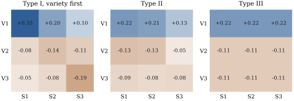

# Types of sums of squares and what they test

[Section 9.3](../ch09-sums-of-squares/03-sequential-partial.html) defined the Type I, II and III sums of squares
by the subspaces they project onto (@def-ss-sequential, @def-ss-partial). It also found the cell-mean
hypotheses of three of them in the two-way layout: equal weighted row means for a factor entered first, equal
unweighted row means for Type III, and a single column of the table for last-in sums of squares under
reference coding (@thm-ss-two-way-hypotheses). This section completes the list with one lemma, and then shows
that the hypothesis of a main effect's last-in sum of squares is decided by the coding of the *other* factor.

## One lemma for every sum of squares

Every term of a factorial model has columns that are constant within cells, so every model matrix we meet has
the form \( \W\mathbf{A} \) for a matrix \( \mathbf{A} \) with \( p \) rows, one for each cell. On the cell
scale, projections become weighted by the counts: write
\[
\bH_{\mathbf{A}}=\mathbf{A}(\mathbf{A}\T\bD\mathbf{A})\ginv\mathbf{A}\T\bD ,
\]
the operator that fits a table of cell means by the columns of \( \mathbf{A} \) with weights \( n_\omega \).

::: {#lem-ub-tested}
[The hypothesis of an extra sum of squares]

Let \( \X_1=\W\mathbf{A}_1 \) and \( \X_2=\W\mathbf{A}_2 \), let \( \mathbf{P}_1 \) project onto \( \C(\X_1) \), and let \( \mathbf{Q} \) be the
projection onto \( \C([\X_1,\X_2]) \) minus \( \mathbf{P}_1 \), so that \( \text{SS}(\X_2\mid\X_1)=\y\T\mathbf{Q}\y \). For every
table of cell means \( \bmu \):

::: {.enumerate options="label=(\alph*)"}
1. \( \mathbf{P}_1\W\bmu=\W\bH_{\mathbf{A}_1}\bmu \);

2. \( \mathbf{Q}\W\bmu=\bzero \) iff \( \mathbf{A}_2\T\bD(\I-\bH_{\mathbf{A}_1})\bmu=\bzero \);

3. in the cell-means model, \( \text{SS}(\X_2\mid\X_1) \) is the sum of squares of the hypothesis in (b), and its
   \( F \) ratio with the cell-means error mean square is the \( F \) statistic @eq-ub-cell-f of that hypothesis.
:::

:::

::: {.proof}
(a) \( \X_1\T\X_1=\mathbf{A}_1\T\bD\mathbf{A}_1 \), so by @thm-proj-M-formula
\( \mathbf{P}_1\W\bmu=\W\mathbf{A}_1(\mathbf{A}_1\T\bD\mathbf{A}_1)\ginv\mathbf{A}_1\T\W\T\W\bmu=\W\bH_{\mathbf{A}_1}\bmu \).
(b) By @lem-ss-residualized, \( \mathbf{Q} \) projects onto \( \C(\bT) \) with \( \bT=(\I-\mathbf{P}_1)\X_2 \). A projection
annihilates a vector iff the vector is orthogonal to its range, so \( \mathbf{Q}\W\bmu=\bzero \) iff
\( \bT\T\W\bmu=\bzero \). By (a),
\[
\bT\T\W\bmu=\X_2\T(\I-\mathbf{P}_1)\W\bmu=\mathbf{A}_2\T\W\T\W(\I-\bH_{\mathbf{A}_1})\bmu=\mathbf{A}_2\T\bD(\I-\bH_{\mathbf{A}_1})\bmu .
\]
(c) Let \( \mathcal S_0=\{\W\bmu:\mathbf{Q}\W\bmu=\bzero\} \), the mean vectors allowed by the hypothesis. Since
\( \C(\mathbf{Q})\subseteq\C(\W) \), the orthogonal complement of \( \mathcal S_0 \) within \( \C(\W) \) is \( \C(\mathbf{Q}) \), and
\( \y\T\mathbf{Q}\y \) is the drop in residual sum of squares from \( \mathcal S_0 \) to \( \C(\W) \) (@eq-proj-extra-ss).
That is the sum of squares of the hypothesis (@thm-glh-general-f(b)), whose \( F \) statistic is
@eq-ub-cell-f by @prp-ub-cell-means(d).
:::

Part (b) says that the extra sum of squares of \( \X_2 \) tests whether the residual of the true cell means,
after the terms already fitted and weighted by the counts, is orthogonal to the new term. Unless \( \bD \) is a multiple of the identity, the counts enter the
hypothesis. That is the root of every difference between the types.

## The complete list for two factors

Let the \( a\times b \) layout have all \( n_{ij}\ge1 \), with row totals \( n_{i\cdot} \), column totals \( n_{\cdot j} \) and
\( n=\sum_{ij}n_{ij} \). Besides the weighted row means \( \bar{\mu}^w_i \) of
[Section 17.1](01-cell-means.html), write
\[
\bar{\mu}^w_{\cdot j}=\frac1{n_{\cdot j}}\sum_in_{ij}\mu_{ij},\qquad
\bar{\mu}^w=\frac1n\sum_{i,j}n_{ij}\mu_{ij}
\]
for the weighted column means and the weighted grand mean. As in [Chapter 9](../ch09-sums-of-squares/index.html),
\( \text{SS}(B\mid\mu,A) \) denotes the extra sum of squares of the columns of \( B \) given the intercept and \( A \).

::: {#thm-ub-types}
[The cell-mean hypotheses of the types of sums of squares]

In the two-way layout with all cells occupied:

::: {.enumerate options="label=(\alph*)"}
1. \( \text{SS}(A\mid\mu) \), the Type I sum of squares of \( A \) entered first, addresses
   \( \bar{\mu}^w_1=\dots=\bar{\mu}^w_a \);

2. \( \text{SS}(B\mid\mu,A) \), which is both the Type I sum of squares of \( B \) entered second and the Type II
   sum of squares of \( B \), addresses
   \[
\sum_in_{ij}\,(\mu_{ij}-\bar{\mu}^w_i)=0\qquad\text{for }j=1,\dots,b ;
\]{#eq-ub-type2-b}

3. \( \text{SS}(A\mid\mu,B) \), the Type II sum of squares of \( A \), addresses
   \[
\sum_jn_{ij}\,(\mu_{ij}-\bar{\mu}^w_{\cdot j})=0\qquad\text{for }i=1,\dots,a ;
\]{#eq-ub-type2-a}

4. the Type III sum of squares of \( A \) addresses \( \bar{\mu}_{1\cdot}=\dots=\bar{\mu}_{a\cdot} \);

5. \( \text{SS}(AB\mid\mu,A,B) \), the interaction entry of every type, addresses additivity:
   \( \mu_{ij}-\mu_{il}-\mu_{kj}+\mu_{kl}=0 \) for all \( i,k,j,l \).
:::

The hypotheses have \( a-1 \), \( b-1 \), \( a-1 \), \( a-1 \) and \( (a-1)(b-1) \) degrees of freedom, and each sum of squares
is the sum of squares @eq-ub-cell-f of its hypothesis. The statements for \( B \) follow by exchanging the factors.
:::

::: {.proof}
Parts (a) and (d) are @thm-ss-two-way-hypotheses(a) and (b). By @lem-ub-tested(c), each sum of squares is the
sum of squares of the hypothesis given by @lem-ub-tested(b), and it remains to identify that hypothesis and
count its degrees of freedom.

(b) Take \( \X_1=[\bone,\Z_A] \) and \( \X_2=\Z_B \). The columns of \( \X_1 \) span the vectors that are constant
within rows, so \( \mathbf{P}_1 \) replaces each entry of a vector by the average of its row. Applied to \( \W\bmu \), this
gives \( \bar{\mu}^w_i \) in row \( i \). The entry \( j \) of \( \Z_B\T(\I-\mathbf{P}_1)\W\bmu \) sums \( \mu_{ij}-\bar{\mu}^w_i \) over
the observations in column \( j \), which is the left side of @eq-ub-type2-b. Part (c) is the same
argument with the factors exchanged.

For part (e), the projection is \( \mathbf{Q}=\M-\mathbf{P}_{A+B} \), where \( \mathbf{P}_{A+B} \) projects onto the additive model space, so
\( \mathbf{Q}\W\bmu=\bzero \) iff \( \W\bmu \) lies in that space, that is, iff \( \mu_{ij}=\alpha_i+\beta_j \) for some
\( \alpha,\beta \). Additive tables have vanishing tetrads. Conversely, if all tetrads vanish, then
\( \mu_{ij}=\mu_{i1}+\mu_{1j}-\mu_{11} \), which is additive.

Degrees of freedom. A complete layout is connected, so the additive model matrix has rank \( a+b-1 \) (@thm-est-connected(a)). The degrees of freedom of the extra sums of squares are therefore
\( a-1 \) for (a), \( (a+b-1)-a=b-1 \) for (b), \( a-1 \) for (c) and \( ab-(a+b-1) \) for (e). In each case this is
\( \rank(\mathbf{Q}) \), the number of independent linear restrictions that the hypothesis places on \( \bmu \).
:::

In the Type II hypothesis @eq-ub-type2-a, row \( i \) is compared cell by cell with the weighted means
\( \bar{\mu}^w_{\cdot j} \) of its columns, with the row's own counts as weights. The \( a \) equations sum to zero (@exr-ub-type2-rank). With two rows the hypothesis is \( \sum_jh_j(\mu_{1j}-\mu_{2j})=0 \) with
\( h_j=n_{1j}n_{2j}/n_{\cdot j} \) (@exr-ub-type2-harmonic), which favours columns where *both* rows are well
replicated. That is the most precise comparison when the row difference is the same in every column. When it is
not, the weights are set by the design rather than by anyone's question.

Under additivity, \( \mu_{ij}=\alpha_i+\beta_j \), the hypotheses separate cleanly. The Type II and Type III
hypotheses both reduce to \( \alpha_1=\dots=\alpha_a \): Type III because unweighted row means are
\( \alpha_i+\bar{\beta} \), and Type II by @thm-ss-two-way-hypotheses(d). The Type I hypothesis becomes
\[
\alpha_i+\sum_j\frac{n_{ij}}{n_{i\cdot}}\,\beta_j\ \text{ the same for all }i,
\]
which involves the column effects unless the counts are proportional (@thm-ss-proportional). A factor entered
first is credited with the effects of the factors it is confounded with.

::: {when-format="html"}
{#fig-ub-weights width=100%}
:::

::: {when-format="pdf"}
{width=100%}
:::

In [Figure 17.2.1](#fig-ub-weights) the Type I coefficients (V1's weighted mean minus the weighted grand mean) do
not sum to zero within columns, so that hypothesis compares sites as well as varieties. The Type II and Type III
tables have zero column sums and compare varieties within sites. Type II gives site \( j \) the weight \( n_{1j}(n_{\cdot j}-n_{1j})/n_{\cdot j} \), which is
large only where V1 and the other varieties are both well replicated. Type III weights the sites equally.

## Why Type III needs contrast codings

@def-ss-partial defines Type III through sum-to-zero coding, and @thm-ss-two-way-hypotheses(c) showed that
reference coding gives a different hypothesis. The next result settles which codings give Type III and why.

::: {#prp-ub-coding}
[Which coding a last-in sum of squares depends on]

In the two-way layout with all cells occupied, code \( A \) by an \( a\times(a-1) \) coding matrix \( \mathbf{C}_A \) and
\( B \) by a \( b\times(b-1) \) coding matrix \( \mathbf{C}_B \), with \( [\bone_a,\mathbf{C}_A] \) and \( [\bone_b,\mathbf{C}_B] \) nonsingular (@def-est-coding). Let the interaction columns be the products of the coded columns of \( A \) and \( B \), and let
\( \bw\neq\bzero \) span the line \( \C(\mathbf{C}_B)\perpc\subseteq\Real^b \). Then the partial sum of squares of the
columns of \( A \), with the intercept, \( B \) and the interaction in the model, addresses
\[
\sum_jw_j\mu_{ij}\ \text{ is the same for all }i .
\]{#eq-ub-coding-hypothesis}

The hypothesis depends neither on \( \mathbf{C}_A \) nor on the counts. It is the Type III hypothesis
\( \bar{\mu}_{1\cdot}=\dots=\bar{\mu}_{a\cdot} \) iff every column of \( \mathbf{C}_B \) sums to zero.
:::

::: {.proof}
Put \( \mathbf{K}_A=[\bone_a,\mathbf{C}_A] \) and \( \mathbf{K}_B=[\bone_b,\mathbf{C}_B] \). For an observation in cell \( (i,j) \), the
product of the \( k \)th coded column of \( A \) and the \( l \)th coded column of \( B \) takes the value
\( (\mathbf{C}_A)_{ik}(\mathbf{C}_B)_{jl} \), the entry in row \( (i,j) \) of the corresponding column of \( \mathbf{C}_A\otimes\mathbf{C}_B \).
So the full model matrix is \( \W \) times the columns of \( \mathbf{K}_A\otimes\mathbf{K}_B \), namely \( \bone_a\otimes\bone_b \),
\( \bone_a\otimes\mathbf{C}_B \), \( \mathbf{C}_A\otimes\bone_b \) and \( \mathbf{C}_A\otimes\mathbf{C}_B \). The matrix \( \mathbf{K}_A\otimes\mathbf{K}_B \) is
nonsingular (@prp-mat-kronecker(b)), so the full model space is \( \C(\W) \) and its \( ab \) columns are linearly
independent. Deleting the \( a-1 \) columns \( \mathbf{C}_A\otimes\bone_b \) leaves the reduced model \( \W\mathbf{F} \) with
\[
\mathbf{F}=\bigl[\bone_a\otimes\bone_b,\ \bone_a\otimes\mathbf{C}_B,\ \mathbf{C}_A\otimes\mathbf{C}_B\bigr],
\qquad \rank(\mathbf{F})=ab-(a-1).
\]
Let \( \mathcal V=\{\bmu:(\bu\otimes\bw)\T\bmu=0\text{ for all }\bu\in\bone_a\perpc\} \). Each column of \( \mathbf{F} \) lies in
\( \mathcal V \): by the mixed-product rule, \( (\bu\T\otimes\bw\T)(\bone_a\otimes\mathbf{v})=(\bu\T\bone_a)(\bw\T\mathbf{v})=0 \) for any
\( \mathbf{v} \), and \( (\bu\T\otimes\bw\T)(\mathbf{C}_A\otimes\mathbf{C}_B)=(\bu\T\mathbf{C}_A)\otimes(\bw\T\mathbf{C}_B)=\bzero \) because
\( \bw\perp\C(\mathbf{C}_B) \). The functionals \( \bu\otimes\bw \), \( \bu\in\bone_a\perpc \), form a space of dimension
\( a-1 \), since \( \bu\mapsto\bu\otimes\bw \) is injective. So \( \dim\mathcal V=ab-(a-1)=\rank(\mathbf{F}) \), and
\( \C(\mathbf{F})=\mathcal V \). The partial sum of squares is the drop in residual sum of squares from \( \C(\W\mathbf{F}) \)
to \( \C(\W) \), so it addresses the hypothesis \( \bmu\in\mathcal V \). Now
\( (\bu\otimes\bw)\T\bmu=\sum_iu_i\sum_jw_j\mu_{ij} \) vanishes for every contrast \( \bu \) iff
\( \sum_jw_j\mu_{ij} \) does not depend on \( i \), which is @eq-ub-coding-hypothesis. Finally,
\( \bw\propto\bone_b \) iff \( \bone_b\perp\C(\mathbf{C}_B) \), that is, iff \( \bone_b\T\mathbf{C}_B=\bzero \).
:::

Sum-to-zero, Helmert and orthogonal polynomial codings of \( B \) all give the Type III sum of squares for
\( A \), whatever coding \( A \) receives. Reference coding of \( B \) at level \( r \) gives \( \bw=\mathbf{e}_r \) and the
simple effect of @thm-ss-two-way-hypotheses(c). With more factors (@exr-ub-three-way-coding), the last-in sum of
squares of a main effect is the Type III one when every *other* factor is coded by contrasts. In statsmodels,
write `C(x, Sum)` for every factor.

## The variety trial, five ways

::: {#exm-ub-types-trial}
[Five tables for one data set]

The table has the layout of @exm-ss-anes-types in [Chapter 9](../ch09-sums-of-squares/index.html), and the listing computes its entries the same way,
as squared lengths of projections. For the trial of @exm-ub-variety-trial:

| Term | df | Type I, variety first | Type I, site first | Type II | Type III | reference coding |
|---|---|---|---|---|---|---|
| variety | 2 | 0.571 | 6.184 | 6.184 | 4.958 | 3.601 |
| site | 2 | 31.175 | 25.562 | 31.175 | 27.634 | 7.456 |
| interaction | 4 | 2.146 | 2.146 | 2.146 | 2.146 | 2.146 |
| residual | 28 | 8.781 | 8.781 | 8.781 | 8.781 | 8.781 |

Only the Type I columns add up to the model sum of squares \( 33.892 \); the Type II and Type III entries add up
to \( 39.506 \) and \( 34.738 \). The verdicts on varieties differ. Entered first, \( F=0.91 \) and \( p=0.414 \): the
raw averages \( 6.423 \), \( 6.583 \) and \( 6.275 \) mix each variety with the sites it was grown at. After sites
(Type II), \( F=9.86 \) and \( p=0.001 \). Type III gives \( F=7.90 \) and \( p=0.002 \), the test of @exm-ub-variety-trial. The last column compares the varieties at S1 only (\( F=5.74 \), \( p=0.008 \)).

The script checks every entry against statsmodels' `anova_lm` (types 1, 2 and 3, with sum-to-zero and Helmert
coding for type 3), and recovers each entry from the matrix \( \bL \) of its part of @thm-ub-types. It also confirms @prp-ub-coding: reference coding of the varieties with contrast coding of the sites
reproduces \( 4.958 \), and a random coding of the sites gives the sum of squares of @eq-ub-coding-hypothesis.
:::

```{.python .run #cell-sums-of-squares-projections}
import numpy as np
import pandas as pd
counts = np.array([[7, 4, 2],        # rows: varieties V1-V3; columns: sites S1-S3
                   [3, 5, 4],
                   [2, 3, 7]])
true_means = np.array([[5.8, 7.2, 7.6],
                       [5.0, 6.5, 7.5],
                       [4.4, 5.9, 7.2]])
rng = np.random.default_rng(20172)
rows = [(f"V{i + 1}", f"S{j + 1}", round(true_means[i, j] + rng.normal(0, 0.5), 1))
        for i in range(3) for j in range(3) for _ in range(counts[i, j])]
trial = pd.DataFrame(rows, columns=["variety", "site", "y"])

def proj(*blocks):
    """Orthogonal projection onto the span of the given column blocks (any rank)."""
    Z = np.column_stack(blocks)
    U, s, _ = np.linalg.svd(Z, full_matrices=False)
    U = U[:, s > 1e-10 * s[0]]
    return U @ U.T

y = trial["y"].to_numpy()
n = len(y)
one = np.ones((n, 1))
ZA = pd.get_dummies(trial["variety"]).to_numpy(float)     # variety indicators
ZB = pd.get_dummies(trial["site"]).to_numpy(float)        # site indicators
W = np.column_stack([ZA[:, [i]] * ZB for i in range(3)])  # the nine cell indicators

def ss(P):
    return y @ P @ y

P0, PA, PB, PAB, M = proj(one), proj(one, ZA), proj(one, ZB), proj(one, ZA, ZB), proj(W)
typeI_AB = {"A": ss(PA - P0), "B": ss(PAB - PA), "AB": ss(M - PAB)}   # variety first
typeI_BA = {"B": ss(PB - P0), "A": ss(PAB - PB), "AB": ss(M - PAB)}   # site first
typeII = {"A": ss(PAB - PB), "B": ss(PAB - PA), "AB": ss(M - PAB)}
```

```{.python .run #cell-sums-of-squares-type3}
def coding(labels, kind):
    """Columns coding a factor: sum-to-zero, or reference level (treatment)."""
    D = pd.get_dummies(labels).to_numpy(float)
    g = D.shape[1]
    C = np.vstack([np.eye(g - 1), -np.ones(g - 1)]) if kind == "sum" else np.eye(g)[:, 1:]
    return D @ C

def last_in(CA, CB):
    """Partial (last-in) sums of squares of A and B with interaction columns = products."""
    CAB = np.column_stack([CA[:, [i]] * CB for i in range(CA.shape[1])])
    full = proj(one, CA, CB, CAB)
    assert np.allclose(full, M)                  # every coding spans the cell-means space
    return {"A": ss(full - proj(one, CB, CAB)), "B": ss(full - proj(one, CA, CAB))}

typeIII = last_in(coding(trial["variety"], "sum"), coding(trial["site"], "sum"))
reference = last_in(coding(trial["variety"], "treatment"), coding(trial["site"], "treatment"))
sse = ss(np.eye(n) - M)
for name, t in [("Type I, variety first", typeI_AB), ("Type I, site first", typeI_BA),
                ("Type II", typeII), ("Type III (sum)", typeIII), ("reference coding", reference)]:
    print(f"{name:22s}", {k: round(float(v), 3) for k, v in t.items()})
```

The next cell builds the Type II hypothesis @eq-ub-type2-a and the Type I hypothesis as matrices on the nine cell
means, and @eq-ub-cell-f recovers their entries in the table.

```{.python .run #cell-sums-of-squares-hypotheses}
cells = trial.groupby(["variety", "site"])["y"]
ybar = cells.mean().to_numpy()                        # nine cell means, row-major
N = cells.size().to_numpy().reshape(3, 3)             # counts n_ij
npi, npj = N.sum(axis=1), N.sum(axis=0)

def hypothesis_ss(L):
    """Sum of squares of L mu = 0 in the cell-means model (redundant rows allowed)."""
    u = L @ ybar
    return u @ np.linalg.pinv(L @ np.diag(1 / N.ravel()) @ L.T) @ u

# Type II for variety: row i has coefficient n_ij (1[i = k] - n_kj / n_.j) on cell (k, j)
L2A = np.array([[N[i, j] * ((i == k) - N[k, j] / npj[j]) for k in range(3) for j in range(3)]
                for i in range(3)])
# Type I, variety first: the count-weighted variety means are equal
wrow = np.array([[(i == k) * N[k, j] / npi[k] for k in range(3) for j in range(3)]
                 for i in range(3)])
L1 = wrow[[0]] - wrow[1:]
print(f"Type II hypothesis: SS = {hypothesis_ss(L2A):.3f};  Type I hypothesis: SS = {hypothesis_ss(L1):.3f}")
```

## Choosing a sum of squares

The advice of [Section 9.3](../ch09-sums-of-squares/03-sequential-partial.html) stands: decide the hypothesis first, use Type I only when the order of entry is part of the question,
and without interaction prefer Type II. The cell-mean hypotheses sharpen it in three ways.

1. *Test the interaction first.* It is the same in every type and tests additivity (@thm-ub-types(e)). Under
   additivity Type II and Type III test the same hypothesis, and Type II is never less powerful
   (@exr-ub-power-types).

2. *If the factors interact,* the weights of a main-effect hypothesis decide the answer. Choose weights that describe a
   population (equal weights give Type III), or report simple effects within each column with multiplicity-adjusted
   intervals ([Chapter 13](../ch13-multiplicity/index.html)).

3. *Report the hypothesis, not the type.* Anyone can read \( \bL\bmu=\bzero \), and @eq-ub-cell-f tests it. With empty
   cells this is the only safe course ([Section 17.4](04-empty-cells.html)).

## Exercises

### A. Check your understanding

::: {#exr-ub-types-2x2}
[A1]

In a \( 2\times2 \) layout with counts \( n_{11}=6 \), \( n_{12}=2 \), \( n_{21}=1 \), \( n_{22}=3 \), write the hypothesis of
the Type I sum of squares of \( A \) entered first as one linear equation in the four cell means. Show that for the
additive table \( \mu_{ij}=\beta_j \), in which \( A \) has no effect, the hypothesis holds only if \( \beta_1=\beta_2 \). In
particular it fails for \( \beta_1=0 \), \( \beta_2=1 \).
:::

### B. Practice

::: {#exr-ub-type2-rank}
[B1]

Show that the left sides of the \( a \) equations @eq-ub-type2-a add up to zero for every table \( \bmu \). Show also that,
for a connected design, the equations have rank exactly \( a-1 \). *Hint:* count degrees of freedom.
:::

::: {.solution}
Summing over \( i \) gives
\[
\sum_{ij}n_{ij}\mu_{ij}-\sum_jn_{\cdot j}\bar{\mu}^w_{\cdot j}=\sum_{ij}n_{ij}\mu_{ij}-\sum_j\sum_in_{ij}\mu_{ij}=0 .
\]
So at most \( a-1 \) of the equations are independent. By @lem-ub-tested(b) the equations are
\( \Z_A\T(\I-\mathbf{P}_B)\W\bmu=\bzero \), where \( \mathbf{P}_B \) projects onto \( \C([\bone,\Z_B]) \). The number of independent
restrictions they impose on \( \bmu \) is the rank of the projection onto \( \C((\I-\mathbf{P}_B)\Z_A) \), which is
\( \rank[\bone,\Z_A,\Z_B]-\rank[\bone,\Z_B]=(a+b-1)-b=a-1 \) for a connected design (@thm-est-connected(a)).
:::

::: {#exr-ub-type2-harmonic}
[B2]

Show that when \( a=2 \), the Type II hypothesis @eq-ub-type2-a for \( A \) is the single equation
\( \sum_jh_j(\mu_{1j}-\mu_{2j})=0 \) with \( h_j=n_{1j}n_{2j}/(n_{1j}+n_{2j}) \). Show that \( \sigma^2/h_j \) is the variance of
\( \bar{y}_{1j}-\bar{y}_{2j} \), and conclude that under additivity the Type II hypothesis compares the rows with
inverse-variance weights.
:::

::: {.solution}
The first equation is
\[
\sum_jn_{1j}\bigl(\mu_{1j}-(n_{1j}\mu_{1j}+n_{2j}\mu_{2j})/n_{\cdot j}\bigr)=\sum_j(n_{1j}n_{2j}/n_{\cdot j})(\mu_{1j}-\mu_{2j}) ,
\]
and the second is its negative (@exr-ub-type2-rank). The variance of \( \bar{y}_{1j}-\bar{y}_{2j} \) is
\( \sigma^2(1/n_{1j}+1/n_{2j})=\sigma^2n_{\cdot j}/(n_{1j}n_{2j})=\sigma^2/h_j \). If the difference
\( \delta=\mu_{1j}-\mu_{2j} \) is the same in every column, the most precise combination of the column differences
weights them in proportion to \( h_j \), and the hypothesis says that this combination is zero.
:::

::: {#exr-ub-proportional-types}
[B3]

Suppose the counts are proportional, \( n_{ij}=n_{i\cdot}n_{\cdot j}/n \). Show that the hypotheses of
@thm-ub-types(a) and (c) coincide, and that both say that the row means weighted by the column shares
\( n_{\cdot j}/n \) are equal. Why does this agree with @thm-ss-proportional?
:::

::: {.solution}
With proportional counts, \( n_{ij}/n_{i\cdot}=n_{\cdot j}/n=:\pi_j \) for every \( i \), so \( \bar{\mu}^w_i=\sum_j\pi_j\mu_{ij} \). The
left side of @eq-ub-type2-a is \( n_{i\cdot}\sum_j\pi_j(\mu_{ij}-\bar{\mu}^w_{\cdot j})=n_{i\cdot}(\bar{\mu}^w_i-\sum_j\pi_j\bar{\mu}^w_{\cdot j}) \),
and \( \sum_j\pi_j\bar{\mu}^w_{\cdot j}=\bar{\mu}^w \). So (c) says \( \bar{\mu}^w_i=\bar{\mu}^w \) for all \( i \), which is (a). In
@thm-ss-proportional the centred factor spaces are orthogonal, so \( \text{SS}(A\mid\mu,B)=\text{SS}(A\mid\mu) \)
for every data set. Two sums of squares that agree for every \( \y \) must address the same hypothesis.
:::

::: {#exr-ub-codings}
[B4]

Use @prp-ub-coding to find the hypothesis of the last-in sum of squares of \( A \) when \( B \) (with \( b=3 \)) is coded by
(a) the Helmert columns \( (-1,1,0)\T,(-1,-1,2)\T \); (b) the orthogonal polynomial columns
\( (-1,0,1)\T,(1,-2,1)\T \); (c) the columns \( (1,0,0)\T,(0,0,1)\T \), reference coding with level 2 as reference;
(d) the columns \( (1,0,0)\T,(0,1,0)\T \) plus \( \tfrac12(1,1,1)\T \) added to both.
:::

### C. Going deeper

::: {#exr-ub-power-types}
[C1]

Suppose the cell means are additive. Let \( \mathbf{P}_{\text{II}}=\mathbf{P}_{A+B}-\mathbf{P}_B \) and let \( \mathbf{P}_{\text{III}} \) be the
projection of the Type III sum of squares of \( A \). Both have rank \( a-1 \), and both are used with the cell-means
error mean square. Show that the noncentrality parameters satisfy
\( \norm{\mathbf{P}_{\text{II}}\W\bmu}^2\ge\norm{\mathbf{P}_{\text{III}}\W\bmu}^2 \), so that the Type II test is at least as
powerful. *Hint:* both are squared distances from \( \W\bmu \) to a subspace.
:::

::: {.solution}
Write \( \mathbf{v}=\W\bmu \), which lies in the additive space \( \C(\mathbf{P}_{A+B}) \). Then
\( \mathbf{P}_{\text{II}}\mathbf{v}=\mathbf{v}-\mathbf{P}_B\mathbf{v} \), so \( \norm{\mathbf{P}_{\text{II}}\mathbf{v}}^2 \) is the squared distance from \( \mathbf{v} \) to
\( \C([\bone,\Z_B]) \). Also \( \mathbf{P}_{\text{III}}=\M-\mathbf{P}_R \), where \( \mathbf{P}_R \) projects onto the reduced space
\( \C([\bone,\mathbf{C}_B\text{-columns},\text{interaction columns}]) \), and \( \M\mathbf{v}=\mathbf{v} \). So \( \norm{\mathbf{P}_{\text{III}}\mathbf{v}}^2 \)
is the squared distance from \( \mathbf{v} \) to \( \C(\mathbf{P}_R) \). This space contains \( \C([\bone,\Z_B]) \), and the distance to
a larger subspace is smaller. The two \( F \) statistics have the same degrees of freedom, and the power of an \( F \)
test increases with its noncentrality (@thm-glh-power).
:::

::: {#exr-ub-three-way-coding}
[C2]

In an \( a\times b\times d \) layout, where \( C \) has \( d \) levels and all cells are occupied, code the factors by \( \mathbf{C}_A,\mathbf{C}_B,\mathbf{C}_C \), and let the
model contain all main effects and all two- and three-factor interactions, formed as products of coded columns.
Show that the last-in sum of squares of the columns of \( A \) addresses equality over \( i \) of
\( \sum_{j,k}v_jw_k\mu_{ijk} \), where \( \mathbf{v} \) spans \( \C(\mathbf{C}_B)\perpc \) and \( \bw \) spans \( \C(\mathbf{C}_C)\perpc \). When is this
the unweighted hypothesis \( \bar{\mu}_{1\cdot\cdot}=\dots=\bar{\mu}_{a\cdot\cdot} \)?
:::
