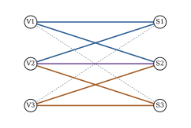

# Empty cells and estimability

Some combinations of levels are never observed, or are
impossible. An empty cell's mean does not appear in the distribution of the data, so no unconstrained analysis can
estimate it (@prp-ub-cell-means(b)). This section works out what survives, building on connectedness (@thm-est-connected) and the estimability of interaction contrasts (@prp-est-interaction).

Throughout, the two-way layout has occupied cells \( O \), with \( m=|O| \), every row and every column contains at
least one occupied cell, and \( c \) is the number of connected components of the design graph of @thm-est-connected. A row is **complete** if none of its cells is empty.

## What remains estimable

::: {#thm-ub-empty-cells}
[Estimability and tests with empty cells]

In the two-way layout described above:

::: {.enumerate options="label=(\alph*)"}
1. In the cell-means model, \( \sum_iu_i\sum_jw_j\mu_{ij} \) is estimable iff \( u_iw_j=0 \) for every empty cell
   \( (i,j) \). In particular the unweighted mean \( \bar{\mu}_{i\cdot} \) is estimable iff row \( i \) is complete.

2. The estimable interaction contrasts, the tables \( (d_{ij}) \) with zero row and column sums and \( d_{ij}=0 \) on every
   empty cell (@prp-est-interaction(c)), form a space of dimension \( m-a-b+c \). The interaction sum of squares
   \( \text{SS}(AB\mid\mu,A,B) \) has \( m-a-b+c \) degrees of freedom. It addresses the hypothesis that all these
   contrasts vanish, which holds iff the occupied cell means are additive: \( \mu_{ij}=\alpha_i+\beta_j \) for all
   \( (i,j)\in O \) and some \( \alpha,\beta \).

3. If the design is connected, the additive model estimates every cell mean, including those of empty cells, and
   under additivity \( \text{SS}(A\mid\mu,B) \) addresses \( \alpha_1=\dots=\alpha_a \), with \( a-1 \) degrees of freedom.

4. Code both factors by contrasts and form the interaction columns as products. If at least one row is
   incomplete and \( k \) rows are complete, the last-in sum of squares of \( A \) addresses equality of the unweighted
   means of the complete rows, and it has \( \max(k-1,0) \) degrees of freedom.
:::

:::

::: {.proof}
(a) The coefficient of \( \mu_{ij} \) is \( u_iw_j \), and @prp-ub-cell-means(b) applies. For \( \bar{\mu}_{i\cdot} \) the
coefficients are \( 1/b \) on row \( i \) and zero elsewhere.

(b) Let \( T:\Real^{O}\to\Real^{a}\times\Real^{b} \) send a table \( (d_{ij})_{(i,j)\in O} \) to its row sums and column
sums. The estimable interaction contrasts form \( \Null(T) \). The transpose sends \( (\bu,\bv) \) to the table
\( (u_i+v_j)_{(i,j)\in O} \). As in the proof of @thm-est-connected, \( u_i+v_j=0 \) on \( O \) forces \( u_i=t_C \) and
\( v_j=-t_C \) on each component \( C \), with arbitrary \( t_C \). So \( \Null(T\T) \) has dimension \( c \),
\( \rank(T)=a+b-c \), and \( \dim\Null(T)=m-a-b+c \). The tables \( (u_i+v_j)_{(i,j)\in O} \) are exactly the occupied parts of
additive tables. They form \( \C(T\T) \), whose orthogonal complement in \( \Real^O \) is \( \Null(T) \). So the occupied cell
means are additive iff they are orthogonal to every estimable interaction contrast, that is, iff all those contrasts
vanish. The interaction sum of squares is \( \y\T(\M-\mathbf{P}_{A+B})\y \), which addresses the hypothesis that \( \W\bmu \) lies in
the additive model space, that is, that the occupied cell means are additive. Its degrees of freedom are
\( m-(a+b-c) \) by @prp-ub-cell-means(a) and @thm-est-connected(a).

(c) The first claim is @thm-est-connected(c). For the second, let \( \mu_{ij}=\alpha_i+\beta_j \). Then
\( (\mathbf{P}_{A+B}-\mathbf{P}_B)\W\bmu=\bzero \) iff \( \W\bmu\in\C([\bone,\Z_B]) \), that is, iff
\( \alpha_i+\beta_j=\beta_j' \) on \( O \) for some \( \beta' \). Then \( \alpha_i+(\beta_j-\beta_j')=0 \) on \( O \), and in a
connected design this forces all \( \alpha_i \) to be equal, as in (b). Conversely, equal \( \alpha_i \) give such a
\( \beta' \). The degrees of freedom are \( \rank[\bone,\Z_A,\Z_B]-\rank[\bone,\Z_B]=(a+b-1)-b \).

(d) As in the proof of @prp-ub-coding, the full model matrix is \( \W \) times the \( ab \) independent columns of
\( \mathbf{K}_A\otimes\mathbf{K}_B \), so its column space is \( \C(\W) \). The reduced model is \( \W\mathbf{F} \). The argument in that proof does not use the counts, and with \( \bw=\bone \) it shows
that \( \C(\mathbf{F}) \) is the space \( \mathcal V \) of tables with equal unweighted row means. Hence the
reduced mean vectors are \( \{\W\bmu:\bmu\in\mathcal V\} \): the tables of occupied cell means that can be completed, by
choosing values in the empty cells, to a table with equal unweighted row means. Suppose the complete rows share a
common unweighted mean \( t \), with \( t \) arbitrary if there are none. Each incomplete row can then be given the mean
\( t \) by choosing the value in one of its empty cells, so the occupied means can be completed. Conversely, a
completion cannot change the means of complete rows. So the hypothesis is equality of the unweighted means of the complete rows. It
consists of the \( k-1 \) restrictions \( \bar{\mu}_{i\cdot}=\bar{\mu}_{i_0\cdot} \), for the complete rows \( i\neq i_0 \), which are
independent because they involve disjoint sets of cells, and of none if \( k\le1 \). The last-in sum of squares is the
drop in residual sum of squares from the reduced model to \( \C(\W) \), so it addresses this hypothesis (@eq-proj-extra-ss), and its degrees of freedom are the number of independent restrictions.
:::

In part (b), a table with zero row and column sums on the edges of the design graph is a *circulation*. The simplest
ones run around cycles with alternating signs. A four-cycle is the familiar tetrad
\( \mu_{ij}-\mu_{il}-\mu_{kj}+\mu_{kl} \); longer cycles give contrasts on six or more cells that survive when every
tetrad through them is broken. The number \( m-a-b+c \) counts the independent cycles (@exr-ub-cycle-basis).

Part (d) is the result to remember about Type III. With empty cells it ignores every incomplete row, and it may test
nothing at all: an empty cell can hold whatever value makes its row's unweighted mean agree, and such means are not
estimable, by (a).

## An example with two combinations never grown

::: {#exm-ub-empty-trial}
[The variety trial with two empty cells]

Suppose that in the trial of @exm-ub-variety-trial V1 had never been grown at S3, nor V3 at S1. That leaves
\( n=33 \) plots in \( m=7 \) cells, with \( 26 \) error degrees of freedom and error mean square \( 0.3096 \). The design
graph ([Figure 17.4.1](#fig-ub-design-graph)) is connected, so the estimable interaction contrasts have dimension
\( 7-3-3+1=2 \), spanned by two tetrads. The interaction sum of squares is \( 1.218 \), \( F=1.97 \), \( p=0.160 \), and the
script checks that the tetrads give the same value through @eq-ub-cell-f. The six-cell contrast around
V1–S1–V2–S3–V3–S2–V1 is the difference of the tetrads (@exr-ub-hexad).

The unweighted means of V1 and V3 are no longer estimable. V1 and V2 share S1 and S2, and the difference of their
averages there is \( 0.603 \) (standard error \( 0.268 \)). The additive model is still identified. Its Type II sum of
squares for varieties is \( 5.766 \) on \( 2 \) degrees of freedom, and it fills the empty cells with \( 8.32 \) for V1 at S3
and \( 4.20 \) for V3 at S1. The first exceeds every observed cell mean: V1's advantage at S1 and S2 is carried to a site
where V1 was never grown, although in the generating means it had nearly vanished there (the true mean is \( 7.6 \)).

The "Type III" sum of squares for varieties is \( 0 \) on \( 0 \) degrees of freedom: V2 is the only complete row (@thm-ub-empty-cells(d)). If only V1 at S3 is removed, it is \( 2.027 \) on \( 1 \) degree of freedom, the sum of squares
of \( \bar{\mu}_{2\cdot}=\bar{\mu}_{3\cdot} \), for every ordering of the levels.
:::

::: {when-format="html"}
{#fig-ub-design-graph width=55%}
:::

::: {when-format="pdf"}
{width=55%}
:::

```{.python .run #cell-empty-cells-empty}
import numpy as np
import pandas as pd
counts = np.array([[7, 4, 2],        # rows: varieties V1-V3; columns: sites S1-S3
                   [3, 5, 4],
                   [2, 3, 7]])
true_means = np.array([[5.8, 7.2, 7.6],
                       [5.0, 6.5, 7.5],
                       [4.4, 5.9, 7.2]])
rng = np.random.default_rng(20172)
rows = [(f"V{i + 1}", f"S{j + 1}", round(true_means[i, j] + rng.normal(0, 0.5), 1))
        for i in range(3) for j in range(3) for _ in range(counts[i, j])]
trial = pd.DataFrame(rows, columns=["variety", "site", "y"])

def proj(*blocks):
    """Orthogonal projection onto the span of the given column blocks (any rank)."""
    Z = np.column_stack(blocks)
    U, s, _ = np.linalg.svd(Z, full_matrices=False)
    U = U[:, s > 1e-10 * s[0]]
    return U @ U.T

def rank(*blocks):
    return np.linalg.matrix_rank(np.column_stack(blocks))

missing = ((trial["variety"] == "V1") & (trial["site"] == "S3")) | \
          ((trial["variety"] == "V3") & (trial["site"] == "S1"))
sub = trial[~missing].reset_index(drop=True)          # V1 never grown at S3, V3 never at S1
y = sub["y"].to_numpy()
n = len(y)
one = np.ones((n, 1))
ZA = pd.get_dummies(sub["variety"]).to_numpy(float)
ZB = pd.get_dummies(sub["site"]).to_numpy(float)
W = np.column_stack([ZA[:, [i]] * ZB for i in range(3)])
m = rank(W)                                           # occupied cells
M, PAB, PA, PB = proj(W), proj(one, ZA, ZB), proj(one, ZA), proj(one, ZB)
sse = y @ (np.eye(n) - M) @ y
df_inter = m - rank(one, ZA, ZB)                      # m - a - b + 1 for a connected design
ss_inter = y @ (M - PAB) @ y
F_inter = ss_inter / df_inter / (sse / (n - m))
print(f"occupied cells {m}, interaction df {df_inter}, SS {ss_inter:.3f}, F {F_inter:.2f}")
ss_typeII_A = y @ (PAB - PB) @ y                      # well defined, a - 1 = 2 df
```

```{.python .run #cell-empty-cells-type3empty}
def sum_coding(labels):
    D = pd.get_dummies(labels).to_numpy(float)
    return D[:, :-1] - D[:, [-1]]

CA, CB = sum_coding(sub["variety"]), sum_coding(sub["site"])
CAB = np.column_stack([CA[:, [i]] * CB for i in range(2)])
df_III_A = m - rank(one, CB, CAB)
ss_III_A = y @ (M - proj(one, CB, CAB)) @ y
print(f"last-in SS for variety with sum coding: {abs(ss_III_A):.3f} on {df_III_A} df")
```

## How software behaves

A program fitting the rank-deficient effects model picks one coefficient vector and computes its sums of squares
from it. The script fits the data of @exm-ub-empty-trial with statsmodels 0.15 under three namings of the levels. It warns that the design is rank-deficient and prints tables anyway. The Type I interaction appears on
\( 4 \) degrees of freedom instead of \( 2 \), with sums of squares \( 3.96 \), \( 2.15 \) and \( 2.05 \) instead of \( 1.218 \).
The Type II interaction entries are \( 23.46 \), \( 53.21 \) and \( 3.17 \), and the Type III variety entries \( 9.43 \),
\( 41.10 \) and \( 34.25 \) on \( 2 \) degrees of freedom, where there is nothing to test. The projections give the same
answers under every naming, as they must. SAS's
"Type IV" sums of squares for empty cells build hypotheses from the occupied cells in a way that depends on the order
of the levels (Goodnight 1980). Whatever the program, check that the printed degrees of freedom equal the rank of the
projection, and write down the hypothesis.

## Recommended practice

1. *Tabulate the counts first,* draw the design graph and count its components. Rows in different components cannot be
   compared, even under additivity (@thm-est-connected(b)).

2. *Ask why the cells are empty.* Cells lost at random fit the theory above. Impossible combinations have no mean, and a
   main effect averaged over them is fiction. Combinations avoided *because* they were expected to do badly bias every
   additive fill-in, and no analysis of the observed cells can detect it.

3. *Test the interaction on its \( m-a-b+c \) degrees of freedom.* If there are few cycles, additivity is barely checked.

4. *If additivity is credible,* use the additive model and \( \text{SS}(A\mid\mu,B) \), and flag least squares means that
   involve empty cells as extrapolations.

5. *If not,* ask estimable questions of the cell means: simple effects, comparisons over shared columns, or a complete
   sub-table, and state which cells each comparison uses. Do not report a Type III or Type IV table without identifying
   its hypotheses.

One can also impose just enough interaction constraints to identify the empty cells ([Section 17.3](03-constrained-models.html)).
The resulting estimates are then set by constraints the data cannot test (@exr-ub-partial-empty), and should be
presented as assumptions.

## Exercises

### A. Check your understanding

::: {#exr-ub-empty-count}
[A1]

A \( 3\times4 \) layout has every cell occupied except \( (1,4) \), \( (2,1) \) and \( (3,1) \). Find \( m \), the number of
components of the design graph, the degrees of freedom of the interaction, and the tetrads that are estimable.
:::

::: {#exr-ub-shared-ground}
[A2]

In @exm-ub-empty-trial, which comparisons between V1 and V3 are estimable in the cell-means model? Why is the V1–V2
comparison over S1 and S2 estimable when neither unweighted mean is?
:::

### B. Practice

::: {#exr-ub-2x2-empty}
[B1]

In a \( 2\times2 \) layout with cell \( (2,2) \) empty, show that the additive model estimates \( \mu_{22} \) by
\( \bar{y}_{21}+\bar{y}_{12}-\bar{y}_{11} \), and find its variance. Show that the last-in sum of squares of \( A \) with sum-to-zero
coding is identically zero. Compare with @exr-ss-empty-cell.
:::

::: {.solution}
With three occupied cells and a connected graph, the additive model has \( 1+2+2-1=3=m \) free parameters. Its fitted values
are the three cell averages, since \( \text{SS}(AB\mid\mu,A,B) \) has \( 3-2-2+1=0 \) degrees of freedom. Additivity gives
\( \mu_{22}=\mu_{21}+\mu_{12}-\mu_{11} \), estimated by \( \bar{y}_{21}+\bar{y}_{12}-\bar{y}_{11} \) with variance
\( \sigma^2(1/n_{21}+1/n_{12}+1/n_{11}) \). Row 1 is the only complete row, so @thm-ub-empty-cells(d) with \( k=1 \) gives zero
degrees of freedom, and the sum of squares vanishes for every data set. Directly, the reduced model with columns
\( \bone \), the \( B \) column and the product column already has rank \( 3 \) on the three occupied cells.
:::

::: {#exr-ub-disconnected}
[B2]

Take the \( 4\times5 \) design of @exm-est-connected, with occupied cells \( (1,1),(1,2),(2,2),(2,3),(3,4),(4,4),(4,5) \). Find the
degrees of freedom of the interaction and the Type II sum of squares of \( A \). Which comparisons of rows can the additive model
make?
:::

::: {#exr-ub-hexad}
[B3]

In @exm-ub-empty-trial, show that the six-cell contrast \( \mu_{11}-\mu_{12}-\mu_{21}+\mu_{23}+\mu_{32}-\mu_{33} \) has zero row
and column sums and vanishes on the empty cells. Write it as a combination of the two tetrads, and trace the cycle it
corresponds to in [Figure 17.4.1](#fig-ub-design-graph).
:::

::: {.solution}
Row sums: \( 1-1=0 \), \( -1+1=0 \), \( 1-1=0 \). Column sums: \( 1-1=0 \) for S1, \( -1+1=0 \) for S2, \( 1-1=0 \) for S3. It has no
coefficient on \( (1,3) \) or \( (3,1) \). With \( T_1=\mu_{11}-\mu_{12}-\mu_{21}+\mu_{22} \) and
\( T_2=\mu_{22}-\mu_{23}-\mu_{32}+\mu_{33} \), the contrast is \( T_1-T_2 \), because \( \mu_{22} \) cancels. The cycle is
V1–S1–V2–S3–V3–S2–V1. It uses every occupied cell except V2–S2, the edge the two tetrads share.
:::

::: {#exr-ub-partial-empty}
[B4]

In a \( 2\times3 \) layout with only cell \( (2,3) \) empty, impose the single constraint
\( \mu_{12}-\mu_{13}-\mu_{22}+\mu_{23}=0 \). Show that every cell mean becomes estimable and find the estimate of \( \mu_{23} \). Can the
constraint be tested?
:::

::: {.solution}
The constraint gives \( \mu_{23}=\mu_{22}+\mu_{13}-\mu_{12} \), so any table satisfying it that vanishes on the occupied cells vanishes
everywhere, and @exr-ub-constrained-identified gives identifiability. The five occupied cell means are unrestricted, so
their estimates remain the cell averages, and \( \hat{\mu}_{23}=\bar{y}_{22}+\bar{y}_{13}-\bar{y}_{12} \). The constraint involves the
empty cell with a nonzero coefficient, so it is not estimable in the cell-means model and cannot be tested (@prp-glh-nonestimable). The fit is the same whether it holds or not. It only decides what we say about \( \mu_{23} \).
:::

### C. Going deeper

::: {#exr-ub-cycle-basis}
[C1]

Let \( F \) be a spanning forest of the design graph, with \( a+b-c \) edges. Show that each occupied cell \( e \) not in \( F \) closes
a unique cycle in \( F\cup\{e\} \), and that the alternating-sign contrast \( d^{(e)} \) of that cycle is an estimable interaction
contrast. Show that the \( m-a-b+c \) contrasts \( d^{(e)} \) are linearly independent and hence form a basis of
the space in @thm-ub-empty-cells(b).
:::

::: {.solution}
Adding an edge \( e=(i,j) \) to a forest joins two vertices of the same tree (the graph and the forest have the same components),
so it closes exactly one cycle, the tree path from \( i \) to \( j \) followed by \( e \). A cycle in a bipartite graph has even length
and alternates between row and column vertices. Giving its edges alternating signs \( \pm1 \) makes the two edges at each
vertex cancel, so the row and column sums vanish, and the table is supported on occupied cells. The contrast \( d^{(e)} \) is
the only one of the family with a nonzero entry at \( e \), because the other cycles use only forest edges and their own
extra edge. So in any vanishing linear combination the coefficient of \( d^{(e)} \) is zero, for each \( e \). There are
\( m-(a+b-c) \) of them, the dimension of the space, so they form a basis.
:::

::: {#exr-ub-type3-columns}
[C2]

In the trial with only V1 at S3 removed, what does the "Type III" sum of squares for sites test, and on how many degrees of
freedom? Verify your answer by modifying the listing.
:::
